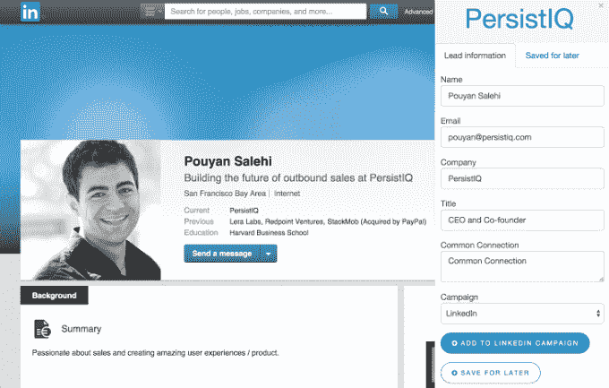

# YC 支持的 PersistIQ 融资 170 万美元，为销售人员创造更智能的自动化技术

> 原文：<https://web.archive.org/web/https://techcrunch.com/2015/07/30/persistiq-seed-funding/>

# YC 支持的 PersistIQ 融资 170 万美元，为销售人员创造更智能的自动化

销售工作流初创公司 [PersistIQ](https://web.archive.org/web/20230131054222/https://persistiq.com/) 已经筹集了 170 万美元的种子资金。

这是其中的一个故事，创业公司说它几个月前就筹集了资金，很忙，现在才决定宣布这个消息。种子轮的投资者包括 Point Nine、Salesforce Ventures、Y Combinator 和未披露的天使投资人。(PersistIQ 是去年在 Y Combinator 孵化的[。)](https://web.archive.org/web/20230131054222/https://techcrunch.com/2014/08/12/with-yc-backing-persistiq-hopes-to-remove-excel-from-the-outbound-sales-process/)

联合创始人兼首席执行官 Pouyan Salehi 认为，虽然大多数在线销售工具都专注于特定的渠道，如电子邮件或电话，但 PersistIQ 旨在改善整个销售流程的工作流程，并“销售代表无处不在”。

“我们已经处于电子邮件、LinkedIn、Salesforce 和许多其他地方的交汇点，”他说。“我们想扩展一下，说作为一名销售人员，你有一个支持你的解决方案。”

PersistIQ 自动化了大部分对外销售流程，从您的数据库中删除重复内容，在正确的时间发送跟进电子邮件并个性化信息，因此希望这不会像是机器人发出的销售宣传。(PersistIQ 将此描述为“包含人的因素的自动化”。)

该公司表示，它有数百名客户，包括 [ZenPayroll](https://web.archive.org/web/20230131054222/https://zenpayroll.com/) ，该公司报告称，PersistIQ 已经使其销售团队增加了 10 倍(！)更有成效。

较新的功能包括详细分析哪些有用，哪些没用，一个与其他销售产品集成的 API，以及一个将电子邮件地址从 LinkedIn 拉进你的销售数据库的 Chrome 扩展。