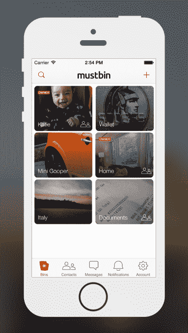

# 个人数据组织者 Mustbin 再筹集 150 万美元，增加安全信息

> 原文：<https://web.archive.org/web/https://techcrunch.com/2014/05/28/personal-data-organizer-mustbin-raises-1-5-million-more-adds-secure-messaging/>

Mustbin 是一个个人数据管理器，可以让你拍摄重要文件的照片，如财务报表、家庭和车辆信息、医疗文件等，并将其安全地存储在云中，自从去年 11 月[推出私人测试版以来，它已经成为我 iPhone 主屏幕上的首选应用之一](https://web.archive.org/web/20230320145110/https://techcrunch.com/2013/11/13/backed-by-4-5-million-in-series-a-funding-mustbin-for-iphone-organizes-and-secures-all-your-personal-data-in-one-place/)。今天，该公司宣布追加 150 万美元的资金，并扩展其服务，现在包括一个安全的消息组件。

Mustbin 于 2012 年底由 Brian Shin 创建，他也是 Visible Measures 的创始人兼首席执行官，此前从 DAG Ventures、General Catalyst Partners、Mohr Davidow、Northgate Capital、Hubspot 创始人 Dharmesh Shah、Jonathan Kraft 和其他天使投资者那里筹集了 450 万美元的首轮融资。来自现有投资者的另外 150 万美元，使该公司迄今为止筹集了 600 万美元。

虽然一个安全的文档存储应用程序看起来会与云存储中的“大家伙”竞争，如谷歌、微软、Dropbox、box 和其他公司，但 Mustbin 的独特角度是，它是一个移动优先的应用程序，其中的“文档”只是组织良好的 iPhone 照片。事实上， [Shin 早些时候告诉我们](https://web.archive.org/web/20230320145110/https://techcrunch.com/2013/11/13/backed-by-4-5-million-in-series-a-funding-mustbin-for-iphone-organizes-and-secures-all-your-personal-data-in-one-place/)，他想出了 Mustbin 这个主意，因为他曾试图通过手机拍照来记录事情，但事情变得一发不可收拾。

相反，Mustbin 的界面允许您将这些类型的照片组织成集合，如“钱包”、“家庭”、“汽车”等，并提供指南来帮助您创建顶级类别以及导入特定类型的文件(例如，保险卡、银行对账单、收据、免疫记录等)。).

与此同时，你放在 Mustbin 中的所有东西都有 AES-256 加密，并在云同步期间进行端到端加密。这些数据存储在亚马逊 S3 上，也是加密的，所以即使是公司的工程师也无法访问。

## 消息传递和媒体夹共享

今天，该公司推出了几个功能，以扩展之前主要为个人使用而设计的应用程序:安全信息和 Bin 共享。消息功能让 Mustbin 用户可以互相发送带有端到端加密的免费消息。这在你处理敏感数据的应用程序中是有意义的——你现在可以在应用程序中安全地这样做，而不是翻到 iMessage 然后交流这些文件。

Mustin 的营销总监 Matt Fiorentino 补充道，“它简化了整个体验。”

更重要的是，这些信息会永久保存在 Mustbin 应用程序中，因此在发送后的几年内都可以使用。

此外，通过 bin 共享，Mustbin 现在允许您与信任的朋友和家人共享整个文件夹(“Bin”)。例如，你可以与你的另一半分享一个装有家庭文件的“垃圾箱”，而你可以用另一个垃圾箱来与家人分享照片，另一个则用来整理医院账单。Bin 成员现在也可以评论和喜欢 bin 内容，这将 Mustbin 带入了“社交”应用领域。

“我们的使命是让人们能够拥有和控制自己的信息和通信。Fiorentino 解释道:“第一步是帮助人们拥有自己的信息，这是我们在第一版应用程序中关注的重点。“第二步是帮助人们拥有他们的通信，这就是安全信息和 Bin 共享的意义所在，”他说。

尽管该公司拒绝透露确切的用户数量，但他们会说，他们有“数千名用户”，现在正在组织“数万”份文档。我们被告知，额外的资金将用于帮助 Mustbin 在未来一年至 18 个月内加速增长。

Mustbin 的更新版本[可以在 iTunes](https://web.archive.org/web/20230320145110/https://itunes.apple.com/us/app/mustbin/id725880116?ls=1&mt=8) 上找到。