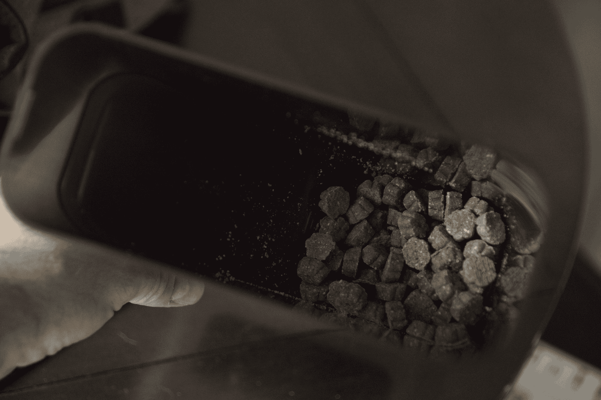
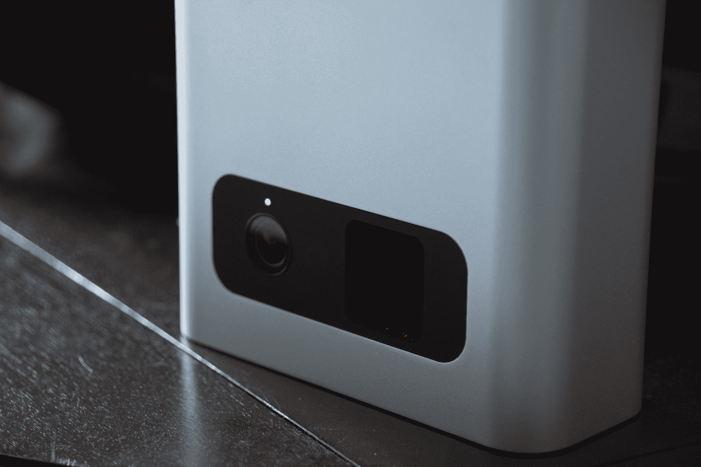
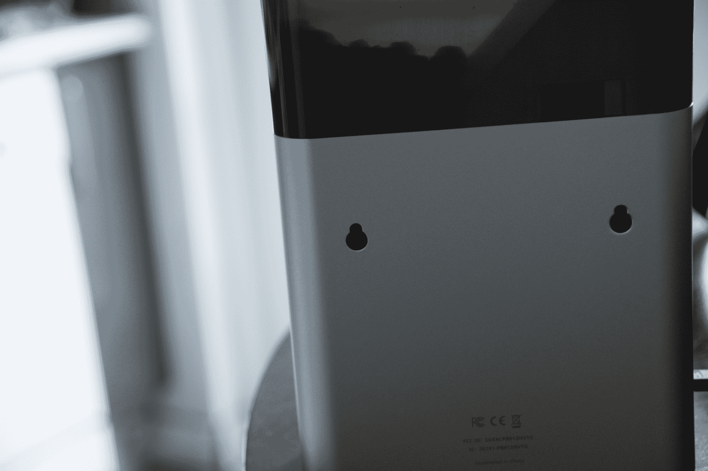

# Petcube 咬治疗配药相机审查

> 原文：<https://web.archive.org/web/https://techcrunch.com/2017/08/26/petcube-bites-is-a-capable-canine-companion-for-when-youre-not-home/>

我认为这是一种表达方式，让你的狗更亲近，但让你的猫更亲近。也许吧。不管是什么，宠物对人很重要。由于 Wi-Fi 联网摄像头等技术的广泛普及，即使你不在同一个地方，也可以密切监视他们。Petcube Bites 是其中的一种相机，但它也是一种零食分配器，只要你有活跃的互联网连接，你就可以在家里为你的宠物发射零食。

公平的警告:这是一个比你的普通 Nest 或罗技智能家用相机大得多的单元。它的大小大致相当于一部大型百科全书，或者几台 Mac minis 站在它们的薄边上堆叠在一起。然而，这个尺寸是实用的，因为它有一个相当大的蓄水池，用于存放你的零食，还有一个高清摄像头，一个 Wi-Fi 收音机和一个实际发射这些零食的机制，用户可选择的范围约为 6 英尺。

【T2

Petcube Bites 附带精选的全天然零食，因此您可以立即开始使用。当谈到她吃什么的时候，我的狗不是很有辨别能力(前几天她吃了半个比萨饼盒子)，但是我可以说她很高兴地把这些吃了下去。

如果你以前安装过任何类型的 Wi-Fi 摄像头或连接的家庭设备，设置 Pectcube Bites 很容易——即使你没有安装过，也不会有任何问题。它基本上包括使用你为 iOS 或 Android 智能手机下载的应用程序将设备连接到你的 Wi-Fi 网络。

一旦连接上，咬的东西就会出现在应用程序中，你可以连接到它来查看摄像头的实时反馈，并做其他事情，包括在你想与你的宠物“交谈”时启动双向语音对话。当然，你也可以触发分发零食，这就是 Bites 与更基本的双向连接家用摄像机的不同之处。

使用这款应用程序，你只需在智能手机屏幕上轻轻一点，就可以开始享受美食了。还是那句话，你可以设置距离，和之后。几秒钟后，食物会落入托盘，然后被踢出房间。我发现这和设计的相当一致，虽然偶尔会分发两份而不是一份，这不是一个大问题，可能会被我的狗描述为一个功能，而不是一个错误。您还可以调整份量，甚至可以设定一个分配时间表，如果您希望它们在预先设定的时间释放。

我的狗很快就意识到，机器里的小马达发出的呼呼声意味着有好吃的要来了，所以几乎每次我送一个给它时，它都会出现在食物准备好之前的画面里。当你不得不离开家的时候，和你的宠物一起玩是多么有趣啊。

Petcube Bites 除了提供宠物零食外，还有一些不错的功能。它具有运动检测功能，可以向您的设备推送通知(如果您愿意，可以将其关闭)。与价格相对低廉的专用家庭安全摄像头相比，视频质量一点也不差。如果你有一只宠物，并且你已经在考虑一个 Wi-Fi 摄像头，从性价比的角度来看，这可能是一个更好的选择。

Petcube Bites 的其他优点包括多种安装选项-您可以使用橡胶底座将其放在平坦的表面上，或者使用背面预先钻好的孔将其简单地插入墙壁中的安装螺钉。再说一次，它很大，所以对于任何关心它是否适合(或不适合)家居装饰的人来说，拥有如何使用它的选项是一个很好的好处。

Petcube Bites 现在有三种颜色可供选择，售价 229.99 美元。其他功能，包括历史云视频存储，可作为额外付费月计划的一部分。