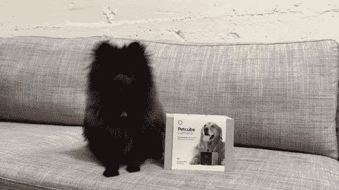
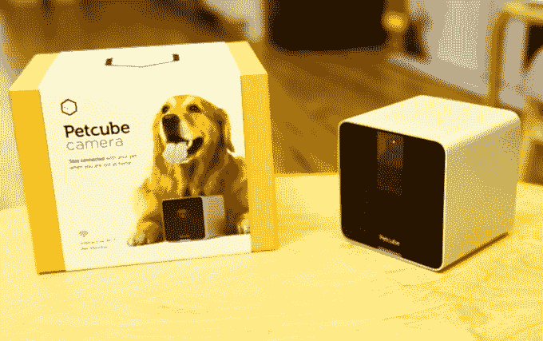
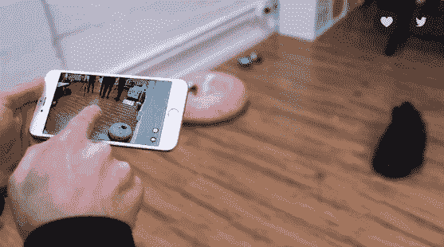
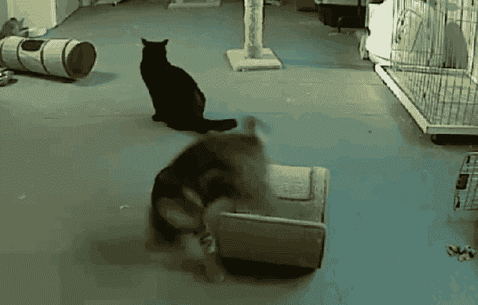

# Petcube 筹集了 260 万美元，因此您可以在任何地方娱乐您的宠物

> 原文：<https://web.archive.org/web/https://techcrunch.com/2016/02/03/petcube-scoops-up-2-6-million-so-you-can-entertain-your-pet-from-anywhere/>

Petcube 是 Y Combinator 2016 年冬季班的一部分，是一家年轻的初创公司，希望将宠物护理和联网家庭结合在一起，以改善我们宠物的生活。为此，该公司已经为他们的第一款产品 [Petcube 相机](https://web.archive.org/web/20230323125835/https://petcube.com/)筹集了 260 万美元。

这轮融资来自 Almaz Capital、Y Combinator 和 AVentures Capital，迄今为止 Petcube 的总融资额为 380 万美元。

售价 199 美元的 Petcube 摄像头不是普通的家庭监控设备。它可以连接到您的家庭 Wi-Fi，并使您能够通过内置的应用程序控制的激光玩具远程娱乐您无聊的宠物。(Petcube 的网站详细说明了 5mW 3R 级激光是经过认证的，对宠物是安全的。)

广角摄像头传输高清 720p 视频，因此您可以实时观看您的宠物猛扑和翻滚。内置麦克风和扬声器让你的宠物听到你的爱。

任何养宠物的人都会有这样一种懊悔的感觉，当你出去一天的时候，把你的宠物留在了身后。所以很自然地，我们想知道当我们不在的时候，我们毛茸茸的朋友在做什么。Petcube 的创意来自于联合创始人亚历克斯·内斯金，他的小狗洛基在被单独留下时患有分离焦虑症和无聊症。要是有一种方法能整天和他的小狗保持联系就好了。因此，Petcube 诞生了，首席执行官雅罗斯拉夫·阿日纽克和 CEO 安德烈·克伦加入进来，将这个想法付诸实践。

Petcube 的人有一个内部说法，宠物产品应该像人类产品一样精心设计和精心呵护。自 2013 年作为 HAXLR8R 硬件加速器的一部分问世以来，这一口号已经让三人组走过了漫长的道路。

同样值得注意的是，Petcube 在 Kickstarter 上非常成功地推出了 Petcube 相机。该活动从热切的买家那里筹集了 25 万美元，超过了 10 万美元的目标，巩固了许多宠物主人希望整天与宠物保持联系的观念。Petcube 的联合创始人兼首席执行官亚尔·阿日纽克(Yar Azhnyuk)表示，新的资金将用于扩大分销，并继续开发更多专注于宠物的产品，他说这些产品已经在开发中。

就竞争而言，宠物科技领域正在发展。还有[活动追踪器](https://web.archive.org/web/20230323125835/https://techcrunch.com/2015/01/29/fitbit-for-dogs-maker-whistle-acquires-tagg-pet-tracker-and-raises-15m/)、[智能食物分配器](https://web.archive.org/web/20230323125835/https://techcrunch.com/2014/01/21/petnet-raises-1-125m-to-make-a-smart-food-dispenser-for-your-furry-friends/)，甚至[智能垃圾盒](https://web.archive.org/web/20230323125835/https://techcrunch.com/2014/11/12/tailio-smart-litter-box/)。Azhnyuk 指出，为我们的动物制造的许多其他产品都处于非常早期的开发阶段。Petcube 表示，他们看到宠物主人使用其他类型的技术来娱乐他们的宠物，例如离开时让电视开着，或者使用家庭监控摄像头来监视他们的动物。

但是这些解决方案不能像 Petcube 相机那样提供与动物互动的能力。

不养宠物？你仍然可以在 Petcube 应用程序的[探索部分与其他动物玩耍。美国大约有 30 个宠物收容所安装了 Petcube 摄像头，允许 Petcube 社区从远处了解收容所的宠物，并有望创造一些收养匹配。](https://web.archive.org/web/20230323125835/https://petcube.com/mobile-app/)

你可以在 Petcube、亚马逊、Brookstone、百思买和 Fryes 上购买 199 美元的 Petcube 相机。

