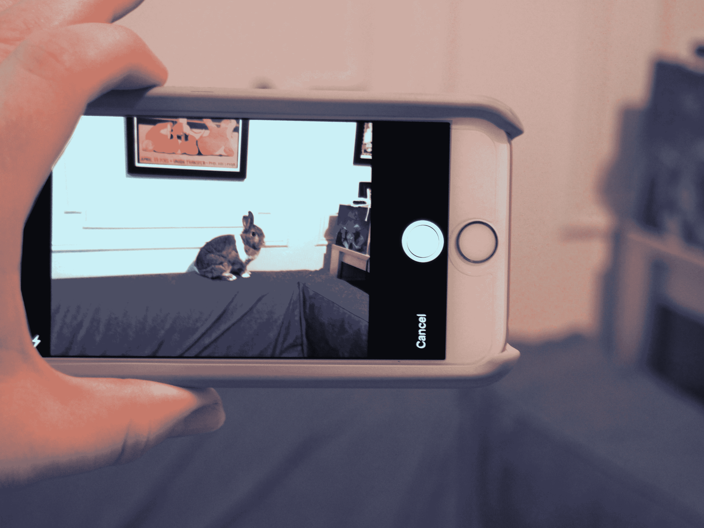
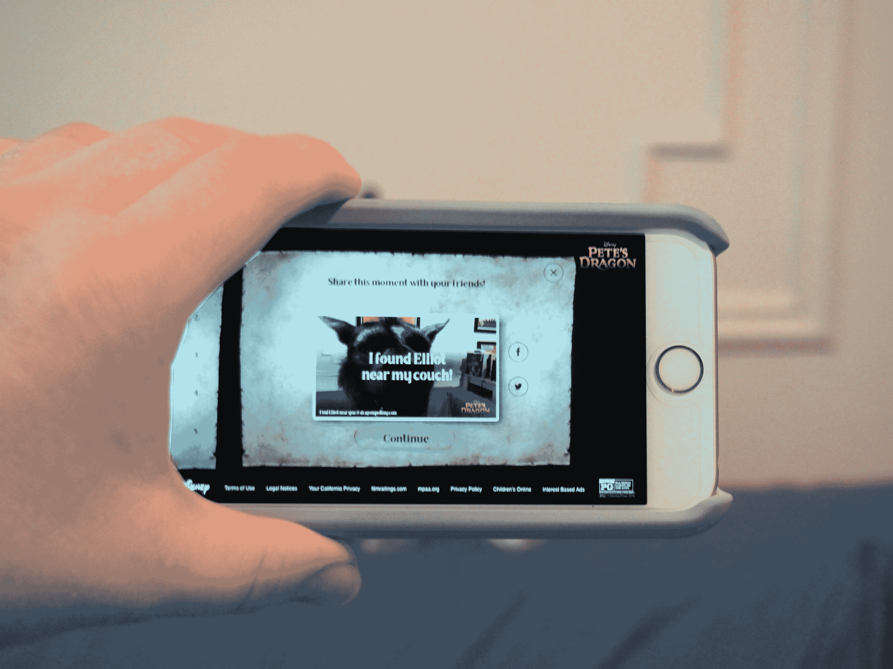

# 迪士尼为一款名为“皮特之龙”的增强现实手机游戏 TechCrunch 征集谷歌云的愿景

> 原文：<https://web.archive.org/web/https://techcrunch.com/2016/08/11/petekemon-drago/>

# 迪士尼将谷歌云的愿景用于一款名为“皮特之龙”的手机游戏

这不是 Pokemon Go，但它仍然很迷人，使用谷歌的云视觉为你的附近添加一点 CGI 龙的魔力。《看龙》(Dragon Spotting)游戏是免费的，可以通过一个移动浏览器访问，该浏览器旨在推广迪士尼即将推出的《T2》皮特之龙的翻拍版。

该页面通过一系列古怪的动画地图向玩家提供简单的说明。不过，这很简单，让你识别一系列常见的物体——一张桌子、一张沙发、一扇门、云、植物和灌木丛。用户拍一张照片，或者从他们的照片库中使用，然后，嘣，有一条龙，一直藏在显眼的地方。

谷歌的云视觉 API 进行处理，使用该技术来识别照片中的物体。如果它找不到它要找的东西，它会把你送回绘图板。如果你在现实生活中没有找到它想要的东西，只要摇一下手机，它就会移动到下一个对象上。

这些照片很有趣，是对原创的真人动作和手机动画以及 2016 年的 CGI 的小小敬意。一旦拍摄完成，照片就可以通过社交网络共享，推广游戏，并通过代理人推广新电影。这也是一个很好的警示故事。很明显，这个地方一直都爬满了龙。

*经[濒临](https://web.archive.org/web/20221209224536/http://www.theverge.com/2016/8/11/12431696/disney-google-petes-dragon-spotting-ar-mobile-game)T4*