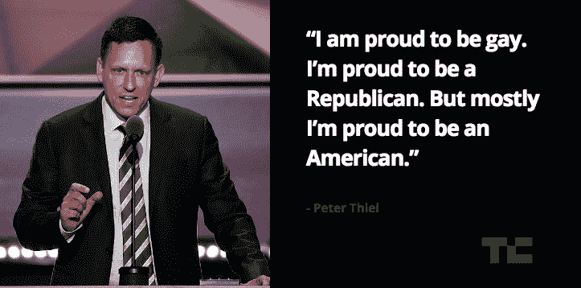

# 拥有新西兰国籍，彼得·泰尔可以平静地观看世界燃烧 

> 原文：<https://web.archive.org/web/https://techcrunch.com/2017/01/26/peter-thiel-new-zealand-citizen/>

在这个不确定的时代，每个人都有第二个国家可以去。就像非营利基金会或闪闪发光的特斯拉一样，第二公民身份是真正科技精英的身份象征。如果你足够富有和有关系，为什么不选择哪个国家的法律和税法适合你呢？此外，如果你的祖国发生危机，你还有一条快速撤离路线。

鉴于他与特朗普政府关系密切，他可能不需要特朗普政府，但彼得·泰尔的处境非常有利，比我们所有人都长寿。我们甚至不是指[人体生长激素](https://web.archive.org/web/20230125205415/https://www.cnet.com/news/peter-thiel-plans-to-live-till-hes-120/)或[令人毛骨悚然的输血](https://web.archive.org/web/20230125205415/http://www.inc.com/jeff-bercovici/peter-thiel-young-blood.html)。可以说，如果美国民主走向失败，泰尔有一个完美的亿万富翁后备计划:新西兰国籍。[海选](https://web.archive.org/web/20230125205415/https://www.wired.com/2015/05/silicon-valley-letting-go-techie-island-fantasies/)到此为止。

《新西兰先驱报》在一篇关于贝宝创始人在该国财产的报道中披露了出生于德国的泰尔是新西兰公民。这篇报道指出，美国公民 Thiel 由于拥有双重新西兰公民身份，根据海外投资法购买一块“敏感土地”并不需要特别许可。2015 年，据报道，泰尔通过第二星公司(Second Star)支付了约 1000 万美元购买瓦纳卡湖的一处地产，该公司将泰尔列为其唯一股东。

海外投资办公室的一位发言人告诉《新西兰先驱报》:“二星和泰尔先生不需要同意，因为他有新西兰国籍。”。

《纽约时报》向新西兰海外投资办公室核实了这一说法:

> 海外投资办公室的女发言人乔安娜·卡尔(Joanna Carr)周三证实，泰尔已经提交了所需的文件。卡尔在一份声明中说，“我们是去年得知泰尔先生的公民身份的。”。

通过正常途径成为新西兰公民并不容易。公民身份要求申请人在过去五年内在该国停留[1350 天，要求每年 240 天。泰尔把他的官方住所列为旧金山，所以他不太可能用这种老式的方式取得资格。相反，泰尔很可能是通过政府的特殊例外获得了公民身份。](https://web.archive.org/web/20230125205415/https://www.dia.govt.nz/diawebsite.nsf/wpg_URL/Services-Citizenship-Become-a-New-Zealand-citizen-Part-2?OpenDocument)

来自新西兰的公民申请

时机可能看起来可疑，但泰尔似乎有足够的先见之明，在 2016 年大选前寻求新西兰公民身份。从硅谷同行中剥离出来，泰尔当然在特朗普的崛起中发挥了积极作用，[向竞选](https://web.archive.org/web/20230125205415/https://techcrunch.com/2016/10/16/peter-thiel-will-donate-1-25m-to-the-trump-campaign-despite-the-latest-controversies/)捐款，在过渡团队工作，现在担任顾问。

具有讽刺意味的是，鉴于其明显的一只脚伸出的状态，泰尔对民粹主义候选人的支持有时会激发出深刻的美国民族主义意识。正如他在共和党全国代表大会的一次演讲中所宣称的:“当然，每个美国人都有独特的身份。我为自己是同性恋而自豪。我为自己是一名共和党人而自豪。但最重要的是，我为自己是美国人而自豪。”

没有泰尔本人的消息，我们无法确定他隐身新西兰的身份是世界末日的预报员还是逃税。或者也许他只是喜欢*指环王*！我们联系了泰尔的发言人来澄清他的动机，如果有消息，我们会及时更新。

泰尔可能是一个自豪的美国人，但他反对他所谓的“没收税”的愿望可以追溯到 2009 年的一篇文章，该文章也抨击“极权主义集体，以及每个人死亡不可避免的意识形态”

那么，新西兰成为超级富豪的著名避税天堂可能不是巧合，这个避税天堂可以减轻那些“没收税”的负担

但是等等，还有更多:

> 我没有绝望，因为我不再相信政治包含了我们世界所有可能的未来。在我们这个时代，**自由意志主义者的伟大任务是找到一种逃避各种形式政治的方式**——从极权主义和原教旨主义的灾难到引导所谓“社会民主”的不假思索的民众
> 
> 关键问题就变成了一种手段，如何不通过政治，而是超越政治。因为在我们的世界里已经没有真正自由的地方了，我怀疑逃避的方式必须包含某种新的、迄今为止从未尝试过的过程，将我们引向某个未被发现的国度。因此，我把我的努力集中在可能创造新的自由空间的新技术上。

泰尔接着将“网络空间”、“外层空间”和“海上登陆”称为三大技术前沿，为一个有缺陷的系统提供了一条出路。

几年后，经历了一场民粹主义运动，他似乎已经在新西兰定居了。