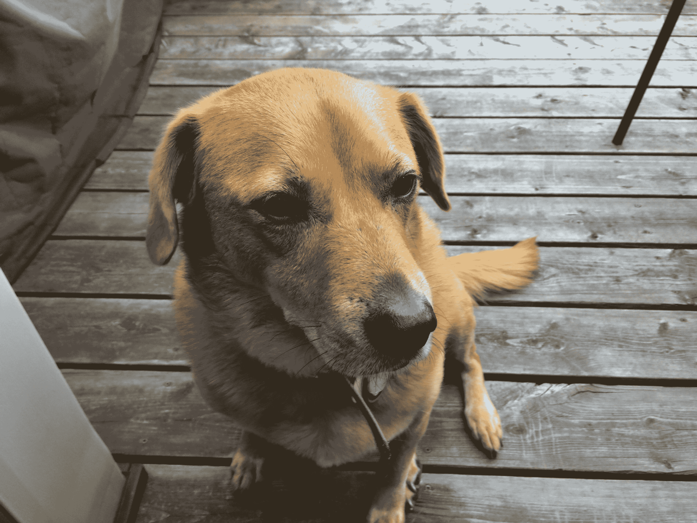

# Petnet 筹集了 1000 万美元，帮助人们为他们的宠物提供更个性化的护理 

> 原文：<https://web.archive.org/web/https://techcrunch.com/2016/08/30/petnet-raises-10m-to-help-people-treat-their-pets-with-more-personalized-care/>

你应该给你的狗喂多少食物？世界各地的宠物主人都曾问过这个问题——在他们的狗或猫的一生中可能会问很多次。这也是宠物科技公司 Petnet 能够获得由战略投资者和合作伙伴 Petco 牵头的新一轮 1000 万美元 A 轮融资的部分原因。

Petnet 成立于 2013 年，希望消除回答这个问题的不确定性，并帮助宠物主人对他们正在帮助他们的小猫或小狗健康饮食这一事实更有信心。数量惊人的宠物没有获得正确的平衡；根据[宠物肥胖预防协会](https://web.archive.org/web/20221206153639/http://www.petobesityprevention.org/2014-pet-obesity-statistics-2/)的统计，美国大约有 53.7%的狗和 57.9%的猫被归类为肥胖。

我自己的狗，如下图所示，身材匀称，体重在它的类型和身高的推荐范围内(我知道这一点，因为我哥哥是兽医)，但即使赔率对我有利，也要花相当长的时间才能算出准确的喂食量。Petnet 的首席执行官兼联合创始人卡洛斯·埃雷拉说，我并不孤单。

Herrera 在一次采访中解释说:“很多人都不知道该给他们的宠物买什么，该给他们的宠物买什么特别的食物，而且在倒食物的时候，他们也不知道该给他们的宠物喂多少。”。“因此，在消费者层面，这就是我们要做的。就是回答这些问题:‘在我的宠物的生命阶段，我需要什么？’因为你对宠物的需求会随着时间而改变。"

因此，Petnet 创建了它的系统，该系统利用兽医批准的信息网络以及本地传感器来帮助消费者确定他们应该给他们的宠物喂什么，以及喂多少和多久喂一次。

现在，部分得益于这笔资金，Petnet 正在扩大其分销和产品线。现有的 Petnet SmartFeeder 现在将在 Petco 零售点和网上销售，此外还有百思买和其他可用的地点，今年在 CES 上推出的新 SmartBowl 将仅通过 Petco 销售。SmartBowl 在用户倒入正确的量时向用户提供通知，但与 SmartFeeder 相比，它保留了更多的喂食过程手册。

这一轮融资的具体目标是帮助他们在全国范围内扩大现有产品线，Petco 分销安排将对此有很大帮助。但 Herrera 指出，这也将有助于他们扩展到喂养以外的宠物护理领域。Herrera 说，该公司的总体目标是提供“个性化的宠物护理体验”，这自然不仅仅包括食物。