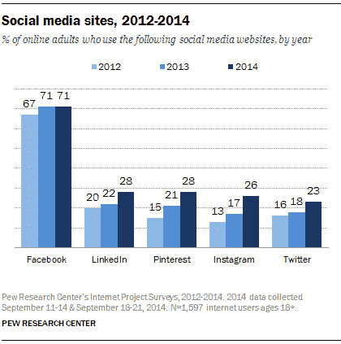

# 皮尤:随着其他用户的增加，脸书用户增长放缓，但仍拥有最多的参与用户

> 原文：<https://web.archive.org/web/https://techcrunch.com/2015/01/09/pew-facebook-user-growth-slowed-as-others-gained-but-still-has-most-engaged-users/>

根据皮尤研究中心今天早上发布的一份新报告，脸书仍然是最受欢迎的社交网络，但其在美国的增长已经放缓。与此同时，报告发现，越来越多的美国人现在使用多个社交媒体网站，使得 Twitter、Instagram、Pinterest 和 LinkedIn 等平台的用户数量在过去一年中都有了显著增加。

一段时间以来，人们一直认为脸书在美国已经达到了“临界质量”，这些新数据进一步支持了这一说法——社交网络仍然是最受欢迎的，但其会员水平与 2013 年相比几乎没有变化。一个例外是“年长”的成年人。

首次有超过一半(56%)的 65 岁及以上的互联网用户使用脸书。是的:奶奶和爷爷现在在脸书。

这让我想起了最近的一篇文章，19 岁的 Andrew Watts 解释了[今天的青少年如何看待今天的社交媒体网站](https://web.archive.org/web/20221006140652/https://medium.com/backchannel/a-teenagers-view-on-social-media-1df945c09ac6)。在信中，他将脸书称为“一个尴尬的家庭晚宴，我们真的不能离开，”并补充说，脸书对青少年来说是“死的”，超出了它的群体功能。他说，总的来说，青少年觉得脸书“古怪又烦人”。在脸书有爸爸妈妈，现在还有祖父母，可能对这没有帮助。

虽然脸书可能已经失去了“酷”的因素，至少根据一份报告，它的用户群仍然非常活跃。71%的美国互联网用户使用脸书，与 2013 年 8 月持平，70%的用户每天使用该网站，高于 2013 年的 63%。45%的人每天与脸书接触几次。

对于只使用一个社交媒体网站的美国网民来说(28%的人使用，低于 36%)，脸书就是其中之一。这个群体中 79%的人将脸书作为他们唯一的社交网络。

## 越来越多的美国网民使用多个社交媒体网站

虽然脸书仍然占据主导地位，但越来越多的美国人正在将他们的活动扩展到其他社交媒体资产。现在，52%的网民使用两个或更多社交媒体网站，高于 2013 年的 42%。

不过，脸书并没有真正失去年轻观众——它只是在其他地方抓住了他们。报告发现，其 Instagram 网络在年轻人中非常受欢迎。Instagram 的整体用户数量增加了 9 个百分点，几乎每个人群都有显著增长。但更重要的是，有史以来，美国大约一半使用互联网的年轻人(18-29 岁)使用 Instagram，其中一半(49%)每天都使用 insta gram。然而，皮尤指出，这与 2013 年相比并没有显著变化。

LinkedIn 的用户数量也在增长，该网站上受过大学教育的互联网用户比例首次达到 50%。Twitter 和 Pinterest 在不同的人群中增长，尽管后者仍然大量迎合女性。42%的在线女性现在使用 Pinterest，相比之下，只有 13%的在线男性使用。

然而，报告称，Pinterest 和 LinkedIn 上的参与度并没有真正增长。17%的 Pinterest 用户每天都会访问这项服务，与 2013 年大致相同。只有 13%的 LinkedIn 用户每天使用其平台，与 2013 年持平。

不幸的是，Twitter 的参与度正在下降。“36%的 Twitter 用户每天都会访问该网站，但这实际上比 2013 年的 46%下降了 10 个百分点，”皮尤指出。Twitter 在美国拥有 mindshare，是排名前五的社交网络，但参与度下降很好地说明了该公司今天面临的一些核心问题:主要是人们仍然很难“理解”，从注册后开始到找到朋友，到理解他们为什么要每天查看 Twitter 网络。

调查中的数据是从针对美国互联网用户的多项调查中收集的。皮尤称，81%的 18 岁及以上的美国人上网。