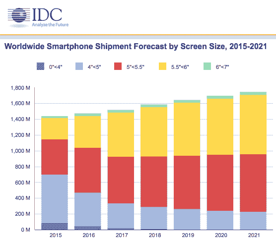

# 智能手机屏幕找到自己的最佳尺寸 

> 原文：<https://web.archive.org/web/https://techcrunch.com/2017/05/31/phables-are-the-phuture/>

过去几年里，智能手机领域的笑话是屏幕变得越来越大——伸出手掌，让你在被举起来说话时看起来很可笑。

时代变了。对着电话说话？为什么，怎么 2005 年的你！随着电话图标在通过手指轻弹触摸屏的乐趣来吸引我们的注意力的战争中失利，平板手机早已成为新的常态，输给了所有其他提供更多视觉娱乐和/或交流方式的应用程序，无论是通过文本、自拍镜头还是愚蠢的 GIF。

苹果是智能手机屏幕尺寸膨胀的落后者，在这种“越大越好”的逻辑中，它仍然是一个不情愿的参与者。它在 2014 年推出了第一款平板手机 5.5 英寸的 iPhone 6 Plus，并在旁边贴了一句话:“比更大更大”，这体现了它备受折磨的组织工作。关于哪一个说得越少越好。

iPhone 制造商不愿意参与拉伸裤子的智能手机热潮，也包括试图逆潮流而动，在 2016 年恢复 4 英寸的 iPhone 因素，并在引擎盖下增加一点重量，也被称为 [iPhone SE](https://web.archive.org/web/20230130100805/https://techcrunch.com/2016/03/21/iphone-se-apple-small-iphone-seo-is-fun/) 。

它继续将这款“最小的 iPhone”与其 4.7 英寸的“标准”旗舰产品和 5.5 英寸的顶级平板手机放在一起。但分析师预测，未来几年对 SE 尺寸智能手机的需求将会下降，因为平板手机将占据越来越大的市场份额。

TL；平板医生现在是智能手机的固定设备。

分析师 [IDC](https://web.archive.org/web/20230130100805/http://www.idc.com/getdoc.jsp?containerId=prUS42628117) 昨天发布了其最新的智能手机市场预测，展望 2021 年，它预计 4 英寸(不到 5 英寸)屏幕的设备出货量将输给更大的屏幕。该公司预计，今年全球将有 3.142 亿部 iPhone SE 尺寸的设备出货，到 2021 年将缩减至 2.233 亿部。

与此同时，预计智能手机市场的绝大部分将几乎被 5 英寸至 5.5 英寸以下的设备和 5.5 英寸至 6 英寸以下的设备平分秋色，预计出货量将分别从今年的 5.933 亿部和 5.587 亿部增长到 2021 年的 7.314 亿部和 7.493 亿部。

这意味着平板手机或接近平板手机领域的手机真的是未来。如果你喜欢的话，也可以用“phuture”(我的同事乔恩·拉塞尔(Jon Russell)用 hattip 来说这句俏皮话)。

与大多数通胀问题一样，随着手机尺寸的膨胀，智能手机和平板电脑之间的界限已经发生了变化——因此，虽然平板电脑过去通常在 5 英寸左右(甚至更小)，但现在更典型的是 5.5 英寸以上。

因此，到 2021 年，它可能会被推得更远一点。

也就是说，IDC 预计最大的智能手机(6 英寸到 7 英寸以下)不会有太大的市场变化。该公司预计今年这一大类的出货量将达到 3200 万，到 2021 年将略微增长至 3740 万。

因此，更有可能的是:智能手机将成为屏幕尺寸在 5 到 6 英寸之间的设备的同义词。而“平板”这个词最终将被保留给少数“高达 7 英寸”的大家伙。

这恰恰表明，如果你是一个听起来很奇怪的词，没有人首先喜欢，那么胜利并不总是像人们所说的那样。

当谈到智能手机显示屏时，尺寸当然很重要，最小的显示屏(小于 4 英寸的显示屏看起来将完全消失)。但是最大也不是最好的——实际上超过 6 英寸，你就有了一个笨拙的大手机和/或一个小的因此不是很有用的平板电脑。这一切都是为了找到基于设备效用的最佳点:即视觉、感官计算与便携性相结合。

在可预见的未来，智能手机屏幕尺寸的最佳位置看起来牢牢固定在 5 到 6 英寸之间。至少在计算范式再次转变之前是这样——某种社会认可的可穿戴设备成功地将所有人的目光从吸引注意力的玻璃板上移开，代之以现实世界的增强远景。至少这是一种理论。

在那之前，我们想要五到六英寸的触摸屏玻璃。