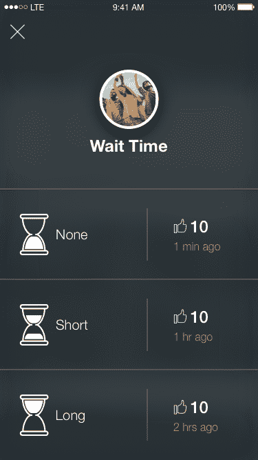

# PHIND 的新应用将帮助你发现地点，看看它们是否热闹 

> 原文：<https://web.archive.org/web/https://techcrunch.com/2016/06/03/phinds-new-app-will-help-you-discover-places-see-if-theyre-buzzing/>

一家名为 [PHIND](https://web.archive.org/web/20221007170114/https://www.phind.it/) 的视觉技术和搜索初创公司在去年 Disrupt NY 的初创公司战地[上亮相，推出了当时被称为“Shazam for places”的应用程序，即一款让你通过拍照了解周围世界的应用程序。大约一年后的今天，PHIND 推出了其生产版本，专注于帮助用户发现新的地方——包括通过浏览和基于文本的搜索——以及通过社区报告功能收集关于这些地方的实时信息，等等。](https://web.archive.org/web/20221007170114/https://beta.techcrunch.com/2015/05/05/dont-search-phind-snap-a-photo-pull-in-all-info-about-a-location-then-book-stuff/)

也许你现在可以称之为“位置的 Waze ”?

虽然这款应用早期的巧妙之处在于它能够[将照片转化为搜索查询](https://web.archive.org/web/20221007170114/https://beta.techcrunch.com/2015/05/05/dont-search-phind-snap-a-photo-pull-in-all-info-about-a-location-then-book-stuff/)，但 PHIND 的联合创始人兼首席执行官 Rishi Jhunjhnuwala 承认，这限制了该应用的覆盖范围。

“我们意识到，我们只是在冲击旅游市场，我们实际上是在搬起石头砸自己的脚，因为我们想进一步扩张，”他解释道。“那时我们包括文本和类别搜索……现在我们包含了更多的旅行规划，”Jhunjhnuwala 说。

随着今天更新、重新设计的版本发布，PHIND 继续沿着这条道路前进，让人们能够从远处寻找新的地方。

虽然拍照搜索功能仍然存在，但新应用程序提供了与 Yelp、OpenTable、Foursquare 和优步等服务的更深入集成，因此你可以立即了解你周围可能想吃、喝或参观的地方。

例如，你可以看到一个地方的 Yelp 星级数，或者查看照片，看看一个地方有多远，甚至可以在应用程序中预订优步。

今天的目标是更好地吸引那些希望用替代方式找到地方的人，而不是使用谷歌搜索或谷歌地图，同时也消除了当你研究一个企业时经常发生的应用程序切换。

“这是一种简化的搜索体验，”Jhunjhnuwala 说。

“有时人们希望在 Yelp 上看到评论，或者在 Foursquare 上看到提示，甚至在维基百科上看到历史，”他解释道。“尽管每个人都认为搜索很简单——人们也认为谷歌已经简化了它——但我们认为它仍然存在问题，可以进一步简化。”

除了改进用户界面，将地点信息放在应用程序的前端和中心，PHIND 现在还在测试社区报告功能，用户可以报告某个地点在那一刻的活动。例如，如果很拥挤或者队伍很长。报告的数量将影响该地点是否在应用程序中显示为“趋势”。

然而，这个想法并不新奇——初创公司已经一次又一次地尝试这样做，包括 [Visor](https://web.archive.org/web/20221007170114/http://www.visor.co/) 、 [WhatsBusy](https://web.archive.org/web/20221007170114/http://www.whatsbusy.com/) 、 [Dash](https://web.archive.org/web/20221007170114/http://ovens.reviewed.com/features/how-busy-is-your-favorite-restaurant-this-app-knows) 、 [Density](https://web.archive.org/web/20221007170114/http://www.density.io/) 、 [SceneTap](https://web.archive.org/web/20221007170114/https://www.crunchbase.com/organization/scenetap#/entity) 、 [Placemeter](https://web.archive.org/web/20221007170114/http://www.placemeter.com/) 以及许多其他产品。

挑战在于让人们真正去报道。与 Waze 不同，Waze 的社区数据可以让你避免事故，选择不同的路线，或者不会因超速被抓，很少有人对分享一个地方是否繁忙的信息感兴趣。冲动不存在了。

[gallery ids="1331732，1331739，1331737，1331736，1331735，1331733"]

更好的解决方案是被动地收集这些数据——正如[谷歌自去年以来一直在做的那样，](https://web.archive.org/web/20221007170114/https://beta.techcrunch.com/2015/07/28/google-search-now-shows-you-when-local-businesses-are-busiest/)由于它从谷歌地图中提取的用户位置数据，它在位置列表旁边以条形图的形式显示繁忙时间。

然而，PHIND 认为它有一个解决方案。它直接与洛杉矶的当地企业主合作，以便在该城市推广该应用程序，而不是试图同时关注所有地方。一旦它在这个市场上出名了，它就会尝试在其他大城市重复这个过程，比如纽约和旧金山。

迄今为止，PHIND 已被下载 30，000 次，据报道每月有 7，000 名用户。然而，这位首席执行官说，重点不是市场营销，而是现在推出的技术改进。

新版本的 PHIND 可以在 iTunes 应用商店免费下载[。](https://web.archive.org/web/20221007170114/https://itunes.apple.com/app/id898016251)

[vimeo 168734030 w=640 h=1138]