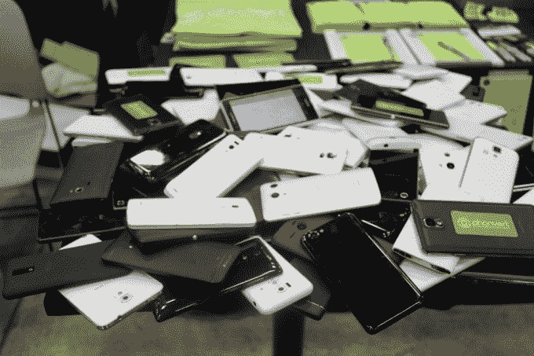

# Phonvert 计划将旧智能手机转化为物联网节点 

> 原文：<https://web.archive.org/web/https://techcrunch.com/2016/03/14/phonvert-has-a-plan-to-convert-old-smartphones-into-iot-nodes/>

# Phonvert 计划将旧智能手机转化为物联网节点

随着人类每年创造越来越多的智能手机，一年或两年的智能手机无意中出现了过剩，功能仍然强大，但不太理想，让位于新型号。虽然这些退役的智能手机中有许多仍在工作，并有可用的传感器，如相机、加速度计、触摸屏和蓝牙无线电，但其中的大部分仍未使用，甚至更糟的是，最终被扔进了垃圾填埋场。

在 [SXSW 2016](https://web.archive.org/web/20221209104550/http://sxsw.com/) 上，我与 [Phonvert](https://web.archive.org/web/20221209104550/https://phonvert.com/) 项目的负责人 Tomo Kihara 进行了交谈，他向我介绍了 IDC 的一项研究，“去年有超过 2.8 亿部可用的智能手机被替换，但没有被回收。”

考虑到这些信息，Tomo 与 Keisuke Shiro、Kosuke Takahashi 和 Seibe Takahashi 一起创建了 Phonvert，这是一个开源软件平台，可以将退役的智能手机转换为可用的物联网节点。

你把 Phonvert 安装到你的旧智能手机上，然后你可以让它再次变得可用和有价值，用于各种任务，比如冰箱摄像头、邮箱摄像头、视频婴儿监视器等等。

【YouTube = https://www . YouTube . com/watch？v = dk2vu 0 _ mXEc & feature = player _ embedded]

值得注意的是，这个位于东京的团队认为自己更像是一场运动，而不是一家初创公司。他们也乐于通过#phonvert 标签在 Twitter 上收集智能手机如何与他们的软件一起重用的新想法。

