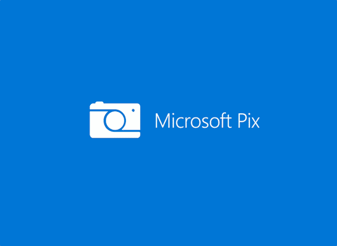

# 微软在其 Pix 应用程序中的 Photosynth 使得在 iOS 上捕捉全景变得很容易

> 原文：<https://web.archive.org/web/https://techcrunch.com/2017/12/20/photosynth-returns-as-a-feature-in-microsofts-pix-camera-app/>

# Photosynth 作为微软 Pix 相机应用的一项功能回归

今年早些时候，微软[关闭了 Photosynth](https://web.archive.org/web/20230307225748/https://blogs.msdn.microsoft.com/photosynth/2017/02/06/microsoft-photosynth-has-been-shut-down/) ，这是一项将多幅图像拼接成全景和半 3D 模型的服务。这项服务在 2008 年推出时，给人留下了极其深刻的印象，但它从未真正流行起来。尽管如此，它还是有它的粉丝——现在微软以一种新功能的形式将它带回了 iOS 的 [Pix 相机应用程序。](https://web.archive.org/web/20230307225748/https://www.microsoft.com/en-us/research/product/microsoftpix/)

此外，Pix 应用程序还获得了一个漫画功能(内部黑客马拉松的结果)，它使用机器学习模型从你的 Pix 时刻捕捉中找到最佳帧，以创建一个基本的漫画。你所需要做的就是添加你的演讲泡泡。

微软指出，新的 Photosynth 功能使用了原始平台背后的一些技术，但它也指出，Pix 中的 Photosynth 现在速度更快，捕捉更流畅。它还利用了内置的 Pix 功能，如自动增强白平衡、色调和清晰度。

“这个想法是在我试图拍摄 Snoqualmie 瀑布时遇到一些挫折后产生的，”微软在华盛顿州雷蒙德市的人工智能和研究组织的首席项目经理乔希·韦斯伯格在今天的声明中说。“我不想必须选择捕捉场景的哪一部分，我想要所有细节。Photosynth 意味着你不再需要选择。我现在可以以一种自然的方式捕捉整个场景。与所有 Pix 功能一样，我们也致力于通过引入更智能的方法来计算曝光和拼接，从而提供最佳的图像质量。”

可悲的是，如果你是 Android 用户，微软没有任何消息可以分享它计划何时(或是否)将 Pix 带到你选择的移动平台上。