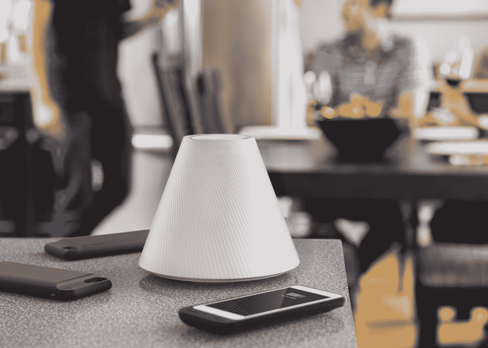

# Pi 希望扩大无线充电的覆盖范围 

> 原文：<https://web.archive.org/web/https://techcrunch.com/2017/09/18/pi-wants-to-extend-the-reach-of-wireless-charging/>

无线充电并不新鲜——但随着新 iPhones 将它作为一项功能，它的可见性将得到巨大提升。

但无线充电仍然非常有限，特别是在充电时你的设备可以在哪里。在很大程度上，“无线充电器”意味着“一个你可以直接把设备放在上面的垫子。”把你的手机从垫子上抬起几厘米，充电就停止了。

今天下午在 TechCrunch Disrupt 战地首次亮相的公司 Pi 想要改变这种情况。它正在建造一种设备——被恰当地命名为 Pi 充电器——他们说这种设备可以在大约一英尺的范围内以任何方向为多种设备充电。这不是其他公司花了多年时间试图解决的全房间充电概念，但它比 pad 提供了更多的灵活性。

该团队表示，他们在这里使用共振感应，或与新 iphone 和许多安卓手机中的 Qi 充电标准相同的基本概念。据联合创始人约翰·麦克唐纳称，他们的秘密武器是一种波束形成算法，可以让他们安全地将磁场导向设备所在的任何地方。

“这个算法的核心是让我们塑造一个磁场，”约翰告诉我。“这是一个古老的想法…但是，这背后真正的天才是我的联合创始人李昕[石]，他能够简化这个如此复杂的问题，以至于你需要在最新的 i7 处理器上花费几分钟的计算时间才能解决。他提出了这些矩阵，可以证明在一个简单的微控制器上，只需两个时钟周期就可以获得最优解。”

该公司在舞台上展示了这项技术，看起来效果不错。他们展示了五台设备(四台手机，一台平板电脑)在进入 Pi 范围时同时充电。

那么为什么是“圆周率”呢？这是向两位创始人的母校麻省理工学院致敬。该校以多种方式庆祝圆周率，包括在圆周率日(3 月 14 日——或 3/14 日)宣布入学；鉴于他们把这个项目从麻省理工学院的一个实验室剥离出来，延续这个传统是有意义的。

该公司始于麻省理工学院的计算机科学和人工智能实验室，也称为 CSAIL。其创始人在一个班级(他们的同龄人和老师推动他们参加的创业班)偶然相遇后，他们决定与学校达成协议，将立信的工作转化为商业项目。

“没有那所学校，我们就不会存在。”约翰说。

该公司迄今已筹集了 350 万美元。

Pi 的团队表示，他们还没有确定充电器的确切价格，但他们预计 2018 年的某个时候这款充电器的价格将低于 200 美元。

## 战场判官问答:

它能充电多远？

任何方向约 12 英寸；上方，向侧面或下方。

**它充电能有多快？**

它因距离而异；就在设备旁边，全速充电。设备离 Pi 越远，速度越慢。

**你们的定价会是多少？**

我们现在还没有确切的定价，但它将远远低于 200 美元，我们将保持 50%以上的毛利润。

你有没有想过做一个可以插入 Google Home 或现有有线设备的组件？

是啊！绝对的。

如何在这里赚大钱？

这在很大程度上与我们能够触及的垂直市场有关。我们从消费者开始，但企业才是我们想要跟进的。如果你在家使用它，你会想要一个在办公室。如果办公室有一个，你会想要一个在会议室。

它能在笔记本电脑上工作吗？

这个不会；这个装置的最大输出功率是 20w。我们可以用不同的成分来增加。

**您是否在为现有设备构建案例？**

是的—为了向后兼容。未来的手机不需要外壳，比如 iPhone 8。