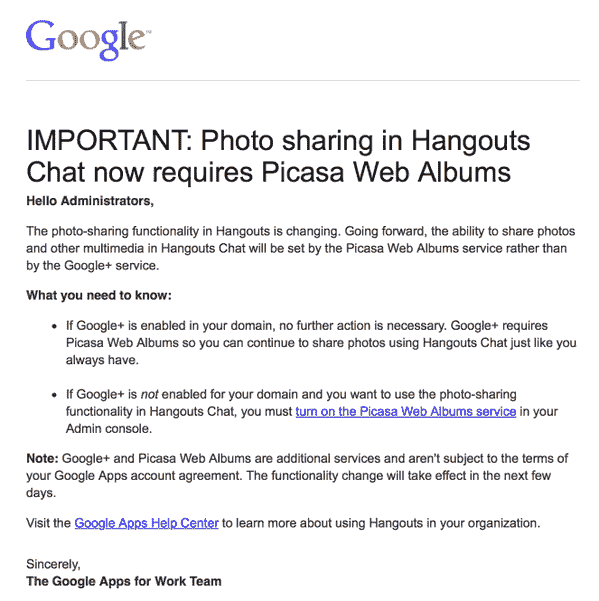

# Picasa 桌面用户被提示转而使用 Google 相册备份技术

> 原文：<https://web.archive.org/web/https://techcrunch.com/2015/07/23/picasa-desktop-users-prompted-to-move-to-google-photos-backup-instead/>

作为向谷歌新的照片托管和共享服务过渡的一部分，谷歌照片(Google Photos)于今年 5 月推出(T3)，谷歌旧的 Picasa 桌面软件的用户现在被提示升级到谷歌照片备份(Google Photos Backup)以将他们的照片保存到谷歌的云存储中。这一变化可能标志着将 Picasa 用户转移到更新的 Google Photos 网络服务的计划的开始。

然而，Google Photos Backup 只是一个桌面上传程序，它不能取代 Picasa 的桌面软件，后者还具有将照片组织到相册、收藏项目或按照片或视频过滤等工具。

一些 Picasa 用户可能在最近通过谷歌软件更新程序进行更新后发现了这一变化，该程序用于更新和修补桌面上 Picasa 的漏洞等。在自动下载更新的发布说明中，谷歌表示 Picasa 的新版本(3.9.140)包括“谷歌照片发布的更新(详情待定)”。

安装此更新后，Picasa 用户下次启动 Picasa 桌面软件时，会被提示下载并安装 Google 相册备份。幸运的是，对于那些仍然喜欢 Picasa 体验的人来说，现在可以通过点击“不，谢谢”按钮来消除提示，这允许你像往常一样继续使用 Picasa。

那些点击“获取 Google 相册备份”的人，会被重定向到 Google 相册网站上的[应用下载页面。从这里，他们可以选择下载以前向 Google 相册用户提供的相同的桌面软件上传工具。该应用程序可以更容易地将存储在您的计算机上或连接的相机和存储卡上的照片和视频上传到 Google 相册在线服务中。](https://web.archive.org/web/20221207011325/https://photos.google.com/apps)

就目前而言，桌面上的 Picasa 看起来不会真的被 Google Photos 桌面应用程序取代*，尽管谷歌最终让 Picasa 寿终正寝的时候到了，这一点当然有争议。这项服务及其配套的应用程序都比较老，在外观和功能上都过时了，而且不包括一些[谷歌照片的更酷的功能](https://web.archive.org/web/20221207011325/https://beta.techcrunch.com/2015/05/28/google-photos-breaks-free-of-google-now-offers-free-unlimited-storage/#.s2agxy:g7qG)，比如自动剪辑助手。*

 *今天的谷歌需要更好地为最终用户巩固其照片体验。在 Google Photos 发布后的几个月里，它仍然通过 Google+ Photos 存储照片，这是其社交网络服务 Google+的照片上传和共享组件。直到本周，该公司才宣布将最终关闭网络、安卓和 iOS 上的 Google+照片。谷歌甚至在声明中承认，提供多种服务“让用户感到困惑”。

[gallery ids="1186622，1186621，1186620，1186619，1186618"]

但是 Google+ Photos 并不是最终用户困惑的唯一来源。该公司多年来也一直坚持使用 Picasa，尽管它推出了 Google+ Photos 等升级版体验。最近，与 Google+ Photos 的关闭相关的是，谷歌向谷歌应用程序管理员发送了一封信，信中说，在 Google+ Photos 关闭后，他们必须允许 Picasa 网络相册继续在谷歌 Hangouts 中共享照片。

坦白说，这太疯狂了。

谷歌混乱的照片策略还包括一个专门的 Chromebook 应用，现在也正在处理中。回到 2013 年夏天，[谷歌在 Chromebook 上推出了 Google+ Photos 应用程序](https://web.archive.org/web/20221207011325/https://beta.techcrunch.com/2013/06/25/google-launches-google-photos-app-for-chromebook-pixel-coming-soon-to-other-chrome-os-devices/)，但根据 Chrome 网络商店页面和谷歌支持网站上的一个常见问题的说明，该应用程序将于本周[停止使用。(实际上，谷歌表示，自 2015 年 7 月 21 日起，它不再有效)。Chromebook 应用程序的用户被要求搬到 photos.google.com。](https://web.archive.org/web/20221207011325/https://chrome.google.com/webstore/detail/google%20-photos/efjnaogkjbogokcnohkmnjdojkikgobo)

当然，Picasa 品牌仍然受到很多人的喜爱，它在主流用户群中拥有稳固的知名度，这可以解释为什么谷歌在强制过渡到谷歌照片上犹豫不决。

但在某些时候，花费资源来维护一个过时和老化的服务是没有意义的，它复制了谷歌旗舰产品谷歌照片的许多功能。尽管可能会遭到 Picasa 用户的强烈反对，但谷歌是时候咬紧牙关，永远关闭 Picasa 了。毕竟，公司关闭用户喜欢的服务没有问题，对吗？

***更新:**据谷歌发言人表示，“这只是为了向 Picasa 用户表明，他们可以将自己所有的照片和视频备份到谷歌照片中。”他们补充说:“Picasa 仍然是谷歌全部照片服务的一部分。”**