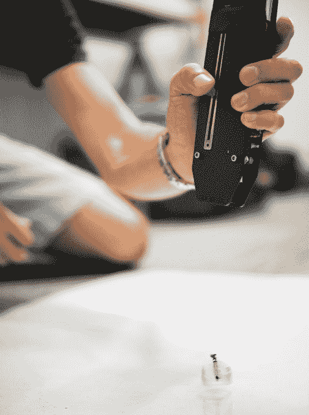

# Piccolissimo 加入超微型飞行机器人的行列 

> 原文：<https://web.archive.org/web/https://techcrunch.com/2016/10/31/piccolissimo-joins-the-ranks-of-ultra-tiny-flying-robots/>

像 Spot 这样的大型机器人可能非常适合搬运东西或快步走上舞台，但同样复杂的工程技术也可以用来创造小型机器人——宾夕法尼亚大学的这个小飞行器是迄今为止最小的一个。

它被称为 Piccolissimo，在意大利语中是最小的意思，也是对创造者马特·皮考利名字的一种戏谑——虽然它实际上不是世界上最小的飞行机器人，但佩恩确实声称它是世界上最小的*自我供电、可控的*飞行机器人。其他的更小，但是要么不能被操纵，要么(像[机器人](https://web.archive.org/web/20221025223759/https://beta.techcrunch.com/2015/10/05/the-robobee-can-now-swim/))是有线供电的。

 大约四分之一的宽度，Piccolissimo 只有两个移动部件，比我们本月早些时候看到的 [ballbot](https://web.archive.org/web/20221025223759/https://beta.techcrunch.com/2016/10/05/this-ballbot-is-like-a-real-life-bb-8/) 多了一个。一个是螺旋桨，另一个是 3D 打印体:两者都在旋转，但速度不同。螺旋桨稍微偏离中心，机体每秒钟旋转 40 次，使推力保持垂直——但对旋转速度的微小改变可以使它向一个方向或另一个方向移动。这一切都是由一个简单的红外线信号控制的。

目前它只是徘徊，但功能很容易添加。

皮考利在宾夕法尼亚大学的新闻发布会上解释说:“旋转车辆载人很糟糕，但携带传感器却很棒。”。“常见的做法是制作一个简单的传感器，然后旋转它，就像机场的雷达天线一样。我们免费获得这一功能，所以我们可以带一个线扫描相机，就像条形码阅读器一样，把它放在车身上，然后获得 360 度全景。”

很容易添加，至少假设你可以将添加量保持在一克以下——这是这个小型平台上当前的有效载荷限制。

制造超小、超简单设备的原因有很多。简单往往意味着高效、廉价，甚至是一次性的——这不仅对消费应用有利，对任何地方都有利。派遣一个价值百万美元的人形机器人去调查，比如说，辐射泄漏或受损的建筑，这是一个重大决定。如果失败，不仅代价昂贵，而且机器人的复杂性意味着它可能像人一样容易受到辐射、灰尘和其他障碍的影响。

另一方面，一群 100 个 Piccolissimos 协调成一个小组，装备有照相机、辐射传感器和加速度计(一人一个)可以快速廉价地侦察一个地区，如果他们不能生存，那么，你可以再印一百个。