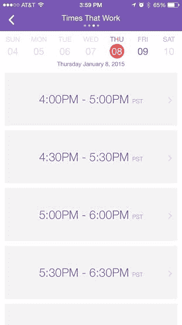
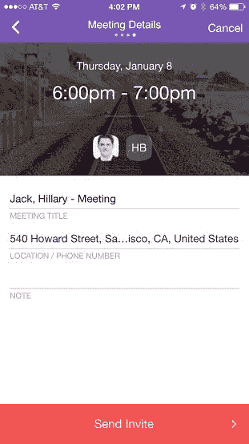

# Pick 旨在消除为每个人寻找会议时间的挫败感

> 原文：<https://web.archive.org/web/http://techcrunch.com/2015/01/09/pick-aims-to-take-the-frustration-out-of-finding-a-meeting-time-for-everyone/>

# Pick 旨在消除为每个人寻找会议时间的挫折感

Pick 是一款桌面和 iOS 应用程序，旨在帮助你找到一群人开会的时间。它不会给每个人发一封随机时间的电子邮件，希望其中一个行得通，而是从你所有的日历中收集信息，并确定每个人什么时候有时间聚在一起。

这款应用几天前在[应用商店](https://web.archive.org/web/20230316033353/https://itunes.apple.com/us/app/pick-find-time/id938525242?mt=8)悄悄推出，没有多少粉丝。它目前在 [App Annie](https://web.archive.org/web/20230316033353/http://www.appannie.com/apps/ios/app/pick-find-time/rank-history/#vtype=day&countries=US&start=2015-01-07&end=2015-01-09&view=rank&lm=1) 上的生产力排名第 856 位。然而，它很快被发现并发布在产品搜索上。它昨天在那里冲击了第一名。

虚拟调度器在过去的一年里蓬勃发展。X.ai 的虚拟助手“艾米”于去年五月发布，T2 现在拥有 4000 万美元的估值。x.ai 和 Clara 都通过在你的电子邮件中抄送机器助手来帮助你安排与他人见面的时间。你提前告诉[日历](https://web.archive.org/web/20230316033353/https://calendly.com/)你喜欢哪个会议时间。Zirtual 提供了一个真正的助手来帮助你安排日程等等，但是每个月花上他们几个小时的时间你就得花几百美元。

大多数机器助手都是免费提供的。Pick 的联合创始人 Ryan Mindigo 暗示将会有一个企业版，在某个时候会有点贵。

Mindigo 表示，这项服务的应用程序部分是他的日程安排助手与众不同的地方。“你必须记得把你的邮件抄送给助手和其他人。谁想这么做？”他问。

Mindigo 和他的联合创始人 Michael Selepec 在 Yammer 的销售部门工作时产生了这个想法。“因为 Yammer 是一个如此大的收购，我们的收件箱被招聘人员要求见面的邮件淹没了，”Mindigo 在最近宣布推出的博客文章中写道。

在 Yammer 的早期，也就是在微软之前，两人一起创业。他们最初的想法是使用这个工具来安排销售拜访。“虽然任何使用数字日历的人都可以使用 Pick，但我们认为我们的许多早期采用者将是销售专业人士，”Selpec 在 Product Hunt 上写道。

Mindigo 和 Selpec 已经知道有很多选择，包括雇佣一个真正的助理。但是助理是要花钱的。他们也认为免费或廉价的解决方案不够好。明迪戈说:“现在，你可以在 15 秒内用手机发送一个基于双方可用性的日历邀请，而不是一周交换一次短信。”

虽然企业销售是目标市场，但 Pick 计划追求更广泛的受众，并整合 Outlook、谷歌日历和 iCloud 上的 10 亿多用户。

到目前为止，Pick 是一项非常困难的工作。然而，Mindigo 提到，它可能会在不久的将来寻求融资。他开玩笑说，Pick 也可以帮助你管理未来的人际关系。