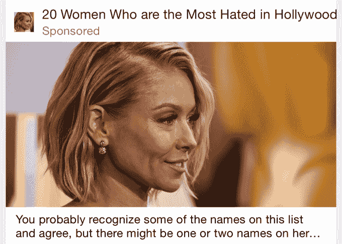

# PicsArt 筹集 1500 万美元建立一个照片编辑社区

> 原文：<https://web.archive.org/web/https://techcrunch.com/2015/06/04/picsart-raises-15m-to-build-a-community-around-photo-editing/>

# PicsArt 筹集 1500 万美元建立一个照片编辑社区

图片分享服务公司 PicsArt 正在围绕创造性地编辑图片建立一个社区，它已经在由 Insight Venture Partners 牵头的一轮风险投资中筹集了 1500 万美元，红杉资本也参与了投资。

像[视觉供应公司](https://web.archive.org/web/20230321004430/http://vsco.co/)和 [EyeEm](https://web.archive.org/web/20230321004430/https://www.eyeem.com/) 一样，PicsArt 要求投资者投资，因为它有能力让用户分享和参与他们移动设备上的艺术。在最近的一次聊天中，PicsArt 首席业务发展官 Wilson Kriegel 告诉 TechCrunch，“我们提供单一的价值主张，以简单的方式支持所有的创意。我们带来了一套工具和一个围绕它的社区，而不是单一的功能。”

这种关注关系到创业公司如何赚钱和组织其社区。例如，该公司赚钱的一种方式是向品牌和创意机构收取费用，让他们围绕特定主题或使用特定工具开展竞赛(如果他们需要使用应用内购买的工具，这可以带来二次收入)。

Kriegel 表示，PicsArt 的主 feed 还充当了一个发现引擎，使其成为应用安装广告和赞助内容的成熟平台。正是在这里，PicsArt 基于标签的定位的局限性变得显而易见。当我浏览我的 PicsArt feed 时，我没有看到我可能喜欢的电影或可能符合我兴趣的应用程序的广告，而是看到了各种各样的广告，从糟糕的 clickbait(像一些博客底部的“围绕网络”广告)…

…像这样的总链接:

PicsArt 最初在 Android 上推出，其 6500 万用户中有 80%仍在谷歌的操作系统上。但 Kriegel 表示，这家初创公司正在投资 iOS 的增长，该公司大约有 100 人在 R&D、后端和产品工程岗位上工作。

Leena Rao [首先在《财富》杂志上报道了这轮融资，指出该融资对 PicsArt 的估值约为 2.5 亿美元。虽然他能够向 TechCrunch 证实这轮融资的规模，但 Kriegel 拒绝对这家初创公司的当前估值发表评论。](https://web.archive.org/web/20230321004430/http://fortune.com/2015/04/13/picsart-raises-15-million/)