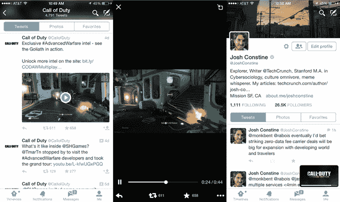
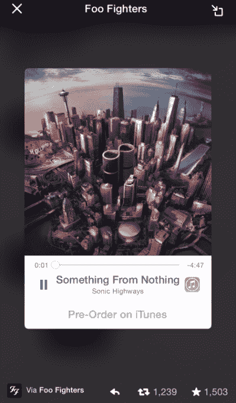

# Twitter 变成了它自己的第二个屏幕，当你浏览 TechCrunch 时可以播放可停靠的视频

> 原文：<https://web.archive.org/web/https://techcrunch.com/2014/10/27/picture-in-twitter/>

# Twitter 变成了它自己的第二个屏幕，当你浏览的时候可以播放可停靠的视频

你可以称之为推特图片。上周，Twitter 推出了其[可对接声卡](https://web.archive.org/web/20221207004824/https://beta.techcrunch.com/2014/10/17/music-in-twitter-not-twitter-music/)，类似的功能也出现在视频中，这样你就可以在 iOS 和 Android 上浏览 Twitter 时继续观看视频片段。正如我发现的一条[使命召唤推文](https://web.archive.org/web/20221207004824/https://twitter.com/callofduty/status/525681314200944641)所展示的那样，Twitter Player 卡可以让你全屏观看视频，或者点击将其停靠在屏幕底部，这样当你在 Twitter 应用上冲浪时，它可以继续播放。

通过减少视频的干扰，Twitter 可以鼓励用户观看自己制作的视频片段和视频广告。总有一天，可停靠视频可以让你在 Twitter 应用程序中观看并在第二屏幕上发布内容。

[ Twitter 的声卡](https://web.archive.org/web/20221207004824/https://blog.twitter.com/2014/introducing-a-new-audio-experience-on-twitter)上周与 SoundCloud 和 iTunes 合作推出，让你在导航应用时[可以从对接的播放器上听音乐。这有效地让你为你的 Twitter 会话创建一个配乐，或者在阅读其他推文时发现新的音乐。](https://web.archive.org/web/20221207004824/https://beta.techcrunch.com/2014/10/17/music-in-twitter-not-twitter-music/)

停靠的视频功能让人想起 YouTube 的画中画选项，供您在观看时浏览。我已经联系了 Twitter 了解可对接视频的细节。[更新:[下一个网站](https://web.archive.org/web/20221207004824/http://thenextweb.com/twitter/2014/08/21/twitter-ios-now-lets-watch-videos-minimized-view-browsing-timeline/)在 8 月份写了这种设计的早期版本，但它已经更新为更圆的边缘，更小，更不显眼的对接播放器尺寸。]

当视频在 dock 中播放时，一个白色进度条表示剪辑还剩多长时间，如果您要撰写推文，音频会继续播放。显卡不像声卡那样优雅，因为你肯定无法从屏幕角落里的一个微型视频播放器中获得完整的体验。

不过，可对接的视频播放器仍然很有用。你可以全屏播放一段简短的视频，比如广告、精彩片段或预告片，然后在结束时将其停靠，以便继续收听，或者确保你不会错过结尾的任何精彩内容。如果小播放器中的某个内容引起了您的兴趣，您可以轻按它以将其带回全屏幕。

更大的机会可能是长形式的视频。想象一下，当您阅读并发布关于赛事的推文时，会看到体育比赛或颁奖典礼的视频。推特长期以来被视为电视的伙伴。但是，通过抛弃电视机并整合其视频内容，推特可能是你走向全球水冷器的唯一屏幕。