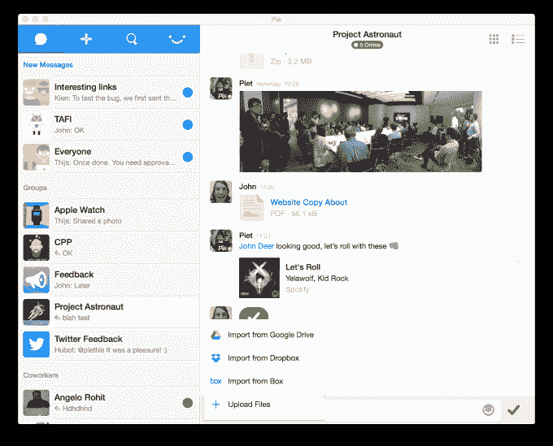

# Pie 为其面向非技术人员的企业消息服务 TechCrunch 吃掉了 120 万美元

> 原文：<https://web.archive.org/web/https://techcrunch.com/2015/06/04/pie-1-2-million-in-fresh-funding/>

[Pie](https://web.archive.org/web/20221005132647/https://www.pie.co/) ，总部位于新加坡的“normals”企业消息服务[去年夏天我们介绍过的](https://web.archive.org/web/20221005132647/https://beta.techcrunch.com/2014/06/10/with-800000-in-seed-funding-pie-wants-to-take-a-slice-of-the-enterprise-collaboration-market/)，已经筹集了 120 万美元的 A 轮融资，准备将其服务货币化。

新出炉的资金由日本游戏制造商 GREE Ventures 的投资部门牵头，该公司在东南亚尤其活跃。现有投资者 Koh Boon Hwee、Wavemaker Partners、Dennis Goh 和 YSS 资本的 Ivan Yeo——来自该公司 80 万美元的种子轮——也参与了进来。

Pie 是一项为团队提供的消息服务，其应用程序跨越了 [iOS](https://web.archive.org/web/20221005132647/https://itunes.apple.com/us/app/pie/id615176201?mt=8&uo=4) 、 [Android](https://web.archive.org/web/20221005132647/https://play.google.com/store/apps/details?id=com.piethis.pieandroid) 、 [Mac](https://web.archive.org/web/20221005132647/https://itunes.apple.com/us/app/pie/id854372667) 和[web](https://web.archive.org/web/20221005132647/https://app.pie.co/)，并与 Dropbox、Google Drive、box 和其他应用程序集成。很像 Slack 的简化版。保持简单是其创始人荷兰创始人 Pieter Walraven ( [一个了解他的消息应用](https://web.archive.org/web/20221005132647/https://twitter.com/jonrussell/status/595066799739183106)的人)和 Thijs Jacobs 非常谨慎和持续的决定。

“人们喜欢 Pie，因为它的设计没有什么特别之处，比如没有开发人员关注的花哨功能。Walraven 解释说:“我们的目标受众是其他企业聊天玩家服务不足的人群，例如，‘不阅读 TechCrunch 的人’”。

Pie 最初是一个类似 Pinterest 的“迷你聊天”服务，但去年年底它改变了方向，完全专注于成为一个面向团队的轻量级通信应用。Walraven 告诉 TechCrunch，在没有付费推广的情况下，该应用程序正在被 2000 多家公司使用，从营销、广告和出版等明显的垂直行业到包括花店、制造厂、大学甚至教堂在内的不太可能的客户。他补充说，每月有超过 30%的注册用户活跃。

早期的食物被狼吞虎咽地吃光了，是时候把这种馅饼变成一门生意了。有了新的资金，该公司正准备推出这款应用的付费版本，其中将包括管理员控制，每个用户每月的费用为 3.14159 美元。我们不确定这个笑话是否会被非技术人员理解，但我们还是很欣赏它。

Walraven 告诉我们，该公司最初将重点放在日本。付费企业软件在日本有很大的市场空间——GutHub 刚刚在东京开设了一个办事处，开始类似的推广——他说格力是打开大门的理想合作伙伴。现有投资者 Digital Garage 也是帮助海外公司登陆日本的老手，曾与 Twitter 和 Kiip 等公司合作。

该团队将继续驻扎在新加坡，并将增加员工人数(目前为 10 人)，以开发其应用程序并推动服务向前发展。

格力创投(GREE Ventures)的负责人许宽华(Kuanhua Hsu)认为，馅饼击中了一个甜蜜点:

> 我们非常高兴能投资 Pie，因为我们对该团队的实力以及他们对移动通信和协作的愿景印象深刻。当然，消息传递是一个仍在发展的大趋势，特别是在企业方面，我们认为 Pie 团队正在应对一个市场，特别是中小企业，即介于 WhatsApp 等消费者应用程序和 Slack 等较重的企业软件之间的市场。

Pie 是 Apple Watch [的发布合作伙伴](https://web.archive.org/web/20221005132647/https://itunes.apple.com/us/app/pie-chat-for-work/id615176201?mt=8)，它仍在最终确定其货币化计划，但 Walvaren 表示，它将使用经销商模式，而不是雇佣潜在的昂贵的内部销售团队。

“日本市场真的成熟了，”他补充道。“这是一个高 GDP 市场，有其独特的分销挑战，但这很有吸引力，因为除了几个前代玩家之外，很少有竞争对手。”

Pie 目前超过一半的用户群在美国，但该公司并没有放弃美国。Walvaren 表示，它可能会及时在圣方济各开设一个小办事处，但目前它将在很大程度上依赖持续的口碑和病毒式传播来吸引美国的新客户，包括付费和非付费客户。

Pie 团队实际上在最近的美国之行中遇到了 Slack..Walraven 说，双方就信息和未来计划进行了积极和非常开放的交流。

“尽管如此，我们正处于一个不同的懈怠领域，”他说。

从一个有前途的年轻产品到一个有盈利能力的企业很难，但 Walvaren 认为 Slack 开辟的道路表明，合适的通讯应用程序可以为技术含量较低的受众工作。Slack 已经从技术人员开始，看起来它将从那里进入新的垂直领域，而 Pie 的服务——尽管具有许多美学和文化相似性——来自不同的角度。