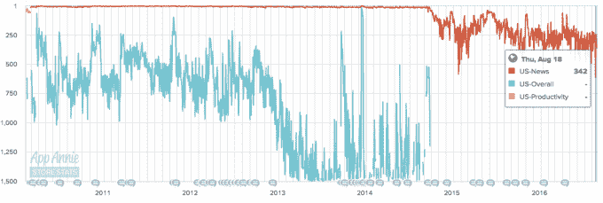

# Pinterest 收购 Instapaper，Instapaper 将作为独立应用 TechCrunch 继续存在

> 原文：<https://web.archive.org/web/https://techcrunch.com/2016/08/23/pinterest-acquires-instapaper-which-will-live-on-as-a-separate-app/>

Pinterest 今天表示，[将收购 Instapaper](https://web.archive.org/web/20221208095331/http://blog.instapaper.com/post/149374303661) 背后的团队，该团队将继续作为一个独立的应用程序运营。 [Instapaper](https://web.archive.org/web/20221208095331/http://instapaper.com/) 团队将致力于核心的 Pinterest 体验和更新 Instapaper。

Pinterest 的逻辑是，该公司的核心原则之一是书签——这很像 Instapaper 的应用程序的主要目标。过去几个月，该公司一直在大举收购。7 月，Pinterest [收购了 Highlight 和 Shorts](https://web.archive.org/web/20221208095331/https://beta.techcrunch.com/2016/07/14/pinterest-acquires-the-team-behind-highlight-and-shorts/) 背后的团队。看起来，就像在某些领域仍然非常受欢迎的其他应用程序一样，Pinterest 将让这个应用程序继续运行下去(至少，直到它结束运行)。

我们很久没有听到 Instapaper 团队的消息了。最后一次重大更新[发生在去年 5 月](https://web.archive.org/web/20221208095331/https://beta.techcrunch.com/2015/03/26/instapaper-6-2-introduces-speed-reading-option/)，虽然该应用一直在稳步前进(随着团队继续在 Pinterest 工作，这种情况还会继续)，但 Instapaper 开创的许多相同功能已经进入了其他核心用户体验。

Instapaper 是最初的“留着以后看”读者之一，他们建立了一种心态，即能够抓住较长形式的内容，而不是简单地跳过或错过。它成为 iPhone 上早期流行的应用程序，在应用商店的新闻类别中排名很高(有时甚至是整个应用商店)。但来自 Pocket 等其他公司的竞争越来越激烈，这让事情变得棘手。

因此，总的来说，Instapaper 的终结似乎并不那么突然。2013 年，当 Betaworks [收购了这款应用](https://web.archive.org/web/20221208095331/https://beta.techcrunch.com/2013/04/25/betaworks-instapaper/)时，创造者马可·阿蒙(Marco Arment)接过了火炬。第二年，它从最初的付费产品过渡到了更多的免费增值模式。事实是，引入核心功能或用例的应用最终会被核心功能发挥最佳的平台所包含。

自然，这种核心功能背后的人才和技术对于像 Pinterest 这样的公司来说是有价值的。Pinterest 的口头禅(“发现、保存、做”)[中的“保存”部分是字面上的意思](https://web.archive.org/web/20221208095331/https://blog.pinterest.com/en/pinterest-save-button-goes-global)——收集想法并记录在各种图钉板上，以备将来采取行动。将这些想法记录下来给了用户一个理由，让他们定期回到网站来完成他们当时正在完成的事情，但是决定不去做。

在 Pinterest 上保存内容的更好体验的一个自然含义是，给该公司提供以潜在尚不存在的形式转化用户的方法。今天最明显的是购买产品，Pinterest 有工具可以直接在网站上购买。但是 Pinterest 的核心用例正在不断扩展，最近增加的一个是原生视频(以及针对原生视频做广告的能力)。

这里有一个例子:当 Pinterest 开始推出原生视频广告时，广告产品经理 Mike Bidgoli 告诉我，该公司观察到的一个重要用户行为是[用户快速浏览视频，而不是完整观看视频](https://web.archive.org/web/20221208095331/https://beta.techcrunch.com/2016/08/17/pinterest-video-ads/)。保存这些视频以获得更完整的观看体验似乎是 Pinterest 想要完善的一个明显的用户体验，因为这意味着更高的参与度——以及更高的潜在转化用户的可能性，以达到 Pinterest 希望鼓励的行动链中的“做”点。

所有这些对 Pinterest 来说都很重要，原因有二:它吸引的人才越多，它就越能调整和改进它的产品；他们带来的专业团队越多，他们就越能更好地重新想象现有功能在用户行为从设备和行为转向新期望时的样子。

当然，一般的商业逻辑仍然适用:更高的回报率，更高的参与度，更高的转化机会或广告机会，从而带来更多的收入和更多的继续增长空间。如果我们看到 Pinterest 变得越来越有收购欲，这很可能是为了找出如何将现有产品与新想法结合起来，以便找出未来几年这种体验的下一个版本(在这里是“save”)是什么样子。