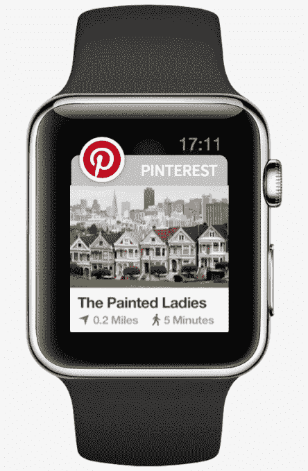
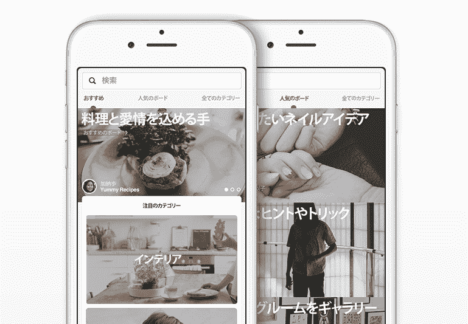

# Pinterest 联合创始人埃文·夏普谈国际抱负、苹果手表、旧金山住房危机等

> 原文：<https://web.archive.org/web/https://techcrunch.com/2015/05/18/pinterest-co-founder-evan-sharp-on-international-ambitions-the-apple-watch-the-sf-housing-crisis-and-more/>

作为关于 Pinterest 的 Jumpstart 计划的一个更大的故事的一部分，我与 Pinterest 的联合创始人埃文·夏普(Evan Sharp)坐下来谈论该公司及其当前的目标。

不过，我们的谈话并不仅限于该公司的国际雄心。我们详细讨论了 Pinterest 的内部结构，他们在寻找什么，以及他们对 Apple Watch 的看法。我也有机会向他询问科技行业和旧金山的现状。

以下是我们谈话的文字记录。

**TechCrunch** :你会如何描述今天的 Pinterest？

Evan Sharp :我们的公共描述，一个可视化的书签工具，容易引起人们的共鸣。这就是我们使用它的原因。当我们与科技媒体交谈时，我们倾向于将其描述为一家解决发现问题的公司。但如果你试图和学习 Pinterest 的人使用这种语言，他们不会明白你在说什么。这就像在人们使用谷歌之前，没有人知道什么是搜索引擎。如果你去市场上说用搜索引擎，你会说，‘那到底是什么？’

TechCrunch :不同平台之间的使用有何不同？

**夏普:**我们喜欢说图钉是物体，它们是数字表示——每一个图钉都是一个链接。“链接”是一种浏览器术语，但我们想说的是，在 Pinterest 上几乎所有有趣和有用的东西背后，是更多的信息，以及你可以(利用这些信息)做的事情。如何处理保存的更改取决于您使用的平台。在大屏幕上，我们看到人们花费更长的会话时间和使用电源功能。在电话上人们也这样做，但是会议更多，时间更短。我们看到人们点击和浏览他们保存的东西。手机实际上只是一种实现人们做他们正在发现的事情的方式，而不仅仅是在我们的数字服务中找到它们。

**TechCrunch:** 苹果手表在这一切中扮演什么角色？

**夏普:**没用过【Apple Watch】；我刚点了一个。我不认为手表会像手机对 Pinterest 那样具有变革性——但是，我可能错了。它只是你用手机做的事情的一种更自然的延伸。事实证明，苹果非常擅长利用我们的技术能力，让它变得有用，并解决人类的问题。我们确实看到了一个趋势，随着我们开发更多的技术，这些设备越来越自然地深入我们的日常生活。手表是它的延伸。人类更自然的做法是看着手腕，而不是拿出手机。

**TechCrunch:**Pinterest 如何看待手表等设备上的新触摸点，比如 force touch？

我认为…我们并不是在焦急地等待下一件事。我希望有一个 skunkworks 团队来思考下一个设备。我们没有全力以赴的原因是，它需要一段时间才能达到任何规模，这对我们的业务非常重要。会有一个自然的点，比如说 iPhone 7 上的 force touch，我们正在考虑 iOS 上的模型。随着 iOS 版本的发布，我们重建了我们的应用程序，我想我们会在下一个版本中这样做。它可能会也可能不会利用这些新的投入。

**TechCrunch** :当你看到日本的团队时，你认为他们最关注的领域是什么？

**夏普:**我们第一次派出了一个团队，他们已经在那里呆了四个星期，所以我们正在弄清楚这一点。对《国际》来说，最大的产品是把你和当地人、当地内容联系起来。即使在英国，当你保存一个食谱时，它也是一个美国食谱，所以对于更可操作的东西，它需要在你生活的任何地方都可用。这是显而易见的，但在我们如何提供推荐方面还有很多事情要做。

就用户界面本身而言，我们还不知道。视觉意象是一种有用的语言。其他应用程序，如中国的 Pinterest 的克隆版(有很多)，它们确实使用不同的用户界面模式。日本和中国的语言更密集。有些微妙的事情我们可能会改变。但我不认为我们会从根本上重新思考这款应用的价值主张——但是，我的意思是，我们可能会改变主意。

**TechCrunch:** 性能如何融入其中？

**夏普:**我们认为速度是一种特性；那是明显的。如果不快，那就没用。没用的。有一个点，它不能变得更快，因为物理定律。我们在国际上已经相当快了。我不认为这能决定我们的成败。这实际上是关于我们在从未听说过它的地方为人们建立意识所做的事情。

TechCrunch: 这方面有哪些例子？

**夏普:**目前我们专注于英国、法国、德国、日本和巴西——巴西是最新的一个。我们真的不知道这个市场有什么独特之处，但我们现在有两个人在那里。不同的国家差别很大。有些国家移动性很强，有些国家互联网连接很差。我们在菲律宾，但这是非常不同的技术。它不是非常移动饱和；它仍然是非常桌面 web。这是违反直觉的，而且与市场的成熟程度有关。我们关注的产品需要根据人们的需求量身定制。

**TechCrunch:** 在非洲这样的地方，你会怎么想？

我们还没有真正关注非洲。

****

**TechCrunch:** 当你在看一个新产品或使用案例时，内部对话是什么样的？

**夏普:**流程本身是非常原型驱动的。说我们做一个手表 app 这将是一个原型驱动的对话。我们找一些对产品感兴趣的顶级工程师，我们会进行一次谈话，他们会制作一个原型。我认为这是我们获得最佳产品的方式。

这是一种教科书式的产品开发方式，你发现问题，制定策略，然后执行。但是如果你想要伟大，你需要从执行的人开始，回到你正在建立的战略和愿景。深刻理解技术能力和局限性的人，他们应该就愿景是什么展开对话。原型是理解可能性的一种非常丰富的方式。

TechCrunch: 当你坐下来面试一位潜在的候选人时，你在寻找什么？

老实说，它没有改变，尽管我们变得更加自信和具体。有一些标志——他们真的很聪明，对技术及其功能充满热情。所有这些在[硅谷]都是理所当然的；这是一个科技的地方。Pinterest 的特点可能更有趣，那就是……我们公司的核心价值观是“编织”这是我们的短语，用来解释我们如何跨越不同的学科，学习彼此的语言来构建事物。

我们希望员工互相教授他们所知道的东西。我们试图建立一家公司，让每个人都能达到很高的水平——我们不仅仅是工程公司或设计公司。

**TechCrunch:** 你关注的互联网最后的前沿是什么？

**夏普:**目前，我们已经在 discovery 上工作了几年；我们觉得我们已经取得了进展，但我们还有很多工作要做。它应该越来越好，越来越个人化，我们正在达到这一点。我们每年提供 1.5 万亿条建议。部分原因是，我们必须确保 Pinterest 的体验就像这个为你精心挑选的目录。

另一个部分是可操作性——我认为有一天我们可以建立一个信息和 API 之类的世界，将所有这些视觉书签变成可操作的东西，而不仅仅是链接。我们和苹果公司建立了合作关系。这是一个模板，我认为你可以考虑我们在哪里采取引脚，以及我们将演变引脚的一种方式。

当然，我认为我们总是关注增长，就像我们谈到的国际增长一样。

**TechCrunch:** 你对“增长黑客——不是粉丝”这个术语有什么看法？

不，我不喜欢这个术语。

TechCrunch: 你会使用什么术语？

让你的产品更有用，更贴近人们？我认为增长团队非常重要，但增长黑客的危险是局部优化，使其提高 1%到 5%。像 Pinterest 这样的产品，如果我们开始局部优化，我们就落后了。我们需要进行全局优化，而不是担心每一个小问题。

**TechCrunch:** 这与 Pinterest 的内部设计方式有什么关系？

**夏普:**从我们的组织方式来看，我们有一个非常有能力的成长团队。那是他们的工作。新的用户体验，在 Pinterest 上发生和登陆的事情——我们必须认真思考如何无缝地实现这一过程。有一个团队是这样工作的，但是如果你只是这样工作，那就有问题了。我们有一个团队致力于探索，致力于首次节约，一个团队致力于使节约更可行，他们正在以一种整体的方式工作。我们必须考虑如何利用 Pinterest，让它变得更有用，而不是变得复杂。

> 看起来，在这个新的应用程序世界里，事情正在迅速集中化。如果互联网是一个图书馆，那么应用程序就是电视埃文·夏普

**TechCrunch:** 鉴于其他一些应用程序也出现了问题，你们对入职流程有什么看法？

**夏普:**这很难——我们的一位国家经理描述道，有一点点应用程序就像垃圾食品。Pinterest 不是垃圾食品；Pinterest 正在学习编码。很充实，很有用，比 clickbait 复杂。当我们上船的时候，我们必须让你明白为什么发现对你的生活很有用。Pinterest 是一个非常有用和相关的工具，教人们如何使用它是最重要的步骤之一。

**TechCrunch** :你如何看待 Refinery29 这样的平台？

我要说的是，在这个新的应用程序世界里，事情正在迅速集中化。如果互联网是一个图书馆，那么应用程序就是电视。有几个频道有很多人。大多数是社交媒体，那些不是核心电视频道，但创造有趣内容的公司需要找到一种方式来插入。

这是一个比喻——浏览器网络超链接非常多，相互连接，有更大的空间，人们使用的网站比应用程序多得多。现在，它只是一个新的世界。人们把所有的时间都花在了排名前 20 的应用上，大多数都是关于社交、给朋友发信息之类的。在这个例子中，我们看到中国在很多方面领先。这些应用都是大型社交应用。这些应用程序试图吃掉其他应用程序或网站。

**TechCrunch:** 喜欢微信之类的东西？

**夏普**:微信内置了所有这些应用；因为他们有眼球。很难竞争。如果你是一家生活方式酒吧，而不是一个核心电视频道，你必须利用这些应用的能力才能生存。

**TechCrunch:** 你对进入充满敌意或激烈竞争的市场有何看法？

**夏普:**我们不太考虑竞争。我们没有太多的直接竞争对手。我的意思是，在中国有很多人克隆了我们。我们之所以选择这些地方，是因为它们是成熟的市场，是在文化上引领该地区的国家。感觉就像，如果我们能获得我们关注的市场，我们就能很好地将注意力转向新的市场。

**TechCrunch:** 这是因为一些文化上的重叠吗？

**夏普:**法国和英国也是这样。例如，日本很有趣，因为他们在文化上引领着他们的地区。

**TechCrunch:** 而法国？

夏普:事实上，我们在法国做得非常好。考虑到他们看重的东西——食物、饮料、时尚，你可能会这样想。

**TechCrunch:** 在某个时候，国际市场将会超过美国，对吗？

**犀利:**我们根本不谈数字；我们应该开始这么做了。但是，当我展望未来时，我们的大多数用户将在美国以外。有很多人在美国以外。

**TechCrunch** :随着 Pinterest 的发展，你认为该平台上有更多原生内容的机会吗？比如说，只存在于 Pinterest 上的菜谱？

夏普:我们今天没有这样做，我可以想象我们将来会这样做。这是有意义的。移动网络是一种非常糟糕的体验，但这不是我们现在要谈论的话题。Pinterest 的一位代表后来告诉我，所有内容中大约有 2%是用户生成的。

**TechCrunch:** 你每周花多少小时在 Pinterest 上？

T21:我一周都在工作，基本上是从我醒来到上床睡觉。周末的时候，我会试着断开连接，也许会开车去加利福尼亚的某个地方。

TechCrunch: 你对旧金山目前的状况有什么看法，比如房地产危机？

**犀利:**我觉得烂透了。只是太难了。这是个棘手的问题。我认为科技行业发展如此之快，以至于自从我住在这里以来，变化已经而且仍然如此巨大。它的发展速度超过了政府的能力。我们正处于一个新问题出现的滞后期，解决这些问题需要数年时间，因为这是达成共识的速度。

现在很艰难，我为那些被高价收购的人感到难过。我不知道该改变什么——这个城市也是创新技术的温床，其他城市会因为我们的问题而死。在这个行业工作，我们都应该感到非常幸运——一个有钱、有影响力、有趣的行业。这是一份工作最大的优点。

> 科技行业发展如此之快，以至于自从我住在这里以来，变化一直如此巨大，现在依然如此。它的发展速度超过了政府的能力。我们正处于一个新问题出现的滞后期，解决这些问题需要数年时间，因为这是达成共识的速度。埃文·夏普

但我认为这是一个复杂的情况，我每天真正能做的就是思考如何让 Pinterest 成为这座城市的积极力量。我们会制造问题，可能是我们自己都没有意识到我们在制造的问题，但希望我们能解决其中的一些问题。我们把时间花在业务之外还为时过早；我们有点迷信工作之外的事情，直到我们有了自我维持的业务，因为我们有别人的钱做风险资本支持。但是随着我们公司的成熟，我们会在社区中做很多事情，希望不是表面上的，而是实实在在的。

**TechCrunch:** 当你在 Pinterest 招聘员工时，你会怎么想？

**夏普:**事实证明，你可以雇佣到真正高效的优秀员工。在[硅谷]有一种观点，认为进取等于有效，但这不是真的。可以是好的，也可以是坏的。我们雇佣非常有同情心和自我意识的好人。这是一家好公司——尽管我有点偏见。

TechCrunch: 你为什么觉得，特别是在科技行业，这个行业有点不能容忍让老公司优雅地死去？

培养真正有天赋的创造力和建立一个规模化的组织是一种截然相反的管理方式。我认为科技行业一直由工程师主导，这并不坏，但这是一件非常具有操作性的事情，尽管它可能具有创造性。很少有大公司保持创造力，因为商业语言是客观语言。

不幸的是，世界上大多数最好的产品——就像电影和娱乐——在开始时都是主观的。设计是一个很好的例子。设计师和他们工作的公司，他们倾向于穿客观语言的服装。这是他们与他人交流的方式。他们隐藏主观，因为他们不知道如何谈论它而不显得不严谨。事实是，大多数最好的东西是主观和客观的工作和思考方式的结合，在一个大的组织中保持这种工作方式几乎是不可能的。

当我开始管理这家公司时，我阅读了基本的管理书籍。所有这些都是关于大规模生产小部件的。并不是说这东西不好。这是一种非常重要的工作方式。没有这些，你无法建造东西，但你必须为创造性、天赋和主观的工作方式腾出空间。这就是我的观点，它听起来很柔软，因为我们不谈论它。这就是大公司无法生存的原因。也许我不知道我在说什么，但也许我知道。

**TechCrunch:** 你从哪里寻找灵感？

**夏普:**我最受其他大规模创意人员的启发。我受到皮克斯和乔尼·伊夫的启发，这些公司和个人在大规模地做着我钦佩的事情。那些公司代表了我想成为的人。并不是说我们会像那些公司一样，而是他们大规模工作的方式和他们创造的品牌，这就是我想要的品牌。我认为我们确实拥有它，但我们需要以健康的方式扩展它。