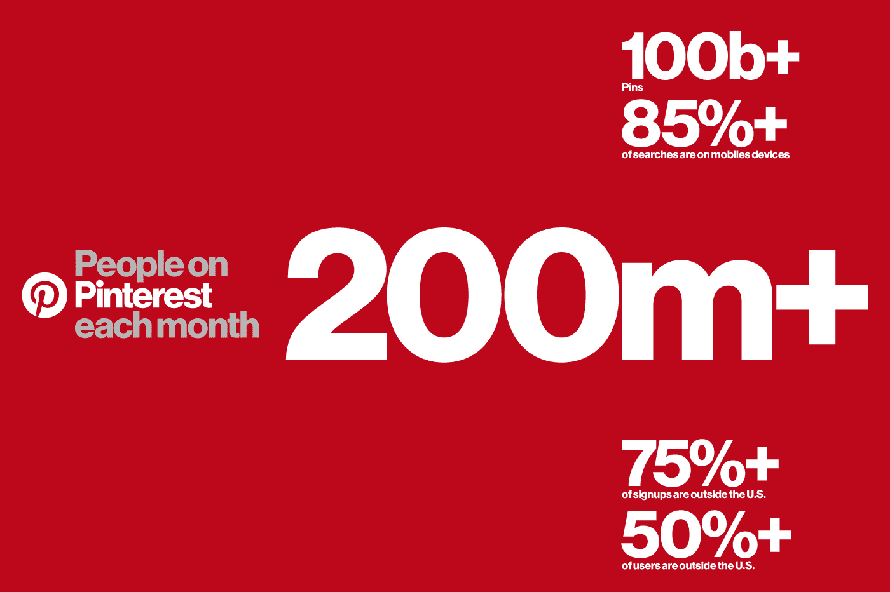

# Pinterest 月活跃用户突破 2 亿

> 原文：<https://web.archive.org/web/https://techcrunch.com/2017/09/14/pinterest-crosses-200-million-monthly-active-users/>

# Pinterest 月活跃用户突破 2 亿

Pinterest 今天表示，它现在拥有 2 亿月活跃用户，比一年前的 1.5 亿有所增加。

今年 4 月，该公司称其月活跃用户达到 1.75 亿，因此在过去一年左右的时间里，它似乎一直在有条不紊地增长。这对该公司来说将是一个好迹象，该公司在 2015 年初设定了一些[非常雄心勃勃的目标，但此后不得不重新调整。Pinterest 最近](https://web.archive.org/web/20230403185118/https://techcrunch.com/2016/10/13/pinterest-hits-150m-monthly-users-missing-earlier-leaked-projections-in-2015/)[以 123 亿美元的估值筹集了 1.5 亿美元的融资](https://web.archive.org/web/20230403185118/https://techcrunch.com/2017/06/06/pinterest-raises-150m-at-a-12-3b-valuation-as-it-makes-a-full-press-into-visual-search/)。在这轮融资中，Pinterest 全力进军视觉搜索，并试图将其作为核心竞争力。

Pinterest 已经将这一定位落实到了许多产品中，其中最大的产品是其相机搜索产品镜头。用户可以拿起手机，将相机对准一个房间，Pinterest 将识别出那个房间里有什么，并将其与平台上的内容同步。Pinterest 受益于已经拥有大量来自用户和企业的高质量照片，它可以依赖这些内容作为一种可防御的数据集，而其他追求图像识别的公司可能无法获得这些内容。

Pinterest 还推出了其他产品来实现这一目标，比如 Shop the Look 和 Instant Ideas。这两个功能都旨在让人们快速搜索图片中的元素，并深入 Pinterest 的兔子洞——这意味着他们更有可能转化为潜在广告商的客户。Pinterest 总裁蒂姆·肯德尔(Tim Kendall)表示，视觉搜索工具将很快出现在 5 月 TechCrunch Disrupt NY 2017 的广告中。

Pinterest 还发布了一系列其他指标，以显示该公司仍在超越其核心竞争力的范围内增长，比如说，随着它在国际上大力推进，75%以上的注册用户来自美国以外。超过一半的用户来自美国以外，该应用的浏览量同比增长了 50%。Pinterest 还表示，其男性受众——通常是观察者事后才想到的——同比增长超过 50%。

可以肯定的是，Pinterest 是一个不同于其他平台的用例，非常适合许多利基市场，如婚礼策划或食谱。但正因为如此，它实际上可能更容易受到像 Houzz 这样的公司的攻击，夺走它最受欢迎的利基市场。例如，Houzz 能够以 40 亿美元的估值筹集到新一轮融资，创造了一些间接面向你可能在 Pinterest 上找到的同类受众的模型。