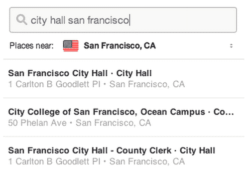
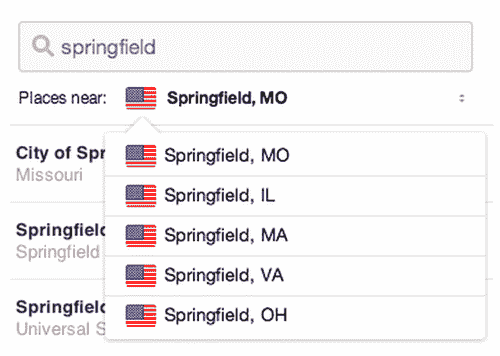

# Pinterest 通过更智能的位置搜索再次改进其搜索引擎 

> 原文：<https://web.archive.org/web/https://techcrunch.com/2014/06/13/pinterest-improves-its-search-engine-again-with-smarter-place-search/>

是的，Pinterest 正在成为一个搜索引擎。继本周的[新闻](https://web.archive.org/web/20221219183825/https://techcrunch.com/2014/06/11/pinterest-becomes-more-search-engine-like-with-the-launch-of-guided-search-on-the-web/)报道称网络上出现了一个名为“引导搜索”的功能后，Pinterest 今天表示，它现在也推出了更智能的“地点搜索”。引入的变化将使在 iOS 和 web 上只需点击几下就可以更容易地将 Pin 映射到 Place Board。

该公司在[的工程博客](https://web.archive.org/web/20221219183825/http://engineering.pinterest.com/post/88679054329/introducing-a-faster-place-search)上解释说，这实际上是为了让地点搜索体验“更直观”。

以前，Place Search 允许用户在一个城市、当前地图视图和全球范围内进行搜索。但 Pinterest 表示，用户只是在同一个搜索框中输入“什么”(地名)和“哪里”(位置)，就像他们使用 Pinterest 的网站搜索界面一样。

所以公司做了一些改变。首先，它现在使用 Foursquare 编写的名为[two fish](https://web.archive.org/web/20221219183825/http://twofishes.net/)的开源地理编码器技术来识别搜索中的地理名称。如果有几个地方同名，例如斯普林菲尔德、密苏里州或伊利诺伊州、马萨诸塞州或弗吉尼亚州等。—它会向您显示所有的可能性，提示您选择合适的一个。Pinterest 也在使用 Foursquare place 数据来帮助识别[地点](https://web.archive.org/web/20221219183825/https://developer.foursquare.com/docs/venues/search)。

最终结果是一个单框的 Place 搜索界面，结果以排序列表的形式返回。

该公司指出，这是重要的一步，“因为 Pinners 将根据这个列表中包含的内容以及他们想要的地方是否出现在顶部来判断我们的位置搜索结果的质量。”

或者，换句话说，Pinterest 只是成为了一种不同于谷歌地图的查找地点的方式，而且它是基于 Foursquare 的数据。

这些变化现在已经在 Pinterest iOS 应用程序和网络上发布，Android 也将很快发布。新的搜索引擎也使得将一个大头针映射到一个位置板变得更加容易——这个功能是去年年底首次推出的。

Place Pins 和 Place Search 是 Pinterest 致力于解决的关键领域，因为它有可能突破女性群体，女性群体目前仍在 Pinterest 上占据主导地位。我们[听说【Pinterest 将在 4 月份发布一款相关的旅游产品，以更好地利用其 Place Pins 功能。那时候](https://web.archive.org/web/20221219183825/https://techcrunch.com/2014/04/16/pinterests-choose-your-own-adventure-could-be-a-travel-product/)[并没有变成事实](https://web.archive.org/web/20221219183825/https://techcrunch.com/2014/04/24/pinterest-guided-search/)，但是总的来说，谣言本身是成立的。Pinterest 专注于让更多的男性(尤其是富裕的男性)加入这个平台，而旅行(和放置大头针)可以帮助实现这一点。

看起来，Pinterest 用户在很大程度上锁定了与旅行或户外相关的地点，有超过 30，000 个与酒店相关，20，000 个与大自然相关，19，000 个只是海滩。

该公司表示，自推出 Place Pins 以来的六个月里，已有超过 10 亿个地方被锁定，创建了超过 400 万个 Place Boards，代表了 300 多个独特的国家和地区。