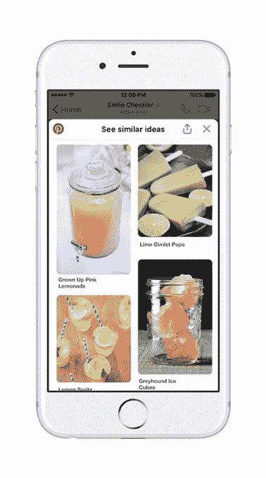

# Pinterest 通过新的机器人和 messenger 扩展与脸书进行了更深入的整合

> 原文：<https://web.archive.org/web/http://techcrunch.com/2017/12/05/pinterest-integrates-deeper-with-facebook-with-a-new-bot-and-messenger-extension/>

# Pinterest 通过新的机器人和 messenger 扩展与脸书进行了更深入的整合

随着 Pinterest 希望进一步扩大用户群，而不仅仅是你预期的用户群，它将不得不开始追逐用户，并在不同的领域与他们见面——这包括通讯应用。

因此，今天 Pinterest 发布了两项更新，这将有助于它利用那些在 Facebook Messenger 上分享内容的观众。人们可能已经在复制 Pinterest 的链接并粘贴到 Messenger 中，但该公司正在寻求使这一点更加无缝，以达到你可以进入 Messenger 并能够定期与 Pinterest 互动的地步。

这个机器人的工作方式和你想象的一样——你打开与 Pinterest 机器人的聊天，输入你感兴趣的想法，比如食物或衣服。然后，这个机器人会开始推荐来自 Pinterest 的想法，如果你对这些想法感兴趣，你可以随时深入研究。Pinterest 是最新一批在 Messenger 这样的平台上看到某种机会的公司，尽管这似乎还没有完全展现出来。

聊天扩展使 Pinterest 的体验更接近 messenger 的体验，允许用户链接出脸书消息中的大头针，并在 Messenger 中更深入地研究该内容。因此，当你在 Messenger 上输入一个 pin 时，你会开始看到并感受到一些类似于核心 Pinterest 体验的东西，而无需实际离开 Messenger。

这不是我们第一次看到 Pinterest 开始超越其家庭平台，以便让人们越来越接近实现一个想法。今年早些时候，Pinterest[推出了二维码](https://web.archive.org/web/20230320132507/https://techcrunch.com/2017/11/14/pinterest-rolls-out-its-own-version-of-qr-codes/)，将出现在商店里，这是试图拉近用户日常行为与让他们真正登录 Pinterest 并开始保存内容之间距离的又一举措。

Pinterest 拥有超过 2 亿的月活跃用户，与脸书相比仍然是一个小亮点——尽管，观众的行为在很多方面肯定是不同的。但随着 Pinterest 希望继续增长，它必须开始寻找通常可能不会关注的地方，以便让人们对这项服务感兴趣。与 Facebook Messenger 更紧密地联系在一起，这是一项拥有超过 10 亿用户的服务，似乎是一个非常自然的起点。