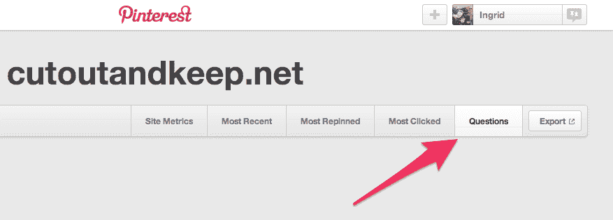

# 问 Pinterest 什么？现场测试问答功能 

> 原文：<https://web.archive.org/web/https://techcrunch.com/2014/05/14/pinterest-is-testing-a-new-qa-feature-pinterest-questions/>

[Jelly](https://web.archive.org/web/20221006013610/http://jelly.co/) 、 [Quora](https://web.archive.org/web/20221006013610/http://quora.com/) 、[雅虎](https://web.archive.org/web/20221006013610/https://answers.yahoo.com/)(有时是为了[荒谬的结局](https://web.archive.org/web/20221006013610/http://knowyourmeme.com/memes/how-is-babby-formed))以及其他一些公司已经将问答服务视为提高用户参与度和推进对话的一种方式。现在，另一个玩家可能会加入这场竞争:Pinterest 已经向我们证实，它也正在测试一个新的 Q & A 功能。

> 一位发言人告诉我们:“我们一直在收集 Pinners 的反馈，以使 pin 更有用。”“我们目前正在测试一小组 Pinners 以更有条理的方式在 Pins 上提问和回答问题的能力。我们目前没有任何其他细节可以分享，但我们会随时向您报告。”

这个功能是由 Tom Waddington 首先向我们指出的，他是一位英国的开发人员和设计师，以通过幕后的[观察](https://web.archive.org/web/20221006013610/https://beta.techcrunch.com/2013/04/19/facebook-goes-flat/)发现[其他](https://web.archive.org/web/20221006013610/https://beta.techcrunch.com/2012/07/03/little-want-button-code-forshadows-big-things-for-facebook-ecommerce/)即将到来的社交网络[发展](https://web.archive.org/web/20221006013610/https://beta.techcrunch.com/2013/06/13/api-code-could-point-to-facebook-building-an-rss-reader/)而闻名。

在一篇博文[中，他写道，他在挖掘他共同创建的手工艺教程社区](https://web.archive.org/web/20221006013610/http://tom.waddington.me/blog/2014/05/14/pinterest-questions/) [Cut Out + Keep](https://web.archive.org/web/20221006013610/http://www.cutoutandkeep.net/) 的 Pinterest 分析时，发现了一个名为“问题”的新选项，从而得到了第一个提示。

它只链接到一个带有问题标签的空白页:

但这提醒了他去查看 Pinterest 的代码，看看还有什么。他写道:“我浏览了一下代码，发现有一大堆引用了一个看起来即将发布的功能。”。

这里有代码供用户询问有关他们正在查看的 pin 的问题，还有代码供原始 Pinner 获得回答问题的通知。在 100 个左右的问题引用中，有出现在网站上的问题代码，以及 iOS 和 Android 应用程序。

(目前还不清楚这个“原创者”是你关注的发布了某个东西的人，还是第一个在 Pinterest 上发布某个东西的人，甚至是有问题的图片的原创者——比如，谁来回答我关于[腌彩虹鱼](https://web.archive.org/web/20221006013610/http://www.pinterest.com/pin/279997301807686646/)的问题:我的朋友杰奎琳，她的联系人玛蒂，还是 theyummybits.com？)

看起来 Pinterest 将试图检测用户是否在提问，而不仅仅是评论，并会提示确认这确实是什么。“删除、报告和喜欢/不喜欢问题的所有常用功能都出现在代码中，”他写道。

当然，这并不是因为你可以使用社交网络或任何网站来回答问题，你就会这样做。脸书对自己的问题功能寄予厚望，这个功能持续了整整两年才开始关闭大部分功能。Google Answers 也被[退役](https://web.archive.org/web/20221006013610/http://answers.google.com/answers/)。值得关注的是，新应用 Jelly——考虑到视觉锚，可能更接近于 Pinterest 的 Q&A ethos——将如何发展更长期的用户吸引力。

另一方面，问答功能的有趣之处在于，除了基本的评论之外，用户还可以在一个主要围绕图像构建的网站上添加更多的文本。

它还将鼓励人们更多地参与内容——参与度是社交媒体网站展示其每月活跃用户真正关注程度的关键指标之一。

这也有助于牵制(双关语！)并让人们已经在网站上非正式地做的事情变得更有用:通过评论区提问。如果你是一个品牌，这可能是一个与客户联系的黄金机会。与其他一些功能相比，如[引导搜索](https://web.archive.org/web/20221006013610/https://beta.techcrunch.com/2014/04/24/pinterest-guided-search/)，它更加开放，当你在网站上集中搜索时，它会将你“引导”到特定的方向。