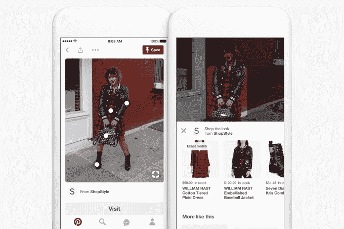

# Pinterest Lens 现在为用户提供了一种根据衣柜里的衣服找出他们的服装的方法 

> 原文：<https://web.archive.org/web/https://techcrunch.com/2017/11/14/pinterest-lens-now-gives-users-a-way-to-figure-out-their-outfits-with-the-clothes-in-their-closet/>

# Pinterest Lens 现在为用户提供了一种根据衣柜里的衣服找出他们的服装的方法

寻找服装和穿什么是 Pinterest 上的一个较大的用例，但随着该公司试图让向用户提供正确内容的过程更加无缝，它越来越关注它与相机现实世界的界面。

现在，该公司在利用这一大用例方面更进了一步，让 Pinterest 用户在决定今天想穿什么时，用他们衣柜里已经有的衣服来利用相机的视觉搜索技术。用户现在可以将相机对准他们的破洞牛仔裤，而不是搜索破洞牛仔裤的服装选项。他们输入一种搜索——比如“海滩服装”——然后用他们已经拥有的特定产品对准他们的相机，更深地潜入那个兔子洞。然后，Pinterest 将对这些牛仔裤进行视觉搜索，用户可以点击查看他们可能感兴趣的各种服装。

视觉搜索产品负责人杰夫·哈里斯说:“镜头的工作方式是，你拍下某样东西的照片，我们试图将这张照片与所有最相似的图像进行匹配。”“我们对 Lens Your Look 的设计更进了一步。我们在我们的时尚别针里寻找代表那套服装的所有服装。我们不是在寻找牛仔裤外套的完整别针，我们在寻找牛仔裤外套的一小部分。对于牛仔夹克的 20 像素来说，这是一个很好的匹配。结合文本和视觉搜索我们能做什么。文字是一个明确的信号，他们想要一套服装，这就缩小了范围。”

此次更新是在今天一系列其他与相机相关的公告中进行的，比如 Pinterest 的二维码的[引入。Pinterest 今天还增加了一项功能，当用户放大大头针的一部分时，就可以立即开始视觉搜索——就像一套服装照片中的包——并直接找到其他类似的产品。](https://web.archive.org/web/20230122153246/https://techcrunch.com/2017/11/14/pinterest-rolls-out-its-own-version-of-qr-codes/)

这是 Pinterest 开始将在 Pinterest 上搜索产品或想法的行为转移到现实世界，并捕捉某人对某个想法的即时兴趣的一部分。在一天开始的时候，试着决定你想穿什么，然后把你的相机对准一件牛仔夹克，这是一个自然的例子，试图更无缝地翻译一个用户在搜索中可能无法自然表达的想法。

这对广告商来说也是一个潜在的福音，在用户已经对一个想法或产品感兴趣并表现出明显兴趣的时候，他们可能有机会抓住用户。随着 Pinterest 将大量搜索行为转移到摄像头和更加可视化的搜索上，它可以更好地捕捉人们在谷歌上搜索时可能会有的意图级行为——但他们可以将摄像头对准某个东西，而不是输入搜索内容。

Pinterest 试图向广告商推销自己，作为一种可以帮助他们跟踪用户行为的产品，从发现产品或想法一直到采取行动，并在有意向的时候抓住他们，填补了另一个可能没有的漏洞。该公司还通过其 Shop the Look 功能增加了 500 多万种可购物产品，该功能显示为大头针内的一个小圆圈，将用户带到潜在的产品。所有这一切都是一种帮助用户获得正确产品的方式，并让他们习惯于在 Pinterest 上与现实世界中的物体互动的想法。

“文本找出候选人，然后视觉找到最佳匹配，”哈里斯说。“这非常适合 Pinterest，因为许多搜索查询都是大型开放式头部查询，它们可以指向许多不同的方向。你给我们这个形象，它让你走得更细。我们认为 Pinterest 有潜力成为世界上最好的造型师。你将它与实际的计算机视觉技术相结合，来理解人们的服装。”