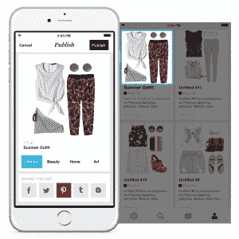

# Pinterest 推出首个开发平台集成 

> 原文：<https://web.archive.org/web/http://techcrunch.com/2015/07/08/pinterest-rolls-out-its-first-development-platform-integrations/>

# Pinterest 首次推出开发平台集成

Pinterest 的开发者平台[于今年 5 月](https://web.archive.org/web/20230130004403/https://techcrunch.com/2015/05/04/at-long-last-pinterest-is-opening-up-to-developers/)开始开放，其首批合作伙伴正在陆续推出 Polyvore 和 If This Then That)是首批合作伙伴之一。

Pinterest 计划慢慢开放其开发者平台，暂时要求开发者注册访问，然后将他们希望合作的合作伙伴添加到本质上是白名单的名单中。当开发人员接入用户的留言板时，他们会获得关于他们所发布的内容的信息，并可以利用这些信息来找出 Pinterest 数据的新用例。

IFTTT 的集成使用户能够通过该公司的服务将自己的 Pinterest 账户与 Instagram 或 Dropbox 等其他服务连接起来。例如，喜欢一张照片会使用 IFTTT 自动将 pin 保存到 Pinterest 板上。该公司表示，用户可以通过这种合作关系登录 Pinterest 的 Polyvore，并向 Pinterest 董事会添加收藏。Polyvore 表示，对该公司整合的初步测试显示，其在 Pinterest 董事会的份额跃升了 132%。

“Pinterest 的 API 类似于我们已经集成到 Polyvore 中的其他社交网络 API，”Polyvore 的集团产品经理 Vishwa Ranjan 说。“总的来说很容易。我们可以访问他们的 SDK 和开发者仪表盘。和他们一起工作真的很棒，他们总是能回答任何问题。”

该公司表示，这是 Pinterest 开始推出其新开发者平台的前两个合作伙伴，不久将有更多合作伙伴。开发者可以在任何时候注册，请求使用该公司的服务，并在 Pinterest 上开发应用，尽管他们必须等到 Pinterest 授权。

Pinterest 并不以仓促行事著称，随着时间的推移，新的开发者会有条不紊地加入进来。但是开发者终于可以访问该公司的数据，这对于那些有想法如何使用 Pinterest 数据的人来说是一个福音——比如能够从 Pinterest 的食谱中订购食材。Pinterest 的开放花了一段时间，但看到脸书等其他平台的成功，很明显 Pinterest 上的数据有很多事情要做。

当然，Pinterest 受益于开发者利用其数据开发新应用。虽然该公司正在有条不紊地增加新的开发者，但该应用的每一次新用途都有可能让其用户群一次又一次地回到 Pinterest。这意味着 Pinterest 上有更多的眼球，这为该公司提供了更多的机会来从其用户群中赚钱——并将这笔钱投入到研发和雇佣更多的人员中。