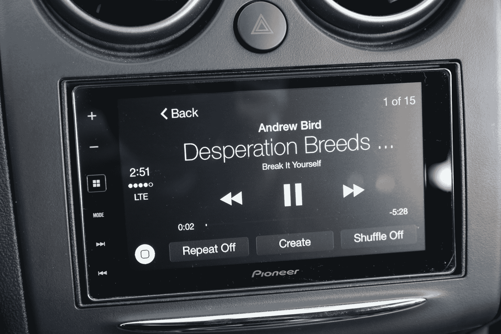
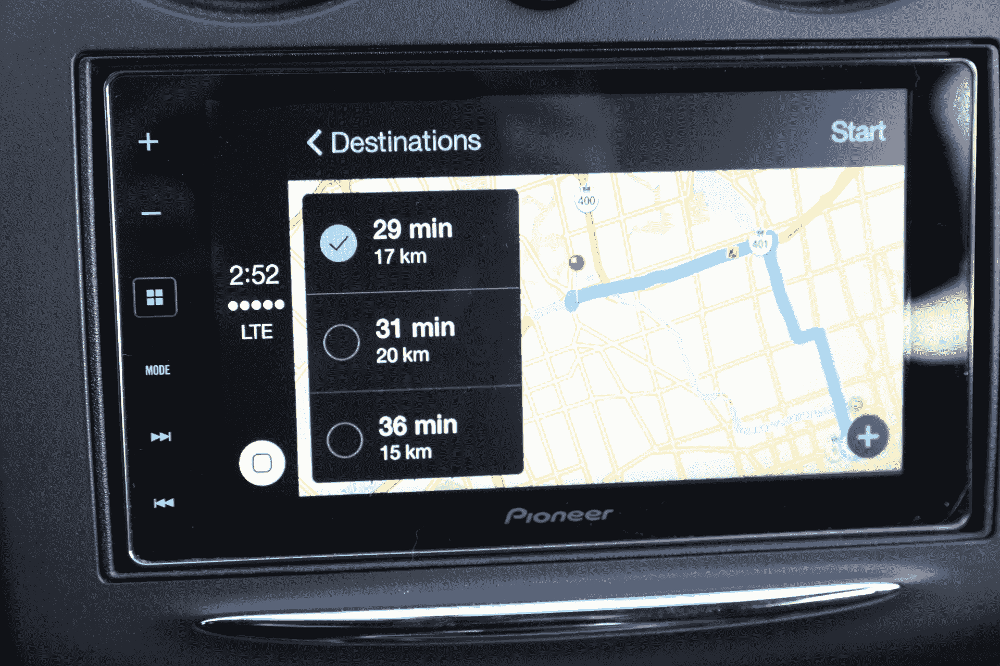
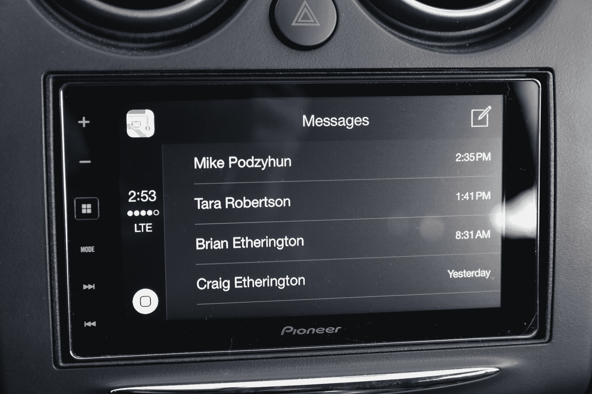

# Apple CarPlay Review 的先锋 AppRadio 4 

> 原文：<https://web.archive.org/web/https://techcrunch.com/2014/12/01/pioneer-appradio-4-with-apple-carplay-review/>

如果你想在你的汽车上安装 [苹果的 CarPlay](https://web.archive.org/web/20221210062337/https://beta.techcrunch.com/2014/03/03/apples-new-carplay-system-will-turn-tens-of-millions-of-cars-into-iphone-accessories/) 车载智能手机系统，你可以购买一辆全新的汽车，也可以选择目前可用的售后解决方案之一。我选择了 Pioneer AppRadio 4，它支持 CarPlay 以及 Pioneer 自己的软件，可用于 iOS 和 Android 设备，它用一个双 DIN 甲板取代了你的汽车音响，其中包含一个 6.2 英寸的电容式触摸屏，支持蓝牙音频流，FLAC 支持等等。

## 视频评论

## 基础

*   6.2 英寸 800×480 显示屏
*   CarPlay
*   闪电、MHL MirrorLink、蓝牙和 HDMI 输入
*   建议零售价:600 美元(外加电缆和附加安装适配器)
*   [产品信息页面](https://web.archive.org/web/20221210062337/http://www.pioneerelectronics.com/PUSA/Car/AppRadio/AppRadio+4+(SPH-DA120))

**优点**

*   没有新车的 CarPlay
*   也在一定程度上支持 iOS 屏幕镜像

**缺点**

*   CarPlay 本身还是有 bug 的
*   AppRadio 应用程序功能平平

## 设计

先锋 AppRadio 4 很可能是对你的车内主机设计的改进，尽管它基本上只是一个大触摸屏。一侧有按键，但这些是触摸键，它们看起来很好，尤其是当你从许多可选的彩色背光定制选项中进行选择，以帮助它们适应现有的方向盘控制和仪表板灯光色调时。

[gallery ids="1089262，1089259，1089260，1089261，1089263，1089265，1089266，1089267，1089268，1089269"]

关于设计的一个警告是，你要确保你的车辆有正确的安装套件——我的基本型号 2013 日产 Rogue 有一个相当标准的双 DIN 立体声隔间，这意味着即使没有面板，AppRadio 4 看起来也很好，但有了正确的模型，它就更加无缝。

安装 AppRadio 4 是一个复杂的过程，也意味着需要正确的零件。我甚至没有亲自尝试，而是前往未来商店，在那里，极客小队汽车配件安装人员在几个小时的时间里处理了一切，包括将正确的蓝牙控制从我的方向盘路由到该单元，并将附带的先锋麦克风运行到后视镜悬挂处上方的一个不显眼的位置。除了收音机，使用未来商店或其他专业安装将花费你相当多的钱，但这也非常容易，你不必担心任何草率的设计。

关于设计的一个警告:一切都依赖于触摸屏和其上的界面。大多数情况下，先锋的内置界面显示的视觉效果并不令人振奋，图形感觉像是从 90 年代设计被认为是次要的时候摘下来的。低分辨率显示屏也不是很好，但当与 CarPlay 一起使用时，它的效果足够好，这也弥补了原生界面设计的不足，具有典型的苹果理性和简单性。

## 特征

这里最大的吸引力是 CarPlay，尽管 Pioneer 的 AppRadio 系列已经出现了四次迭代，拥有自己的应用程序，可以将应用程序以专为汽车使用而设计的特别重新格式化版本输入到主机的触摸屏上。CarPlay 意味着连接一个可以运行它的 iOS 8 设备(iPhone 5 或更高版本)会自动将该设备完全转换为一个 CarPlay 系统——用户仍然可以选择使用 AppRadio，但许多应用程序不再兼容，并且需要以不同的方式连接(通过苹果 Lightning-to-HDMI)适配器。

然而，CarPlay 本身就足以让 iOS 用户对它感兴趣；转换在这里完成，你可以通过主机上的几个不同按钮调用 Siri 并与之交互，包括软件 home 按钮和 AppRadio 4 物理触摸按钮，通常会将你带到主仪表板。

如果你有一个用于方向盘控制的适配器套件，你也可以从你的应用程序或存储在你的设备上控制音量和跳过/倒回音频。我还发现，能够通过蓝牙连接到其他设备非常有用，它允许免提通话，并可以播放通过物理电缆连接的手机以外的音频，如果你有一个经常乘坐的乘客，比如一个重要的人，有时宁愿听自己的音乐，这可能会很好。

通过 AppRadio 软件和 MHL 连接运行 Android 应用程序的能力也很有用，但在硬件兼容性方面受到限制。此外，iOS 和 Android 上的 AppRadio 应用程序迫切需要进行彻底的改革，无论是在设计还是可用性方面。一些有事业心的个人已经自己开发了软件，让你可以将你的 Android 设备完整地传输到显示器上，但这需要根，无论你使用哪种应用程序，成本都在 30 美元左右，而且可能会非常分散注意力。

## 表演

AppRadio 4 本身，尽管有一些过时的用户界面设计和平淡无奇的配套应用，但就其基本功能而言，工作稳定。它还能让音乐听起来更好，不管是什么来源，甚至不用把你的扬声器换成更好的。与只关闭主机的区别是惊人的，考虑到我的 Rogue 在切换前不支持蓝牙立体声音频流，但在切换后支持，即使在考虑 AppRadio 4 也支持的任何软件功能之前，我也对这一变化感到非常高兴。

就 CarPlay 而言，性能基本符合我的预期——尽管有一些明显在软件方面的错误，似乎与 CarPlay 本身有关。这些问题包括音频偶尔完全失灵，这意味着尽管音乐在 Rdio 和 iTunes 中都可以播放，但扬声器却没有声音。然而，来自导航和其他来源的音频工作正常，这就是为什么我确定这不是硬件问题。然而，拔下并插回手机(有效地重新启动 CarPlay)解决了这一问题。

除此之外，CarPlay 工作得很好，通过目前可用的少数几个受支持的应用程序提供简单的导航和媒体播放。当然，苹果地图仍然受到与你的 iPhone 相同的问题的困扰，这意味着它在选择最佳路线方面不如谷歌，有时它会让你接近，但不是完全到达目的地。然而，CarPlay 推出的范围越广，苹果继续改进地图的动力就越大，所以希望随着时间的推移，情况会越来越好。

在 CarPlay 上使用音频应用程序，包括播客、音乐和 Rdio，肯定比在通过 aux 输入连接到汽车的设备上使用它要容易得多，并且在涉及到云流媒体服务时，在旧款汽车上使用大多数 iOS 输入时也不会那么令人头疼。

至于通话和短信，Siri 处理得很好，可以读回内容，识别基于语音的输入，不会出错。我认为，在我长达几周的使用过程中，她可能误解了我的命令和口述一次，这不仅要归功于 Siri 本身，还要归功于先锋公司为耳机提供的麦克风，它似乎也为电话另一端的人提供了良好的声音。与我的日产 Rogue 附带的内置蓝牙系统相比，通话质量总体上有了很大提高。我希望苹果公司能提供一种更方便地查看和阅读联系人信息的方式，因为查看你的联系人列表可以让你在点击最近的来电时撰写新的联系人信息。

## 结果

AppRadio 4 抓住了一个特殊的痒点:现在，你已经有了 CarPlay。它的电容式触摸屏意味着它可以有效可靠地检测输入，蓝牙音频流提供了很多好处，即使你对其余的软件功能不感兴趣，加上硬件可以作为一个非常强大的主机升级，无论你用它做什么。

也就是说，它很贵，没有 CD 卡座(这对我来说是一个额外的好处，因为我总共有两张 CD，而且它们都没有打开过)，而且本机 AppRadio 软件也不太好。CarPlay 也有一些需要修复的错误，目前只有有限的软件库，但它在当前的迭代中仍然非常强大，CarPlay 整个前提的最好部分是它有很多未来改进的潜力。iOS 更新以及应用程序兼容性应该意味着任何 CarPlay 系统投资都是一项长期持续回报的投资。

与大多数股票音响系统相比，先锋的 AppRadio 4 是任何旧车辆的可靠升级，智能功能应该使它比大多数其他可比产品更长寿，尽管价格有点溢价。