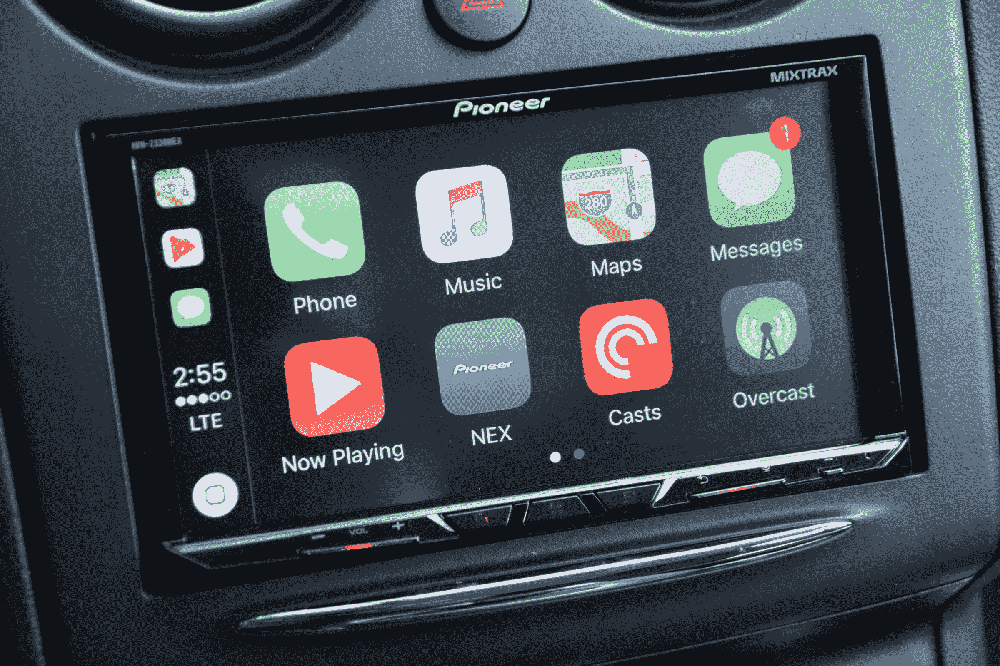
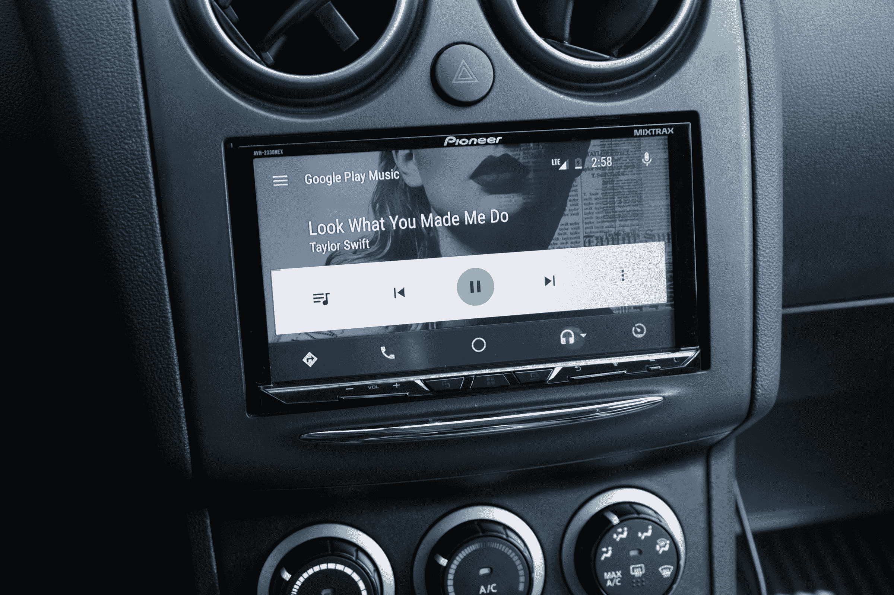
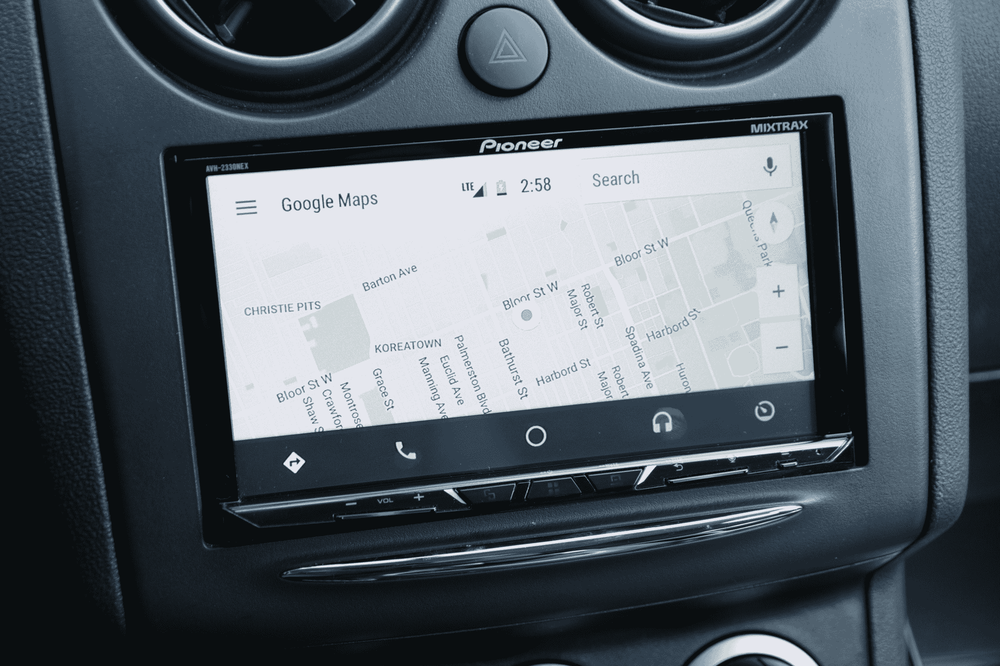

# 先锋 AVH-2300NEX CarPlay 和 Android Auto 车载接收器评测

> 原文：<https://web.archive.org/web/https://techcrunch.com/2017/08/25/pioneers-avh-2330nex-gives-you-both-android-auto-and-carplay-without-a-new-car-price-tag/>

CarPlay 和 Android Auto 只能被称为“缓慢燃烧”。它们都在几年前首次亮相，但通过第一方信息娱乐系统访问它们并没有以早期采用者可能习惯的速度发生。幸运的是，各种第三方售后车载音频和信息娱乐平台为那些不想购买新车或等待自己选择的汽车制造商赶上时代的人提供了一个选择。

先锋公司的新款 [AVH-2330NEX](https://web.archive.org/web/20221025223432/https://www.pioneerelectronics.com/PUSA/Car/NEX/AVH-2330NEX) ，该公司于今年 5 月正式发布，最近才开始发货，在一个包中同时提供 Android Auto 和苹果 CarPlay，如果你碰巧花时间在这两个平台上，这非常方便。它还提供了一个 CD/DVD 插槽，可通过滑动的前面板访问，以及一个分辨率为 800×480 屏幕的 7 英寸电阻式触摸屏。显示屏下方包括物理按钮，以及用于免提和立体声流媒体的蓝牙。

整个事情来在一个双 DIN 包，将与各种各样的车辆，有或没有装饰套件取决于你的车。它还可以插入工厂方向盘控制，以及第一方和售后备用摄像机。AVH-2330NEX 还配有自己的麦克风，这很好，因为根据我的经验，与车辆上出厂安装的麦克风相比，它为谷歌助手和 Siri 以及通话提供了更好的语音识别。

500 美元的 AVH-2330NEX(和 [AVH-2300NEX](https://web.archive.org/web/20221025223432/https://www.pioneerelectronics.com/PUSA/Car/NEX/AVH-2300NEX) ，这是相同的，但不包括高清无线电支持，第二个摄像头输入和遥控器)远比购买一辆新车便宜，甚至在许多情况下，购买信息娱乐升级包将使你能够访问 CarPlay 和 Android Auto 的库存车辆。这也是对工厂音响系统的一大推动，因为它大大提高了我的 2013 款日产 Rogue 的蓝牙和有线音乐以及播客播放的音频质量，这要归功于它的内置 DAC。

但真正的好处是可以访问您选择的移动操作系统，就在您驾驶时想要的仪表板、前方和中间位置。此外，由于标准 USB 适配器，您可以使用各种电缆在两者之间切换，包括 micro-USB、USB-C 和 Lightning，具体取决于您设备的要求。

我发现 CarPlay 和 Android Auto 在 Pioneer 2330NEX 上运行良好，在数小时的广泛测试中，我没有遇到任何问题。文本在 7 英寸的显示屏上很大，清晰可辨，图标和其他界面元素也是如此。动画和过渡也很流畅，我从未遇到过任何类型的滞后，这种情况可能发生在运行这些车载移动软件系统的动力不足的信息娱乐系统上。

我在测试 AVH-2330NEX 时有点担心的另一件事是它没有电容式触摸屏。它使用电阻单元，这在历史上并不适合电子设备的触摸界面:事实上，这是 iPhone 的主要优势之一——它为大众市场的移动设备带来了电容触摸屏，提供了更好的整体用户体验。

令人惊讶的是，与我过去尝试过的电容式车内设备相比，电阻式屏幕几乎没有什么区别。我从未遇到错过触摸输入的错误，屏幕感觉反应足够快。我怀疑这是多年来先进的技术和信息娱乐平台的结合，不需要像智能手机那样高水平的响应能力来感觉它正常工作。

无论哪种方式，电阻式显示器都工作得非常好，并保持低成本。然而，这确实意味着 AVH-2330NEX 有一个塑料覆盖的显示屏，在阳光直射下表现不佳。事实上，这是我对这款设备的一个主要抱怨:屏幕在强光下看起来不太好。它仍然完全可用，但并不理想。

除了 CarPlay 和 Android Auto，先锋 AVH-2330NEX 还提供了许多出色的功能，包括支持备用摄像头。这也在我的测试中完美地发挥了作用，每当我把车倒挡的时候，它就会出现。方向盘控制也很棒(尽管这取决于你的汽车品牌和型号)。这里还有一个小警告:你不太可能将你的呼叫按钮映射到 Siri 或 Android Assistant，但先锋甲板本身有一个专用的硬件按钮，带有麦克风标签，让你可以在任何时候相对轻松地激活这些按钮，最大限度地减少干扰。

[gallery ids="1531680，1531681，1531679，1531677，1531676，1531674，1531672，1531670，1531669"]

先驱 AVH-2330NEX 提供了很少产品能够提供的功能:为旧车带来新的生命，特别是为那些希望体验最新信息娱乐便利功能，但又不想为此购买全新汽车的科技用户。