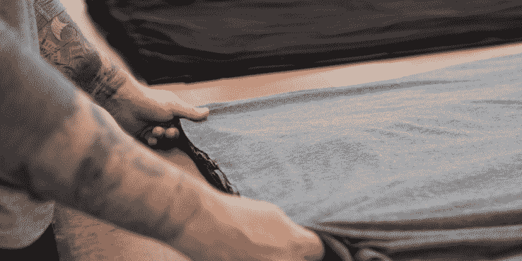

# 男装运动服初创公司 Pistol Lake 从 Slow Ventures TechCrunch 获得 60 万美元

> 原文：<https://web.archive.org/web/https://techcrunch.com/2017/08/09/pistol-lake-600k-slow-ventures/>

总部设在洛杉矶的手枪湖公司已经开发了它认为可能是男士运动服的下一件东西——一系列用新面料制成的衬衫和其他产品，可以在健身房或外出时穿着。为了资助其产品扩展的下一步发展，该公司已经筹集了 60 万美元的新资金。

Pistol Lake 由 Will 和 James Sulinski 兄弟以及 Andrew Kneisley 于 2012 年创立，该公司在过去几年中尝试了不同风格和类型的面料。

尽管 Pistol Lake 最初只有两种产品——一种圆领 t 恤和一种 v 领 t 恤——但随着时间的推移，它增加了各种长袖和短袖套头衫、帽衫和运动衫。迄今为止，它主要通过[众筹活动](https://web.archive.org/web/20221216014007/https://techcrunch.com/2013/09/09/pistol-lake-crowdfunding-hoodies-henleys/)资助新产品类别。

最近，Pistol Lake 一直专注于推进一系列基于其开发的名为 [Eudae](https://web.archive.org/web/20221216014007/https://www.pistollake.com/collections/eudae) 的新面料的运动服产品。Eudae 由桉树纸浆和回收塑料瓶混合制成，舒适且可持续。

威廉·苏林斯基(William Sulinski)正在寻找一种衬衫，这种衬衫的性能与耐克(Nike)或安德玛(Chrysler)等公司出售的聚酯健身器材一样，但没有那种表明你是从健身房出来的光泽。

“我想，让我们制作一种看起来像普通 t 恤但性能像这些健身面料的面料，”苏林斯基告诉我。根据苏林斯基的说法，在测试了“大约 300 种性能织物”后，手枪湖团队与合作伙伴合作，提出了 Eudae。

在读了一篇关于天丝益处的论文后，他想知道将这些纤维与一种回收聚酯结合起来会是什么样。结果是开发了一种定制纱线和织物，Pistol Lake 开始将其用于生产。

通过其 Eudae 系列产品，Pistol Lake 的目标是在活跃的男性中找到一个最佳点，他们可以在健身时穿着这种衣服，也可以在日常生活中穿着。

桉树纤维抑制细菌生长和气味，表明顾客可以出汗，但不必担心周围的人都知道。

(披露:我是 Pistol Lake 的长期客户，也是其 Eudae Kickstarter 的支持者。我非常喜欢这种新面料的贴合感和触感。)

无论如何，在多年众筹新产品和依靠收入运营后，苏林斯基决定筹集少量种子资金来扩大公司的业务。结果，它获得了由 Slow Ventures 牵头的 60 万美元融资，参与投资的有 Casper 联合创始人尼尔·帕里克(Neil Parikh)、乔·蒙塔纳的 Liquid 2 Ventures 和其他一些战略天使投资者。

为什么慢？因为“Slow 的 Dave [Morin]是我们最大的客户之一……实际上可能是我们最大的客户，”Sulinski 说。除了购买该公司的产品，Morin 多年来还提供了宝贵的产品反馈。由于 Morin 已经投资了许多其他成功的直接面向消费者的品牌，如 Casper 和 Allbirds，这可能是值得考虑的反馈。

那么下一步是什么？首先，苏林斯基和他的团队将努力增加产品库存，以满足上个季度每月翻一番的需求。

它还将继续致力于将新产品推向市场。这包括衬衫和短裤的新款式，也包括公司新产品类别的开发，如袜子和内衣。

如果银行里有更多的现金，它应该能够做到这一点，并有望让 Eudae 融入更多人的日常衣柜。