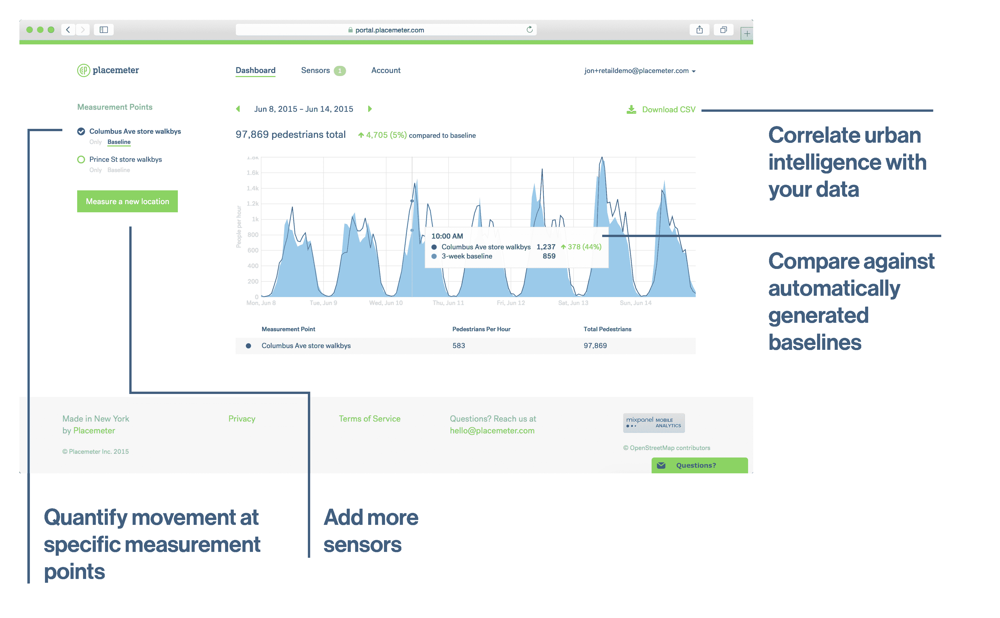

# Placemeter 使用计算机视觉帮助企业和城市测量车辆和行人流量

> 原文：<https://web.archive.org/web/https://techcrunch.com/2015/06/23/placemeter-uses-computer-vision-to-help-businesses-and-cities-measure-vehicle-and-pedestrian-traffic/>

# Placemeter 使用计算机视觉来帮助企业和城市测量车辆和行人流量

如果你拥有一家企业，你可能想知道有多少人走进你的商店。如果你是一个城市，你可能想知道有多少人使用给定的人行道或在某条街上开车。您可以通过一些基本的传感器或 WiFi pinging 来测量所有这些，但这要么不太准确，要么很难安装。总部位于纽约的 [Placemeter](https://web.archive.org/web/20230320192924/https://www.placemeter.com/) 今天即将推出测试版，它使用计算机视觉来跟踪行人和车辆交通(包括摩托车和自行车)。

客户可以使用自己的 IP 摄像头，并将它们连接到 Placemeter 的云后端来跟踪运动。

例如，蒙特利尔的 Quartier Des Spectacles 使用该公司的技术来观察有多少人使用了主要的地铁站，以及有多少人与该地区的一些艺术展览进行了互动。为了实现这一点，Placemeter 接入了现有的安全摄像头，并在艺术装置周围创建了一个虚拟盒子，以观察人们在它们周围停留了多长时间。

同样，许多商店已经使用该服务来查看有多少人从他们身边走过，有多少人走进了商店(想想现实生活中的转化率)。

该公司已经在纽约、波士顿、费城、东京和蒙特利尔收集数据。如果用户不想要长期合同，Placemeter 每月每点收费 149 美元，或者每年 99 美元的折扣(你可以在一个 feed 中跟踪多个点，所以这可能会很快增加)。

从今天开始，Placemeter 也以 99 美元的介绍价销售自己的相机。

对于那些已经有视频数据并希望以后存档的企业，该公司对其分析的视频每小时收费 20 美元。

Placemeter 由亚历克斯·温特和弗洛伦特·派尔(Florent Peyre)创立，它来自于 2013 年春季纽约科技之星(TechStars)项目，也参与了《纽约时报》的时空项目。在 NEA、高通风险投资公司、Tiplepoint Capital、Collaborative Fund 和一些天使投资者的支持下，该公司现在已经筹集了 780 万美元。NEA 牵头 PlaceMeter 的 600 万美元 A 轮融资。