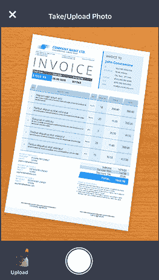
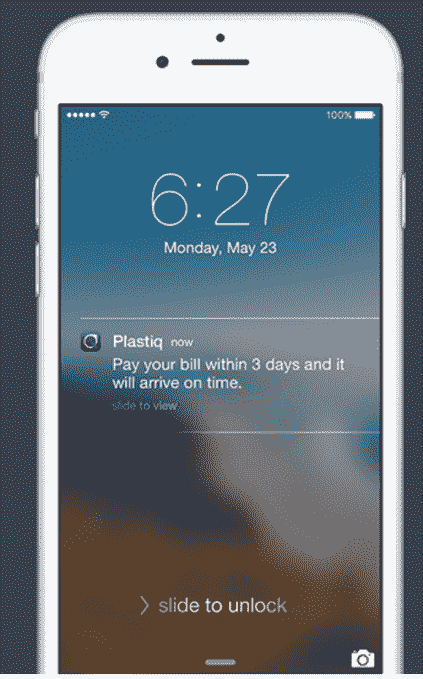

# Plastiq 让您只需拍一张照片就可以用信用卡或借记卡支付任何账单 

> 原文：<https://web.archive.org/web/https://techcrunch.com/2016/04/21/plastiq-lets-you-pay-any-bill-with-your-credit-or-debit-card-just-by-snapping-a-photo/>

今天发布的一款名为 [Plastiq](https://web.archive.org/web/20221025223406/https://www.plastiq.com/) 的新 iPhone 应用程序可以让你用信用卡或借记卡支付任何账单，只需拍一张照片。该应用程序的目标是提供一些专为移动设备设计的东西，这也比使用银行的在线账单支付功能更方便。更重要的是，它允许用信用卡支付账单——因此得名——而不是从你的银行账户中提取。

该公司表示，其主要受众是信用卡持有者，例如，他们喜欢在一张卡上支付所有账单的便利，或者喜欢用信用卡支付以积累奖励。

要使用在美国和加拿大可用的应用程序，您不需要注册 Plastiq 帐户，只需提供您的电子邮件地址，就可以直接在手机上注册。

然后，你只需使用手机的摄像头拍摄一张照片，该应用程序将分析账单上的信息，以确定欠款金额、到期日和你的账户信息(如账号或备忘录)。

然后你可以选择立即付账，或者选择“留着以后再付”

后一个功能特别有用，因为它会将账单添加到应用程序中的虚拟“账单堆栈”中，然后在检测到付款时间时向您发送推送通知。

当然，通知不会在到期日到达——这将导致付款延迟。相反，它被及时发送以满足到期日期，同时也允许您在延迟付款发生前的最后一分钟付款。如果通过借记卡支付，这可以让您最大限度地增加帐户中的资金，或者在通过信用卡支付时利用更高的信用额度。

这款手机应用是与设计公司 IDEO 合作开发的，是之前由这家总部位于波士顿、现位于旧金山的初创公司推出的在线服务的升级版。

[gallery ids="1311283，1311282"]

该公司非常重视账单支付，首先在加拿大推出了这项服务以测试市场，然后在去年将其网络应用程序带到了美国。

今天，这种在线服务已经发展到 50 万客户，其中大多数是回头客。

客户使用 Plastiq 来支付各种服务，以及租金、保险或汽车付款等经常性付款，以及税收或学费等不太频繁的需求。

Plastiq 接受三大信用卡:万事达卡、维萨卡和美国运通卡。

对于接受电子支付的企业，Plastiq 将为您处理这一过程。但许多人使用该应用程序用现金或支票支付。它实际上会像你的银行一样为你开一张支票，然后通过邮件发送出去，并从你的借记卡或信用卡中提取资金。

这家初创公司通过向客户收取信用卡交易 2.5%的便利费和借记卡交易 1%的便利费来创收。

该公司表示，它拥有一些关于支付过程和读取账单信息的临时专利。然而，它在很大程度上修改了现有的 OCR 技术，以达到自己的目的，然后结合人工审查，以确保准确性。这意味着你可以相信它不会搞砸你的账单。

然而，尽管与 PayPal、Square Cash 或 Venmo 等其他支付应用程序有相似之处，Plastiq 的首席执行官艾略特·布坎南澄清说，该公司的新移动产品并没有瞄准点对点支付领域。当你*可以*向承包商、保姆或其他服务提供商等个人付款时，Plastiq 会验证被付款的人实际上是一家企业。

“我们不是为了偿还你的朋友，”他说。“你可以支付任何不接受信用卡的业务或服务，但我们不做真正的 p2p，”布坎南解释说。

这位创始人还指出，移动应用程序是 Plastiq 当前客户的一个结果，他们需要一种使用手机更快速地向任何公司或服务提供商付款的方式。没有人喜欢支付账单，但该公司相信他们可以让它成为更好的体验。

“我们如何让账单支付像自拍一样简单？拍一张照片，加上你的信用卡付款，支付账单，”布坎南说。

Plastiq 应用程序是 iTunes 上的免费下载。

这家初创公司是一个 30 人的团队，由科斯拉风险投资公司、阿特拉斯风险投资公司、Flybridge Capital Partners 和其他公司提供 2000 万美元的[支持。](https://web.archive.org/web/20221025223406/https://www.crunchbase.com/organization/plastiq#/entity)