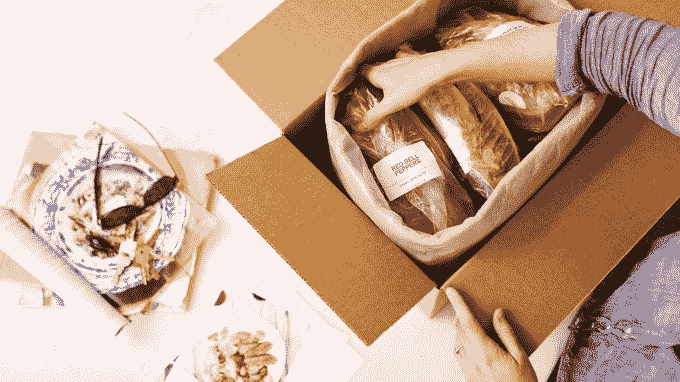

# Plated 在 B 轮 TechCrunch 中价值 3500 万美元

> 原文：<https://web.archive.org/web/http://techcrunch.com/2015/07/16/plated-is-served-35-million-in-series-b/>

总部位于纽约、每周送货上门的 Plated 公司今天宣布完成 3500 万美元的 B 轮融资。现有投资者 Greycroft Partners 和 Formation 8 参与了融资。

[Plated](https://web.archive.org/web/20230129222726/https://www.plated.com/) 早在 2012 年就推出了一个简单的愿景:通过将完美分配的饭菜(以食材和食谱的形式)送到用户家中，让他们享受烹饪乐趣，从而减少浪费。用户可以从菜单上选择那一周的餐点，根据点的餐数，价格从 12 美元/餐到 30 美元/餐不等，比如扇贝这样的高端食品。

虽然它可能比 Blue 围裙的定价(8.75 美元到 10 美元之间)更贵，但 Plated 提供了市场上任何餐包交付服务的最多选择。除了选择之外，Plated 将自己定位为市场上的顶级玩家。想想全食超市和沃尔玛的杂货区。

Plated 投入巨资，尽可能确保送到您家的食品是可持续养殖和运输的，整个过程完全透明。

"你知道在美国销售的 90%的海鲜都是进口的吗？"创始人尼克·塔兰托问道。“它通常是用一堆化学品养殖的，我不想吃那种垃圾，数百万其他美国人也不想吃。”

另一方面，Plated 的海鲜来自一家名为 [Sea To Table](https://web.archive.org/web/20230129222726/https://www.sea2table.com/) 的公司，该公司确保 100%的国内可持续养殖海鲜。

但不仅仅是食物本身。

Plated 也对其产品的运输进行了大量投资。通过使用 100%回收衬垫的新绝缘方法，Plated 能够将碳排放量降低 95%，将每个盒子的二氧化碳排放量从 4.5 磅减少到 0.25 磅。

但至少可以说，这一领域的竞争非常激烈。蓝色围裙每月运送超过 300 万份食物，最近[以 20 亿美元的估值筹集了 1.35 亿美元](https://web.archive.org/web/20230129222726/https://techcrunch.com/2015/06/09/blue-apron-cooks-up-135-million-in-series-d-funding/#.bfqezc:KBlT)。与此同时，欧洲玩家 HelloFresh 正在入侵美国，每月运送超过 400 万份食物。

“我们不想成为最大的，”塔兰托说。“我们只想成为最好的。”

根据塔兰托的说法，与从烹饪设备市场获得部分收入的蓝色围裙不同，Plated 希望专注于食物。

也就是说，该公司不仅投资可持续发展，还投资技术。Plated 在过去五个月里已经在市场上推出了一款 iOS 应用[(蓝色围裙昨天发布了它的应用)](https://web.archive.org/web/20230129222726/https://techcrunch.com/2015/07/15/blue-apron-cooking-reference-here-an-ios-app/)因为塔兰托认为原生移动体验对任何电子商务体验都至关重要。

Plated 拥有 1000 多种独特的食谱，并将在“选择机制”方面投入更多资金，为用户提供更多的食物选择，无论是素食选择还是寻求挑战的厨师更难烹饪的食物。

[Plated](https://web.archive.org/web/20230129222726/https://www.crunchbase.com/organization/plated) 到目前为止已经筹集了总计 5640 万美元的资金，包括新的资金，在全国拥有 400 名员工。