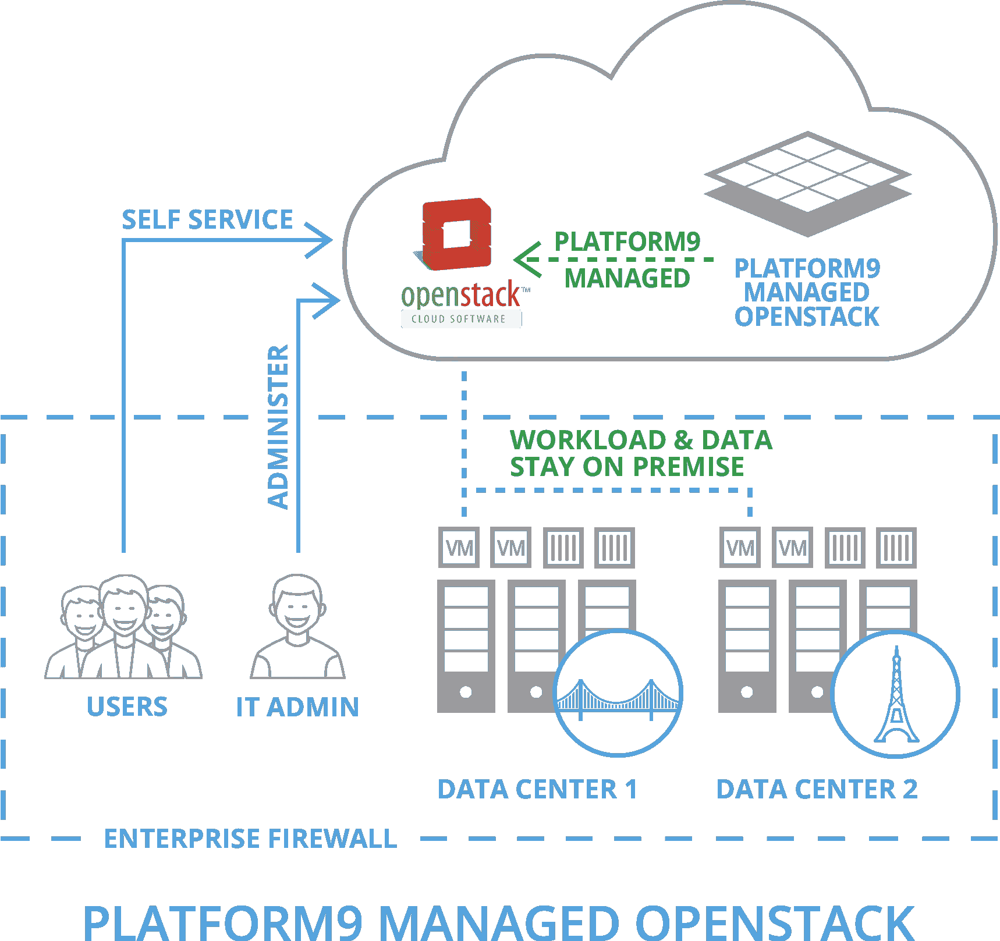
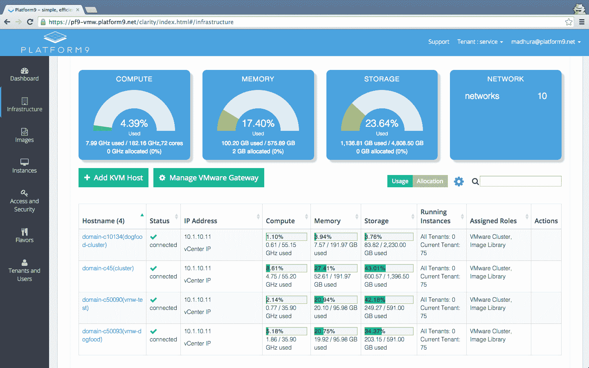

# Platform9 为其 OpenStack 部署和管理服务 TechCrunch 筹集了 1000 万美元的 B 轮融资

> 原文：<https://web.archive.org/web/https://techcrunch.com/2015/08/17/platform9-raises-10m-in-series-b-funding-for-its-openstack-deployment-and-management-service/>

# Platform9 为其 OpenStack 部署和管理服务筹集了 1000 万美元的 B 轮融资

旨在让企业更容易在其现有服务器上启动 [OpenStack](https://web.archive.org/web/20221210022749/https://www.openstack.org/) 私有云的服务平台 9 今天宣布，它已经筹集了 1000 万美元的 B 轮融资，由 Menlo Ventures 牵头，之前的投资者 Redpoint Ventures 也参与了融资。这一轮使该公司的总资金达到 1450 万美元。

从来没有人指责 OpenStack 项目太容易安装。发行版、服务和咨询的家庭手工业帮助企业开始使用 OpenStack 是有原因的。在 Platform9 模型中，该服务以典型的软件即服务方式管理 OpenStack 部署，用户自带服务器基础设施。

首先，你需要在线注册这项服务，在你的服务器上安装一个代理，然后将它们与你的 Platform9 账户配对。这对新安装的服务器和现有的服务器都适用，Platform9 将尝试从它们那里导入现有的工作负载。Platform9 的托管 OpenStack 云随后为您管理计算、存储和网络资源，管理员可以使用 Platform9 界面设置常规配额和角色。

“我们经历了非凡的一年，我们的发展势头正在加速，因为组织希望使用其内部基础架构提供类似云计算的 AWS 体验。Platform9 联合创始人兼首席执行官 Sirish Raghuram 表示:“借助 Platform9 托管 OpenStack，组织现在可以专注于使用内部私有云加速创新，而不是花费数月或数年时间来实施他们的私有云。“B 轮融资使 Platform9 能够为我们不断增长的客户群进一步加速我们的产品路线图。”

该公司表示，自 2015 年 1 月该服务普遍可用以来，其销售额环比增长了 200%(虽然没有基线，但这个数字显然不意味着什么)，17 个国家的公司现在已经签署了网站范围的许可协议。

目前，Platform9 [可与在 CentOS、Ubuntu 和 Red Hat Enterprise Linux 上运行 KVM 虚拟机管理程序的](https://web.archive.org/web/20221210022749/http://platform9.com/product/supported_platforms.html) Linux 服务器以及 VMware 的 vSphere 和 Docker 配合使用。

