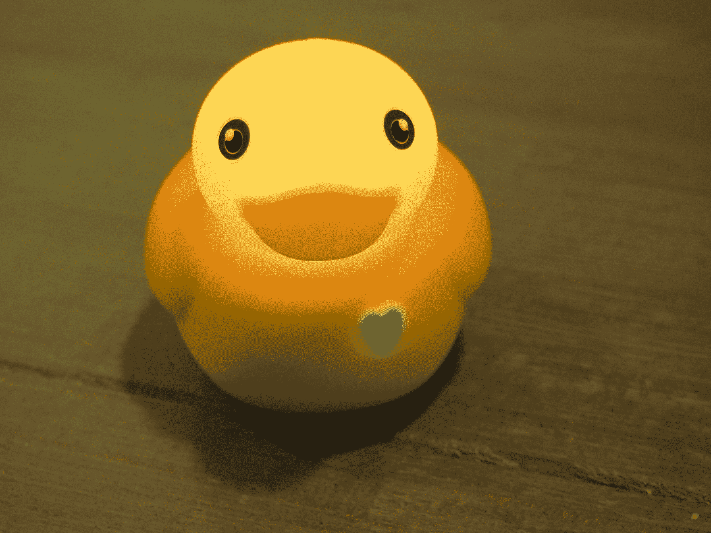

# 玩弄一只聪明的橡皮鸭

> 原文：<https://web.archive.org/web/https://techcrunch.com/2016/06/12/playing-around-with-a-smart-rubber-duck/>

在我们深入讨论之前，您可能需要了解我的一些情况:

1.  我是一个成年人了。我有医疗保险和 401K。我喝波旁威士忌，听 NPR 的歌。我现在穿着一件扣上扣子的衬衫。我拥有许多漂亮的毛衣。
2.  我现在没有孩子。
3.  如果你送我一个聪明的橡皮鸭子，我可能会玩它。我不是石头做的。

这是鸭子埃德温。他经历了很多。2014 年，他在 PI Labs 的创作者试图通过 Kickstarter 让他起死回生，最终在他没有达到 8.5 万美元的目标时取消了竞标。但他坚持了下来。你看，埃德温是一种勇敢的鸭子。早在一月份，他甚至和我们一起在 CES(消费电子展)T3 上登台亮相。他刚好在镇上。巨大的席琳·迪翁粉丝。

在那次采访中，我们可以理解地提出了一个问题，为什么，确切地说，世界需要一只聪明的橡皮鸭。我仍然不完全确定它会。然而，在某些地方，连接功能对橡皮鸭来说是有意义的。一方面，内置温度计可以让埃德温监测浴缸的温度。

然而，问题就在这里——虽然这几乎肯定会成为鸭子的最大卖点之一，但它仍然被归入产品路线图。这说明了作为硬件初创公司早期采用者的一个问题。功能通常在发布时仍处于初级阶段。当它的功能像这里一样重要时，这可能是一个问题。

虽然埃德温在某些方面仍有欠缺，但他目前确实有一些有趣的功能。橡胶鸭子目前最好的特点是它可以兼做完全防水的蓝牙扬声器。我真的说不出为什么，但即使作为一个成年人，在浴缸或游泳池中漂浮着一个鸭子形状的扬声器的想法也有一些吸引人的地方。大概是科学吧。

当然，这里有一个警告——即声音需要穿过橡胶膜。所以，你知道，不太适合发烧友。你可能会想避免任何需要理解人类语言的事情。孩子们，浴缸里不能放播客。

温度计功能已经内置在硬件中，这意味着你可以利用它。在目前可用的三个应用程序中(其中两个仍然只有 iOS 版)有一个是 Temp Time，当你把埃德温靠在额头上时，它会把他变成一个又大又粘的健康体温计。我试了一下自己的头，但是很难得到一个好的读数——或者我一直保持 92 度，可能应该去看医生。陪审团还没有决定。

Edwin 更吸引人的功能之一是为浴缸外设计的(假设你不想让你的孩子泡你的 iPad)，使用小鸭子制作默认 Edwin 应用程序的屏幕版本动画。使用不同的手势，鸭子将帮助阅读故事，玩耍，游戏和唱歌。还有一个独立的睡眠时间应用程序，其中埃德温唱摇篮曲，并兼作夜灯。

随着公司继续一点一点地增加功能，很容易看出产品的发展方向。但目前，埃德温觉得自己比他的各个部分的总和还要少一点，这可能对任何早期加入硬件创业公司的人来说都不奇怪，但随着一些缺失的部分的加入，这只小鸭子可能会变成一只橡胶天鹅。

*更新:埃德温联系我们，告诉我们[沐浴时间应用](https://web.archive.org/web/20221007132353/http://apple.co/1XSPfQi)在这篇文章发布一天后上线。*