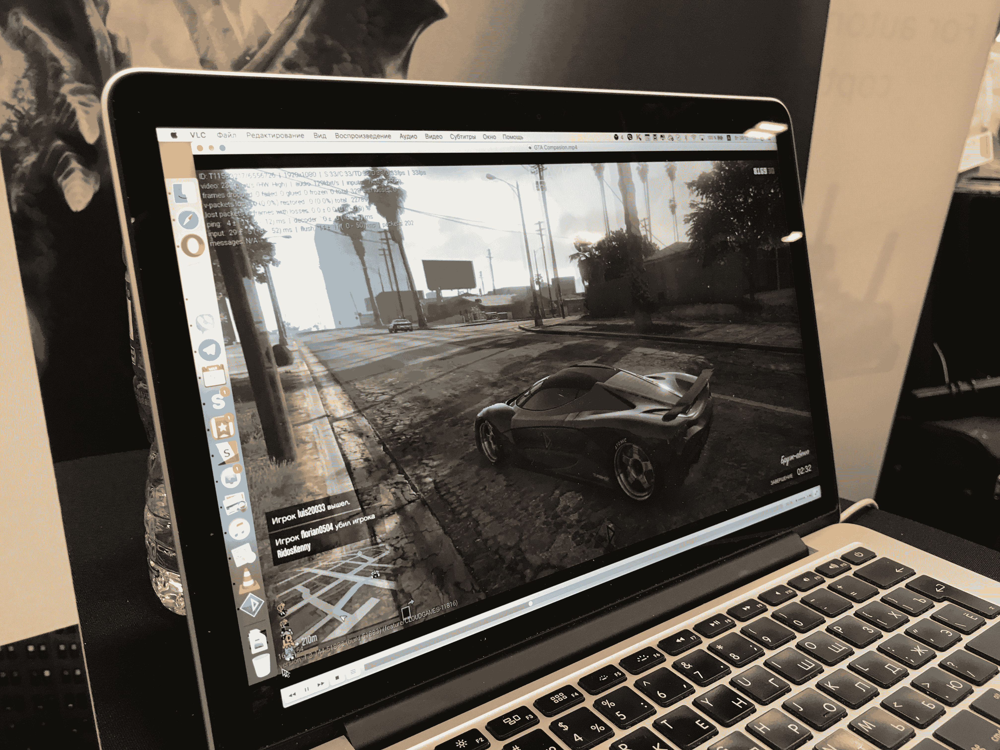
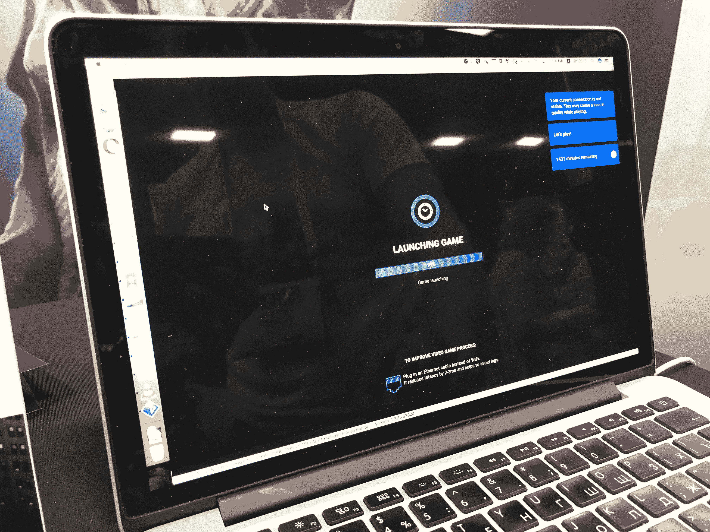

# PlayKey 通过允许你购买或自带游戏来复兴云游戏市场 

> 原文：<https://web.archive.org/web/https://techcrunch.com/2017/05/16/playkey-is-reviving-the-cloud-gaming-market-by-allowing-you-to-buy-or-bring-your-own-games/>

如果您想加入 PC 游戏社区，但没有能力购买一台价值数千美元的 PC，该怎么办？ [PlayKey 拥有独特的虚拟化/云游戏方法](https://web.archive.org/web/20230121055919/https://playkey.net/),支付等级决定了流媒体质量，可以通过从 PlayKey 购买游戏或使用自己的 Steam 游戏库来玩游戏。

PlayKey 的业务基于其位于阿姆斯特丹、伦敦和法兰克福的服务器，而总部位于俄罗斯。在周二的[创业巷](https://web.archive.org/web/20230121055919/https://techcrunch.com/tag/startup-alley/)期间，我与 PlayKey 游戏战略副总裁瓦迪姆·安德雷耶夫谈论了在最佳设置下使用这项服务的规格和要求:“用户可以在我们的服务中使用他们自己的 Steam 库，直接从 Steam 购买游戏，或者从我们这里购买密钥和订阅。”

此外，Playkey 不会冒犯发行商或 Valve，因为他们在技术上是购买游戏密钥的合作伙伴，同时还运行虚拟化服务来帮助这些游戏。

通过这种双线方法，我认为有可能让那些想玩电脑游戏，但又买不起游戏电脑的游戏玩家也能玩上一把。毕竟，如果你停止使用这项服务，从技术上来说，你仍然拥有并有权玩游戏——但是你需要一台游戏电脑。

PlayKey 和过去失败的云游戏竞争对手之间的一个关键区别是他们优化的服务器运行时间(因此降低了运营成本)。PlayKey 可以运行不同的 20 个游戏会话(或用户)，同时在同一台服务器上支持多人游戏。监控工具也是可用的，允许你看到数据包丢失，游戏 FPS，分辨率等等。

PlayKey 支持 150 款游戏，包括大量 AAA 游戏，如*侠盗猎车手:V* 、*巫师 3* 、*黑手党 3*、*杀出重围:人类分裂、* *生化奇兵:无限*和*上古卷轴 V:天际*，每个月都会增加更多游戏。他们的目录还包括一些非 Steam 游戏，如 *Overwatch* 、*上古卷轴:在线*和 *EVE:在线*。

为了让 PlayKey 工作，你需要至少 10MBps 的下载网速，这是 PlayKey 以 720p 分辨率和 30 FPS 播放所需要的，每月订阅 10 美元。然而，如果你选择每月 20 美元的计划，你可以在 ultra 设置下以 60FPS 1080p 高清分辨率播放游戏，最低要求是 20Mbps 的互联网连接。

**那么，你如何开始流媒体播放呢？**

你首先注册，支付 20 美元的高清订阅费(例如)，然后直接从 Steam 或 Playkey 购买游戏密钥(或者只需使用自己的 Steam ID 和库登录)。一个虚拟化的窗口将出现在屏幕上，PlayKey 初始化启动器，游戏开始全屏运行。此外，如果你担心游戏保存:云同步是受支持的，仍然与你的 Steam 帐户绑定，包括社交和截图功能。

如果你还没有准备好投入云游戏，你也可以演示 30 分钟 PlayKey，所以我会说试试看。