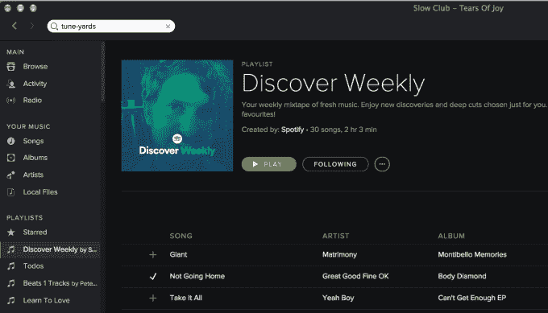
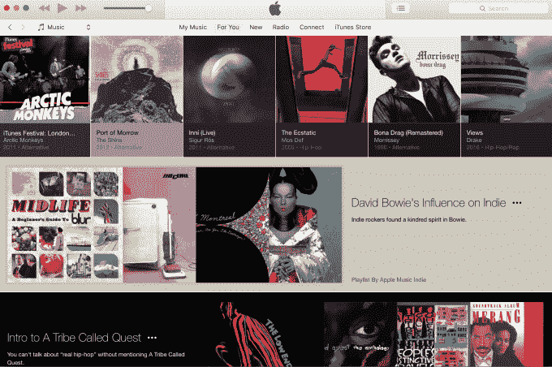
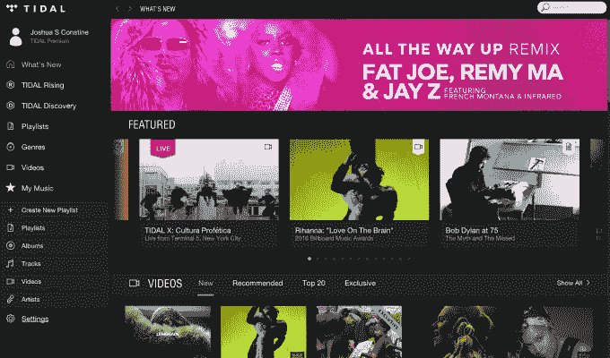
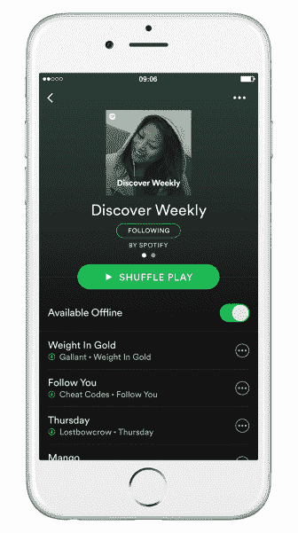

# 《发现周刊》发现 4000 万用户后，Spotify 寻求更个性化的播放列表

> 原文：<https://web.archive.org/web/https://techcrunch.com/2016/05/25/playlists-not-blogs/>

Apple Music、Tidal 以及最近的 Spotify 在音乐探索方面都失败了，因为它们坚持博客式的格式。但是 Spotify 已经破解了这个密码，提供了一个脸书新闻 Feed 风格的个性化的、经常更新的播放列表，名为 [Discover Weekly](https://web.archive.org/web/20230404095455/https://techcrunch.com/2015/07/20/why-browse-when-you-can-play/) 。Spotify 现在表示，自去年 7 月推出以来，播放列表已经拥有[4000 万独立用户](https://web.archive.org/web/20230404095455/https://news.spotify.com/us/2016/05/25/discover-weekly-reaches-nearly-5-billion-tracks-streamed-since-launch/)，50 亿首歌曲被播放。

考虑到 Spotify 总共有 7500 万活跃用户，这对于一个新功能来说是了不起的。Discover Weekly 分析你的收听历史，将其与 Spotify 上的热门和新内容相结合，并在每周一更新 30 首你可能会喜欢的新歌。

它正在工作。超过一半的 Discover Weekly 用户至少保存了一首歌，每周至少听 10 首歌，下周再回来。25 至 34 岁年龄段的人使用最多，Spotify 的首席工程师 Ed Newett 说，这是因为现在是“大学毕业后的几年”，你的社交网络已经发生了变化，你渴望像过去一样接触新的音乐，因为“发现音乐不那么容易了。”

虽然流媒体服务兜售超过 3000 万首歌曲的目录，但其中大多数都被困在搜索框后面。人们很难自发地思考该听什么。

但是流媒体服务上的浏览页面并不是为我们听音乐的现代方式而设计的。它们看起来更像流媒体出现之前的旧 MP3 博客，充满了文本，需要持续的关注和点击。或者它们就像一个自动点唱机，直观地显示大量不同的专辑或主题播放列表，你可以一头扎进去。参见:

苹果音乐的“为你”部分看起来像一个博客

Tidal 的浏览页面看起来也像一个博客

Spotify 意识到，当人们听音乐时，他们希望它简单。给他们一些精选的好歌，让他们点击播放，然后继续工作或锻炼。不看书。不要不停地寻找下一首歌。这只是一种快速吸收新音乐的方式。

一个恼人的事情是，如果你不把整个 Discover Weekly 播放列表复制到一个新的播放列表中，它将在下周一更新时消失。但纽特告诉我，Spotify 正在考虑一个可能的每周发现闪回功能，或其他恢复旧歌曲集的选项。

这项功能非常成功，以至于 Newett 告诉我 Spotify 正在考虑增加更多个性化的播放列表。具体来说，一个是全新的版本，另一个是你可能已经忘记的老的热门和最爱。幸运的是，由于它是建立在 Spotify 完善的播放列表架构上的，这个功能很容易启动和更改。事实上，它最初是由 Hack Week 项目构建的。

《发现周刊》也给了艺术家们帮助。上个月，超过 8000 名音乐人的 Spotify 听众中有一半以上来自《发现周刊》。

释放其庞大目录的价值可能是 Spotify 领先于 Apple Music 和 Tidal 的原因，前者将所有资金投入营销，后者提供碧昂斯的柠檬水等独家服务。

Spotify 没有那些优势。[它仍在亏损](https://web.archive.org/web/20230404095455/http://www.musicbusinessworldwide.com/spotify-revenues-topped-2bn-last-year-as-losses-hit-194m/)——仅 2015 年就亏损 1.94 亿美元。但是增长很快。收入增长 80%，达到 21.8 亿美元，广告收入增长 98%，尽管用户数量仅增长 48%。这对 Spotify 最终的盈利能力是个好兆头。但它必须在与苹果和 Tidal 的竞争中胜出，才能达到大规模。

避开无效的音乐博客发现格式，采用新颖的个性化播放列表方法，可以让 Spotify 与众不同，并让用户相信每月 10 美元或坐着看广告是值得的。但通过聚焦《探索周刊》今天的成功，Spotify 还能指望其他人不抄袭它多久？