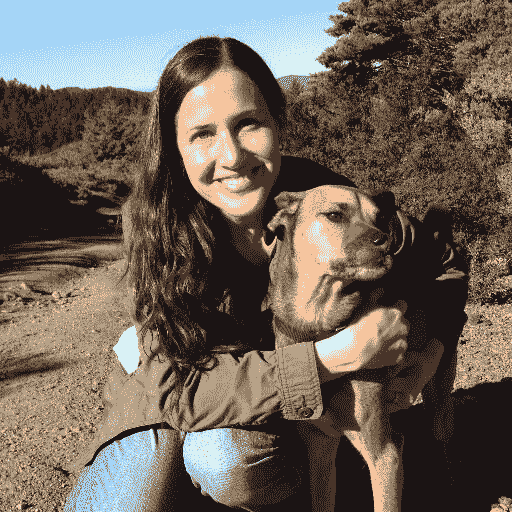
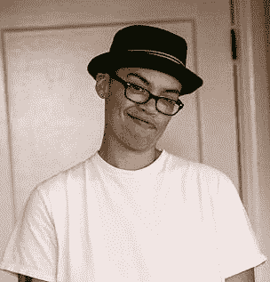

# 欢迎劳拉·科洛德尼、斯特凡·艾蒂安、西格·布鲁斯特和克里斯汀·霍尔-盖斯勒加入 

> 原文：<https://web.archive.org/web/https://techcrunch.com/2016/03/08/please-welcome-lora-kolodny-stefan-etienne-signe-brewster-and-kristen-hall-geisler-to-techcrunch/>

新的一年到来了，TechCrunch 迎来了一些新面孔，他们的兴趣涵盖方方面面，从机器人到风投，再到小工具和摄影，再到科学，再到交通运输等等。

首先，本月晚些时候，劳拉科洛德尼将加入我们，担任新兴技术编辑。劳拉以前是 TC-er，现在正在回归。最近，她在旧金山的道琼斯风险投资和华尔街日报公司担任了四年的风险投资记者。她的研究领域将包括:早期创业公司、加速器等创新枢纽以及众筹、3D 打印、无人机和物联网、未来食品、教育、时尚和交通等新兴行业。

用劳拉自己的话来说，她最感兴趣的是“食品、教育、时尚和交通的未来，以及其他与家庭切身相关的科技领域”，还有“初创型企业，无论是风投支持的、赠款资助的、大学或研究实验室衍生出来的，还是自己创业的。”科技、商业模式或监管方面的变化正在改变各个行业，重塑我们的日常生活，挑战现有的行业领导者。”

之前在 TechCrunch 的时候，劳拉[透露了优步的第一个停止命令](https://web.archive.org/web/20230212065229/https://techcrunch.com/2010/10/24/ubercab-ordered-to-cease-and-desist/)(我们已经走了多远)。在《华尔街日报》上，她爆料了关于[美梦投资](https://web.archive.org/web/20230212065229/http://blogs.wsj.com/venturecapital/2014/05/20/patrick-mcdreamy-dempsey-invests-in-health-startup-crowdmed/)、[泰尔费罗斯](https://web.archive.org/web/20230212065229/http://www.wsj.com/articles/SB10001424052702303330204579250142741126468?mg=id-wsj)和[卡梅隆安东尼](https://web.archive.org/web/20230212065229/http://blogs.wsj.com/venturecapital/2014/07/21/nbas-carmelo-anthony-gets-into-the-seed-investing-game/)的新闻。她还被提名为 Twitter 上的 100 名顶级科技记者之一——我并不在这个名单上，也不对此怀恨在心——所以你应该跟随她去那里。

她还为纽约的好莱坞报道公司杂志撰稿。她为 NYTimes.com 写了一个名为“The Prize”的博客，介绍商业竞争中的发明、企业家和交易。

劳拉是伟大的，我认为她将是一个很好的补充(回到)团队，我知道你会有同样的感觉。

接下来，我们很兴奋地宣布，纽约一位年轻的白手起家的博客作者 Stefan Etienne 将为我们报道小工具和前沿硬件。他是一名年轻的计算机科学专业学生、科技作家、评论家和摄影师。

他从 12 岁开始从事科技写作，在过去的 7 年里，他一直忙于报道这个行业，评论设备并分析它们。斯蒂芬经营自己的网站[笔记本备忘录](https://web.archive.org/web/20230212065229/http://laptopmemo.com/)已经有一段时间了，他是一个思维敏锐的人，我们觉得他会在 TC 如鱼得水。

闲暇时，Stefan 喜欢武术、列清单和在纽约市找咖啡馆。如果你想穿得不正式，你可以点击这里在 Twitter 上关注他。

我很高兴地说，我们已经招募了 Signe Brewster，你可能还记得 GigaOm 的一位出色的自由撰稿人，每月为我们写几篇关于空间、STEM 主题等的特写。她目前正在为我们撰写关于无人机和虚拟现实的报道，你可能听说过，这两个话题现在非常热门。Signe 将继续为其他出版物自由撰稿，但我们也很高兴她能在这里发表文章。

Signe 涵盖新兴科学技术，重点关注 3D 打印、机器人、无人机、VR 和太空。她于 2012 年在威斯康星大学麦迪逊分校获得生命科学传播学士学位，并担任《獾先驱报》的主编。第二年，在加入 GigaOm 之前，Signe 在欧洲粒子物理研究所为《对称》杂志报道粒子物理，并在《连线》杂志获得研究员资格。她在[推特上，这里是](https://web.archive.org/web/20230212065229/https://twitter.com/signe?lang=en)。

接下来，我们请来了一位优秀的自由职业者——克里斯汀·霍尔-盖斯勒——来帮助我们充实由编辑马特·伯恩斯负责的汽车和交通报道。她在波特兰，那里有森林和道路可供驾驶。

她通过与《纽约时报》、《物质是如何工作的》、《大众科学》、《精神牙线》等杂志的编辑合作，磨练了自己的研究和采访技巧。她最喜欢的事情莫过于掉进研究的兔子洞，拿出一本书或一篇文章，让别人觉得有用，而且——她希望——有趣，同时仍然基于你可以信任的可靠来源。她的[推特是激烈的](https://web.archive.org/web/20230212065229/https://twitter.com/kristenhg)。

Jay Donovan 为 TechCrunch 报道新兴技术和创业公司。早在 2009 年，他就成为了 TechCrunch 大家庭的一员，当时他是 crunch gear(TechCrunch 的前小工具博客)的兼职作家。他就是不能离开，从那以后一直给我们写信，但现在会写得更频繁。

Jay 还是 IBM 公司 creative agency Resource/Ammirati 的战略副总监，在那里他为公司的大量客户领导创新和战略项目。 你可以在 Instagram 和 Twitter 上找到他 [@getdonovan](https://web.archive.org/web/20230212065229/https://twitter.com/getdonovan) 。

我们还对现有员工进行了一些调整。Frederic Lardinois 现在是我们在美国的新闻编辑，与英国的 Ingrid Lunden 一起，帮助我们发现和报道最重要的故事。Frederic 是 TechCrunch 的老手，了解我们这类故事的外观、感觉和味道。他会全力以赴确保我们的香料品牌继续流通。不要在推特上关注弗雷德里克。

亨利皮卡维特现在是 TechCrunch 的编辑总监。亨利一直在幕后不知疲倦地工作，帮助塑造 Crunch Network，并帮助作家更好地理解他们的故事的形状。

他的编辑经验，敏锐的头脑和清晰的心将帮助我们把我们的游戏上一个台阶。通过与编辑、视频、产品和活动团队的合作，亨利的工作将是打造一个更专注、更集成的 TechCrunch。基本上，这就是他一直在幕后做的事情，只是现在他得到了明确的信用。亨利是推特(Twitter)上的定时炸弹。