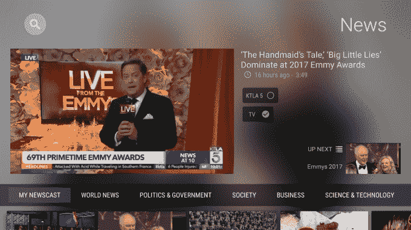

# Plex 在其媒体播放器软件 TechCrunch 中增加了个性化的流媒体新闻

> 原文：<https://web.archive.org/web/https://techcrunch.com/2017/09/26/plex-adds-personalized-streaming-news-to-its-media-player-software/>

媒体播放器软件制造商 Plex 今天正在兑现其今年早些时候收购流媒体新闻初创公司 Watchup 的[交易，在其应用程序中集成了一个专用新闻中心的](https://web.archive.org/web/20230117210716/https://techcrunch.com/2017/01/31/plex-acquires-watchup-to-bring-streaming-news-to-its-media-app/)。该功能提供了一种浏览和发现来自世界各地出版商的新闻的方式，并引入了一种个性化的新闻广播，它可以根据您观看和跳过的节目等内容来适应您的兴趣。

然而，Plex 的产品和增长总监贾森·威廉姆斯向 TechCrunch 澄清说，这个新闻广播不会让用户陷入“新闻泡沫”他说，它仍将包括全球相关新闻、平衡报道以及那些对每个人都重要的新闻故事。

在你点击 Plex 上的新闻中心后，你将立即看到名为“我的新闻广播”的个性化新闻广播。不同于简短的简报——比如像 Snapchat 上的 [NBC 新闻节目](https://web.archive.org/web/20230117210716/https://techcrunch.com/2017/08/18/nbcs-snapchat-news-show-gains-29-million-viewers-in-its-first-month/)——Plex 的“我的新闻播报”实际上由不同来源的几个新闻剪辑组成，平均 3 或 4 分钟长。在观看时，您可以选择跟随或静音源，以通知该功能的推荐技术。

您还可以关注或静音显示在您正在观看的视频旁边的主题。Plex 表示，它使用机器学习技术和其他技术来执行数据提取，以便对一段视频内容进行分类。

这样，Plex 用户可以选择关注他们关心的话题，例如“视频游戏”或一个人的名字，以确保他们不会错过任何关于该主题的新闻。

新闻广播也是个性化的，因为 Plex 将带您体验如何根据您的兴趣配置它，如“政治与政府”、“商业”、“艺术与娱乐”、“科学与技术”和其他高级主题，并提供您的位置和邮政编码。

后者用于通过 Plex 与美国各地各附属电视台的协议提供本地新闻。该公司表示，目前它在大约 80%的美国市场和一些国际市场都有交易。

[gallery ids="1546997，1546996，1546985，1546992"]

除了个性化新闻广播，新闻功能还可以更传统地用于按频道、类别浏览或进行主题搜索。

在推出时，Plex 与 190 多家全球出版商合作伙伴合作，包括 CNN、CBS、金融时报、欧洲新闻、CNET、斯克里普斯、论坛媒体、赫斯特、天空新闻等知名媒体。

威廉姆斯指出，新闻特写也代表了 Plex 的另一种盈利形式，因为它是免费的，并且有广告支持。这意味着这是一个每个人都可以访问的功能，而不仅仅是[Plex Pass 用户](https://web.archive.org/web/20230117210716/https://www.plex.tv/features/plex-pass/)，他指的是 Plex 服务的高级层，今天还包括通过数字天线观看和录制[直播电视的能力。](https://web.archive.org/web/20230117210716/https://techcrunch.com/2017/06/01/plex-becomes-a-low-cost-diy-streaming-tv-service/)

但是，他补充说，“广告和内容的货币化对推荐的新闻没有影响。”换句话说，Plex 的新闻选择不会有偏见，除了你自己编程的偏见，你自己的观看行为和明确选择静音和跟随主题和来源。

Plex News 上的广告将大约每 7 到 10 分钟(或每 3 或 4 个新闻片段，取决于长度)中断一次节目。

在某些情况下，Plex 出售的是广告空间本身；在其他时候，它与新闻来源合作伙伴分享收入。

虽然有些人可能会认为 Plex 的扩展服务内容本身是远离其最初目标的一步，即帮助用户管理他们的个人媒体库，但威廉姆斯认为情况并非如此。

“我们正在确保所有对你来说重要的内容都是可发现的、可搜索的，并以一种奇妙的方式组织起来，你可以在任何地方的任何设备上消费这些内容，”他说。

新闻视频可能不是 Plex 在追逐潜在利润丰厚的脐带切割市场时扩张的唯一领域。威廉姆斯指出，该公司有雄心引入其他直播内容，从直播新闻开始，可能来自第三方。

Plex 的新闻功能今天推出，从 Plex Pass 订户开始，并将在接下来的 48 小时内向所有用户提供。Plex News 也将跨平台工作，包括 Android TV(包括 Nvidia Shield)、Apple TV、Roku、Android mobile 和 iOS。