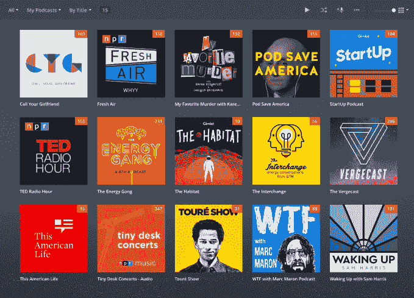
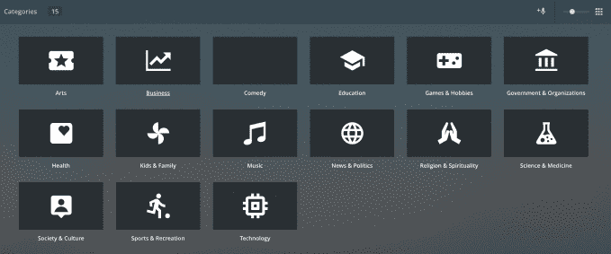
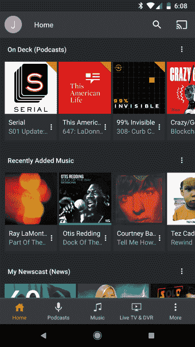

# Plex 增加对播客的支持，推出个性化移动应用 

> 原文：<https://web.archive.org/web/https://techcrunch.com/2018/05/30/plex-adds-support-for-podcasts-debuts-personalized-mobile-apps/>

在 1 月份的 CES 上，TechCrunch 爆料称，媒体软件制造商 [Plex 正计划](https://web.archive.org/web/20230212195410/https://techcrunch.com/2018/01/08/podcasts-are-coming-to-plex-followed-by-web-series-and-other-digital-media/)通过增加新的媒体内容来扩展其服务，首先是播客。如今，它兑现了这一承诺，推出了对播客的测试版支持，并为其 Plex 移动应用提供了全新的外观和更多定制选项。

虽然 Plex 最初是作为一个组织人们家庭媒体收藏的软件应用程序开始的，但在过去几年里它一直在扩展，以增加新的功能来支持那些想通过天线看电视的插队者，并由[录制这些节目。它还](https://web.archive.org/web/20230212195410/https://techcrunch.com/2016/09/01/plex-goes-after-cord-cutters-with-new-dvr-feature/)[收购了](https://web.archive.org/web/20230212195410/https://techcrunch.com/2017/01/31/plex-acquires-watchup-to-bring-streaming-news-to-its-media-app/?_ga=2.245008070.2123525691.1527598964-1447864512.1494524635)流媒体新闻初创公司 Watchup，以便[在其应用程序中增加一个专门的新闻中心](https://web.archive.org/web/20230212195410/https://techcrunch.com/2017/09/26/plex-adds-personalized-streaming-news-to-its-media-player-software/?_ga=2.245008070.2123525691.1527598964-1447864512.1494524635)。

今年早些时候，[公司谈到了它的雄心](https://web.archive.org/web/20230212195410/https://techcrunch.com/2018/01/08/podcasts-are-coming-to-plex-followed-by-web-series-and-other-digital-media/)继续向其媒体中心软件添加更多类型的内容，包括音频和视频播客，随后是数字、网络优先和其他更长形式的创作者内容。(它原本预计在 2018 年 Q1 奥运会上增加播客，所以这个接近 6 月的发布会有点延迟。)

对 Plex 来说，更大的目标是在一个地方组织您的所有媒体内容，从直播和录制的电视节目到您的音乐、照片和视频以及新闻和信息的个人媒体收藏，现在还包括您最喜爱的播客。

这项功能目前处于测试阶段，可在 Plex web 平台、Roku、iOS 和 Android 上使用，对其他设备的支持也将很快推出。

您可以浏览和搜索 Plex 的 podcast 资源库，按类别过滤 podcast，或者点按标题以查看详细信息、专题节目列表和相关 podcast。若要关注该播客，请点按“添加到我的播客”按钮。这也会将播客添加到您的“在甲板上”仪表板。

如果您喜欢的播客不在 Plex 目录中，您可以通过输入提要 URL 来添加它，Plex 会像对待播客一样对待它，它会检索它的所有元数据和相关播客，并使其可搜索。(这很有用，因为 Plex 的目录在发布时不像其他产品那样强大。)

该功能还包括您所期望的标准媒体控制，如前进和后退，支持变速播放，以及“标记为已播放”选项，所有这些都可以通过 Plex 的升级媒体播放器实现。该选项可以帮助您从另一个应用程序过渡到 Plex 的 podcast 平台，因为您不会失去自己的位置，无论您听过什么，没有听过什么。它可以让你不断地标记出你在其他地方看过的，或者只是想跳过的剧集。

您的收听进度也可以在 Plex 的应用程序套件中同步。

该功能在简短的测试中并不完美，但它处于预发布状态，今天它只处于测试阶段，所以现在谈论它作为一款面向公众的产品表现如何还为时过早。

在几周内，Plex 将为播客推出一些其他功能，包括智能下载和精细控制，以管理你想在每个节目的基础上保留的剧集(例如，保留最后三集)；用于更丰富的显示页面和更好的发现选项的附加元数据；和 podcasts 导入和导出(OPML ),以便您可以更轻松地将当前订阅内容移入 Plex。

随着播客的推出，Plex 也在更新其移动应用程序，以提供更好的定制选项。

现在，如果你想在旅途中、在手机上听你的播客和新闻，你可以配置应用程序在你的主屏幕上显示媒体。或者，如果你更多地使用该应用程序将视频投射到客厅的电视上，你可以将那些最喜欢的节目放在体验的前面。诸如此类。

在这个新的可定制主屏幕上，您可以对内容进行重新排序，删除任何部分(如“最近添加的”或“在甲板上”)，或从应用程序的其他地方添加新内容，包括跨服务器(如 Plex Cloud 或您的本地服务器，如您的家用电脑)。)

Plex 还在屏幕底部添加了选项卡，用于在您的媒体类型(如电影、电视、播客等)之间切换。)，它们也是完全可定制的。您甚至可以自定义每种媒体类型的默认源。

[gallery ids="1647814，1647815，1647813，1647812，1647811，1647806，1647805，1647803，1647802，1647799，1647795"]

将播客添加到这种更加个性化的媒体体验中是有意义的，这不仅是因为播客变得多么受欢迎，还因为许多播客与您观看的节目密切相关——它们是创作者评论、圆桌讨论、粉丝聊天、评论家评论等等。然后，很容易想象，从在电视上观看一个节目，然后出去并启动 Plex 应用程序来听播客讨论最后一集。

至少，这是普莱克斯的愿景。然而，即使增加了这些内容，Plex 的软件总体上仍然更适合 DIY 人群——那些想要安装自己的天线，而不是为 YouTube TV 或 Sling 等在线电视服务付费的人。它还没有解决媒体无处不在的问题——最喜欢的节目和电影分散在网飞、Hulu、HBO 和亚马逊等服务上，很难知道你想看的东西在哪里。这些仍然是 Plex 未来可以应对的挑战，它也可以成为一个让你跳转到流媒体目录的中心。

尚不清楚 Plex 的扩张在吸引新用户和付费用户方面效果如何。

该公司没有公布后一个数字，它今天仍然声称拥有和年初一样的 1500 万注册用户。不过，成为播客播放器可能有助于提高这个数字，并最终让更多人接触 Plex 的软件。

播客在网络、移动和 Roku 上处于测试阶段，移动应用程序从今天开始推出。