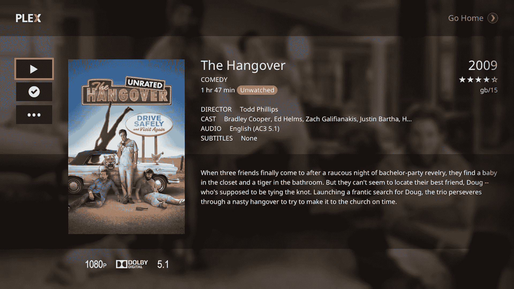

# Plex 在欧洲和亚洲上市 PS4 和 PS3，稍后在美国上市 

> 原文：<https://web.archive.org/web/https://techcrunch.com/2014/12/17/plex-playstation-4-playstation-3/>

# Plex 将在欧洲和亚洲推出 PS4 和 PS3，美国将在稍后推出

我需要完成最终家庭影院设置的一个拼图终于到来了: [Plex 可用于英国、欧洲和亚洲的 PlayStation 4 和 PS3](https://web.archive.org/web/20221209032334/https://blog.plex.tv/2014/12/17/plex-now-sega-genesis-just-kidding-ps3-ps4/) ，PlayStation Store 中有一个应用程序。索尼最新游戏机的 Plex 应用程序是继 10 月在 [Xbox One 上推出媒体流之后推出的。当时，Plex 的联合创始人 Scott Olechowski 暗示 PS4 版本可能正在路上，但没有任何及时发布的坚定承诺。](https://web.archive.org/web/20221209032334/https://beta.techcrunch.com/2014/10/06/plex-launches-on-xbox-one/)

PS4 上的 Plex 基本上采用了与 Xbox One 上相同的界面，这有利于更线性的横向浏览体验，旨在提高您最感兴趣或可能忽略的库中内容的可发现性。

在推出时，Plex for PlayStation 仅限于 Plex Pass 用户，这意味着您必须拥有该公司的付费会员资格才能参与。但是，如果您这样做了，您将能够连接到 Plex 媒体服务器，并以 720p、1080i 或 1080p 分辨率从该源流式传输视频内容。元数据、演员信息、发布日期和摘要也会自动附加到您存储的所有节目和电影中。

然而，美国和加拿大的用户将不得不为 Plex 再等一会儿；该公司表示，它将“很快”推出，有消息称这将在 2015 年初的某个时候推出。