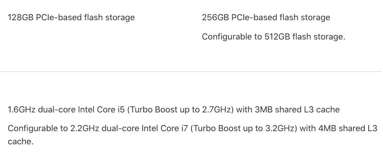
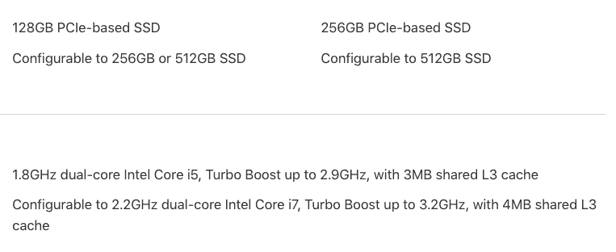

# 剧情转折:MacBook Air 还活着 

> 原文：<https://web.archive.org/web/https://techcrunch.com/2017/06/05/plot-twist-the-macbook-air-is-still-alive/>

# 剧情转折:MacBook Air 还活着

MacBook Air 就是[不会死](https://web.archive.org/web/20221207033827/https://beta.techcrunch.com/2016/10/27/the-13-inch-macbook-air-model-is-still-alive/)。虽然苹果去年推出了更薄更轻的 MacBook Pro，但人们仍然想要一款新的 MacBook Air。MacBook Pro 的重量与 13 英寸的 MacBook Air 大致相当，但价格仍然更高。这就是为什么客户仍然喜欢 MacBook Air。

苹果并没有完全扼杀 MacBook Air，而是保留了它，因为它仍然卖得很好。更好的是，笔记本电脑获得了更好的 CPU。在[苹果的新闻稿](https://web.archive.org/web/20221207033827/https://www.apple.com/newsroom/2017/06/imac-receives-major-update-featuring-more-powerful-graphics-faster-processors-thunderbolt-3-brighter-displays/)中，关于 MacBook Air 只有一行文字:“苹果今天还更新了 13 英寸的 MacBook Air，配备了 1.8 GHz 处理器。”

Aaaaand 就是这样。不要指望视网膜显示屏，不要指望更多的存储或内存。MacBook Air 显然还在维持生命。它甚至没有英特尔的 Kaby Lake 处理器。

如果这对你来说还不够，苹果在没有 Touch Bar 的入门级 13 英寸 MacBook Pro 上降价了。它现在的价格是 1299 美元，而不是 1499 美元，这让人们更有可能完全跳过 MacBook Air。

之前:

之后:

