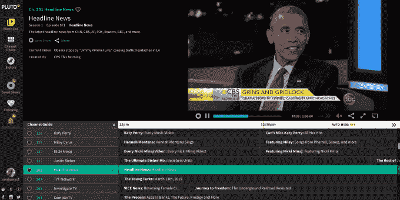

# 针对脐带切割者的在线视频服务 Pluto TV 将会播放 Hulu 

> 原文：<https://web.archive.org/web/https://techcrunch.com/2015/07/01/pluto-tv-an-online-video-service-targeting-cord-cutters-will-soon-stream-hulu/>

后起之秀视频流媒体服务[瞄准断线钳](https://web.archive.org/web/20230405024721/https://techcrunch.com/2015/03/13/diary-of-a-cord-cutter-in-2015-part-4-favorite-apps-and-resources/)、[布鲁托。由于两家公司之间新的分销协议，TV](https://web.archive.org/web/20230405024721/http://pluto.tv/) 现在将分销 Hulu 的免费内容。对于 Pluto TV 来说，这意味着其服务现在能够提供更广泛的主流节目，包括 ABC、NBC 和 Fox 等网络的热门节目。

综艺最先报道了这笔交易[，指出内容将包括各种当前和以前的节目，如《吉米·法伦主演的今夜秀》、《吉米·凯莫现场秀》和《周六夜现场》；比如《宋飞正传》、《星际迷航》、《干杯》、《吸血鬼猎人巴菲》和《快乐时光》。](https://web.archive.org/web/20230405024721/http://variety.com/2015/digital/news/hulu-pluto-tv-free-tv-shows-1201532321/)

然而，两家公司之间的协议性质并不像最近 Hulu 宣布发行 show time 那样广泛。这涉及两家公司之间的商业合作和更深层次的技术整合，Hulu 与 Pluto TV 的合作主要是为了让其网络播放器更容易嵌入 Pluto TV 网站。

在那里，用户将能够观看 Hulu 的节目，以及由 Hulu 的广告服务器支持的广告。这意味着 Pluto TV 的交易类似于 Hulu 过去与 MSN、雅虎和 AOL 等公司达成的交易。

这也意味着这笔交易的性质相当有限。虽然 Pluto TV 现在可以在许多平台上使用，包括 web、iOS、Android，以及通过流媒体播放器，如亚马逊的 Fire TV 和 Fire TV Stick、Chromecast、AppleTV(通过 AirPlay)、Android TV 和三星智能电视，但据我们所知，Hulu 内容只能在 Pluto TV 的网站和 Android 上使用。

此外，Hulu 的节目将只在 Pluto TV 网站的一个新的“点播”区提供，而不是线性流媒体区。

也就是说，对于 Pluto TV 服务的粉丝来说，Hulu 的整合是值得注意的。如今，该公司在主要针对年轻群体的流媒体视频服务领域提供了一个有趣的竞争对手——即“断线钳”和“脐带永不”(cord nevers)用户，他们放弃了付费电视订阅，转而青睐网飞等流媒体服务以及 YouTube 等免费视频内容。

Pluto TV 通过其服务利用了用户行为的这种转变，让你可以在线和通过其跨平台应用观看 100 多个频道。这些频道按兴趣分为音乐、体育、娱乐、喜剧、生活方式、科技、教育、儿童等类别，并组织成在线“电视指南”类型的界面。这个想法是帮助用户发现他们喜欢的网络视频，并允许他们通过建立自己喜欢的节目的定制阵容来进一步个性化体验。

与此同时，视频流来自各种来源，包括 YouTube、Vimeo、Dailymotion、Funny or Die 和其他地方。现在能够将 Hulu 纳入这一组合将极大地扩展 Pluto TV 的内容选择，即使它只是可用的免费节目。

得到 USVP 和其他人超过 1300 万美元支持的 Pluto TV 仍然是一个早期的创业公司，所以它还没有透露它的业务范围——或者更确切地说，Hulu 从这个分销协议中得到什么。但据首席执行官汤姆·瑞安称，该公司“每天都有数百万的视频浏览量。”

他表示:“我们拥有像 Hulu 这样的公司所吸引的积极参与的受众。”。“我们认为这对 Pluto TV 来说是一笔里程碑式的交易。我们的承诺是将传统和数字内容结合在一个向后倾斜的电视体验中，这笔交易对实现这一承诺大有帮助。”