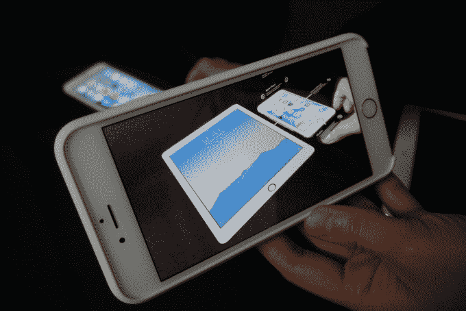

# PointShop hack 使用 AR 来帮助购买小工具 

> 原文：<https://web.archive.org/web/https://techcrunch.com/2016/09/11/pointshop-hack-uses-ar-to-aid-gadget-buying/>

在 TechCrunch Disrupt 旧金山 2016 黑客马拉松的舞台上展示的另一个黑客使用 AR 将小工具置于情境中，旨在帮助消费者更好地理解他们正在看的东西，找到当地的零售商，甚至当场购买小发明。

Yosun Chang 和 Anuj Agrawal 两人团队演示了在 iPhone 上工作的黑客，通过 CrunchBase API 获取苹果公司的数据，通过 MapQuest API 显示购买设备的位置地图，并使用 SAP 的 Hybris API 为电子商务选项提供动力。

该团队在一夜之间开发的应用程序有一个很棒的功能，用户可以点击查看他们正在查看的现实世界物体与以数字方式注入相框的相关产品的视觉对比，比如下图中的 iPad 这是一个小工具买家评估替代品或相关产品的好方法。

“人们喜欢随机购买他们看到的东西，”Unity 开发者常解释黑客的理由时说。“我们最初在想，如果你可以用现实作为你的主键——通常主键是某处的字符串或整数，但如果是对象呢？每一件物品都是由一家可能在 CrunchBase 的公司制造的。”

“你想了解这家公司，而很多时候人们在不知道 Belkin 除了卖连接器还做什么的情况下买东西，”她补充道。

虽然最初的应用对购买小工具最有意义，但该团队认为它可以扩展到购买几乎任何东西。

该团队的后端开发人员阿格拉瓦尔说:“理想情况下，你可以将它指向任何设备，它会给你提供相同的体验，给你不同的结果，也许可以让你进行尺寸比较，也许可以让你进行产品比较，也许甚至可以提供价格信息，比如销售信息。”。

虽然他指出，当然还有其他 AR 应用程序(软件和硬件)可以在物体周围注入产品信息，但该团队仍然认为，在如何向用户呈现信息以及他们对数据源的选择方面，他们的处理带来了一些新鲜的东西。

一旦应用程序识别出对象，它就会显示一系列通过线条链接的标题，很像一个图表。可以点击这些文本注释来扩展/获取更多信息/购买选项。

“这是一个友好的展示，它的交互方式，”Agrawal 在讨论 UI 时补充道。