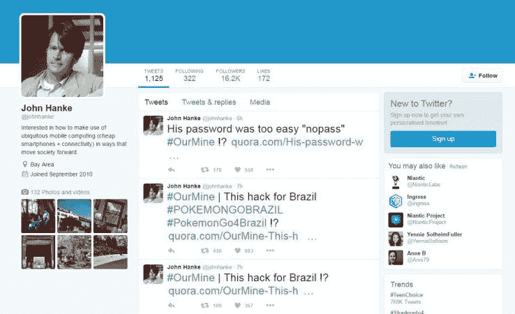

# 口袋妖怪 Go 创造者 Niantic 的 CEO 在 Twitter  上被黑

> 原文：<https://web.archive.org/web/https://techcrunch.com/2016/08/01/pokemon-go-creator-niantics-ceo-hacked-on-twitter/>

# 口袋妖怪 Go 创造者 Niantic 的 CEO 在推特上被黑

《口袋妖怪 Go》创造者 Niantic 的首席执行官约翰·汉克在推特上被黑客组织 our mine[黑了。](https://web.archive.org/web/20230315011537/http://www.cnet.com/news/niantic-ceo-john-hankes-twitter-account-hacked/)

在过去的 24 小时里，黑客集体控制了该账户，并发布了一系列推文，其中一条将汉克的密码标识为“nopass”。

当然，这不是 OurMine 的第一次高调黑客攻击。该组织已经侵入了许多高知名度的账户，包括威廉·夏特纳、马克·扎克伯格、杰克·多西(所有人中！)和特拉维斯·卡兰尼克。事实上，我们已经有了自己的经验。

但是可怜的 Niantic 现在是来自 OurMine 的两次独立攻击的受害者，第一次是 7 月中旬对 Pokemon Go 服务器的 [DDoS 攻击](https://web.archive.org/web/20230315011537/https://ourmine.org/news/2016/07/17/pokemon-go-servers-are-down/)。

黑客们在汉克的账户上发布了#OurMine 标签，并声称这次黑客攻击是“为了巴西”，正如你在下面的图片中看到的，图片由 CNet 捕捉。

OurMine 推出了一种据称可以扫描你的账户漏洞的服务，这些攻击主要是该组织的营销噱头。

这是另一个提醒，要在尽可能多的服务上设置双因素身份验证，并为每个服务使用复杂、唯一的密码。