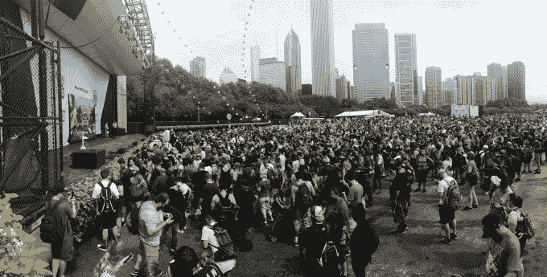

# Pokémon GO Fest 参与者因技术问题中断活动而获得退款

> 原文：<https://web.archive.org/web/https://techcrunch.com/2017/07/22/pokemon-go-fest-attendees-to-get-refunds-as-technical-issues-break-the-event/>

# Pokémon GO Fest 参与者因技术问题中断活动而获得退款

Niantic 的 Pokémon GO Fest 在芝加哥格兰特公园举行，大约有 2 万名 Pokémon GO 玩家参加，每个人似乎都有同样的担忧:天气报告称雷雨即将来临。

天气结果很好。不幸的是，大多数其他事情都没有。

因此，Niantic 刚刚宣布，除了给他们 100 美元的游戏内货币(或神奇硬币)之外，他们还将退还与会者的入场费。Niantic 在活动开始前的估计是大约有 15-20，000 人参加。

(**更新:**目前还不清楚 Niantic 是否会自动退款给与会者，或者只是那些提出要求的人。Niantic 表示，他们将向与会者发送一封详细的电子邮件。)

首先也是最值得注意的是:这个游戏根本不起作用。在第一批参加者进入格兰特公园的几分钟内，手机网络就开始不稳定了。在大门正式打开的 20 分钟内，所有网络都瘫痪了。在过去的十年里，我已经做了相当多的博客直播，所以我习惯了绕过网络拥塞，找到一些信号的表象。什么都没有。

如果你能上网，Pokémon GO 本身就有问题。点击一个怪物来抓住它只会导致一个错误屏幕——这对许多远道而来希望完成 Pokedex 的玩家来说是一个特别的打击，因为公园将会产生一些游戏中最罕见的怪物。你可以点击 Unown 或 Heracross(通常只在非常特定的地区可用，当然不会在芝加哥中部)，游戏就会崩溃。

与此同时，现实世界的物流问题比比皆是。活动开始前几个小时，队伍就排到了街区周围。三个小时后，大部分人还排在外面。旨在显示哪个队统治公园内体育馆的大型显示器被简单地关闭了。

当 Niantic 的约翰·汉克走上舞台时，他受到了几千名观众的欢迎，他们中的许多人高喊“搞定你的游戏”或“我们不能玩了！”一些更激进的与会者走上舞台，亲自分享(读:喊)他们的不满。

截至中部时间下午 2 点，Niantic 计划继续这项活动的议程，希望他们能让事情正常进行。

*故事发展…*