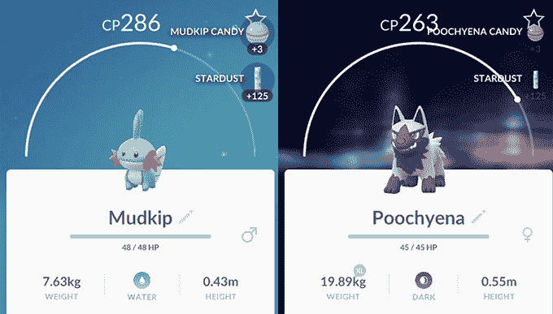

# Pokémon GO 本周将获得 50+新的 Gen III Pokémon(更新:他们来了。)

> 原文：<https://web.archive.org/web/https://techcrunch.com/2017/12/06/pokemon-go-gen-iii-this-week/>

# Pokémon GO 本周将获得 50+新的 Gen III Pokémon(更新:他们来了。)

Pokèmon Go 粉丝们，好消息:第三代口袋妖怪将于本周登陆

或者，我应该说，*更多*第三代神奇宝贝本周登陆。Niantic 告诉我，在本周结束之前，至少会有 50 个新的神奇宝贝加入到游戏中，加入到万圣节前夕出现的少数 Gen III 怪物中。

**更新:太平洋时间 12 月 8 日上午 11:30 左右，第三代神奇宝贝已经开始出现**

“但是等等，格雷格！”你可能会说，对着天空摇摇你的手指。“第三代应该会增加 130 个新的神奇宝贝！其余的在哪里？!"

Niantic 这次不会一次放弃所有东西，而是会随着时间的推移逐步推出。我被告知，他们目前正计划让未来的第三代神奇宝贝以主题团体的形式发布——一周发布更多的第三代火神奇宝贝，另一周发布第三代草神奇宝贝，等等。

像这样在一代人的时间里错开发布时间表的选择可能会让任何渴望尽快抓住它们的人疲惫不堪——但这也有一定的道理。在现有的神奇宝贝宇宙中，Niantic 只能与这么多代人合作——一旦玩家掌握了一代人所能提供的大部分内容，他们就会开始要求更多。通过拆分，他们能够随着时间的推移保持更一致的利息水平。

第三代也被称为“Hoenn”一代，由 2002 年首次出现在《神奇宝贝红宝石和蓝宝石》中的神奇宝贝组成。

Niantic 的 Archit Bhargava 也向我证实，他们将在这个月举办一次游戏内假日活动。他没有说太多期待什么，但确实提到他们的目标是在 12 月 21 日左右开始。

与此同时，该公司还宣布，天气——就像外面真实世界的天气一样——将影响游戏。[更多详情请点击此处。](https://web.archive.org/web/20221007165748/https://beta.techcrunch.com/2017/12/06/pokemon-go-weather/)