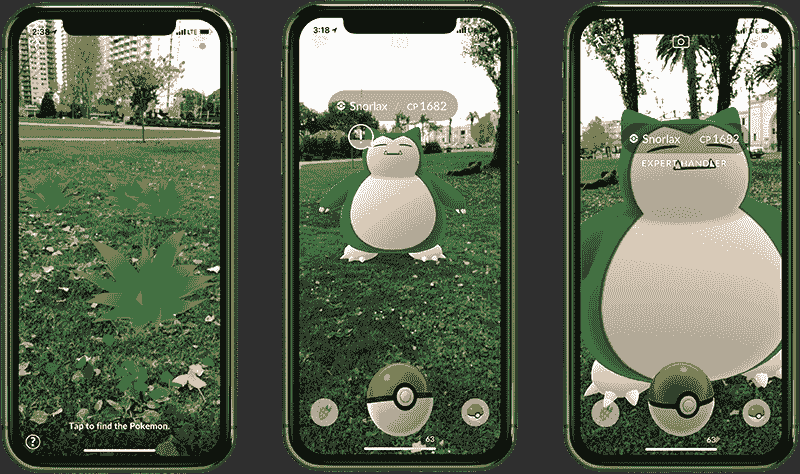

# Pokémon GO 获得了一个新的改进的增强现实模式(但只在 iOS 上)

> 原文：<https://web.archive.org/web/https://techcrunch.com/2017/12/20/pokemon-go-gets-a-new-and-improved-augmented-reality-mode-but-only-on-ios/>

# Pokémon GO 获得了一个新的改进的增强现实模式(但仅在 iOS 上)

还记得 6 月份，Niantic 在 WWDC 登台展示《精灵宝可梦 GO》的测试版吗？那个使用苹果新的增强现实框架 ARKit 来增强游戏的增强现实能力的游戏？

该功能现在被称为 AR+，将于本周晚些时候发布(长期缺席的神奇宝贝应该很快就会出现。)

Pokémon GO 自推出以来就允许你使用手机的摄像头将 Pokémon 叠加到真实世界的视图上，但执行起来总是有点简单。由于它真正关心的唯一传感器是手机的陀螺仪，神奇宝贝只是在你面前的空间里漂浮。你可以左转/右转瞄准，但如果你试图靠近或远离，神奇宝贝就会跟着你一起滑行。

这是一个足够聪明的技巧，帮助这款游戏达到了一度疯狂的受欢迎程度——但在你后院看到卡比兽的新鲜感消退后，即使是最专注的玩家也关闭了 AR 模式。切换到无摄像头的非 AR 模式使耗电的游戏变得更少——因为你不再需要担心瞄准时的陀螺仪，关闭 AR 实际上使游戏变得更容易。

本周早些时候，我会见了 Niantic，给新的 AR+模式一个旋转。**以下是我学到的:**

*   寻找神奇宝贝的过程没有改变:在现实世界中四处走动，寻找在地图上弹出的神奇宝贝，点击它们开始遭遇。
*   当你在 AR+模式下遇到一个神奇宝贝时，你会看到一个提示，提醒你注意周围的情况。这个游戏有很多安全提示。
*   一旦游戏检测到一个平坦的表面，你会看到你面前有几片高高的草地(这是对手持神奇宝贝游戏的认可。)轻点草地，神奇宝贝就蹦出来了。
*   你现在可以近距离接触神奇宝贝，更好地瞄准你的投掷。你离得越近，就越容易投出漂亮的球
*   但是不要动作太快！神奇宝贝有一个小图标，表示它们有多害怕；靠得太近太快，它们就会跑。
*   给神奇宝贝喂 nanab 浆果会让它对你的动作不那么敏感
*   在不惊吓到神奇宝贝的情况下，离它足够近，然后“专业训练者”模式就开始了。这可以稍微提高你的捕获率——如果你成功了，你会从你的捕获中获得更多的经验值和星尘。

在 AR+模式下玩非常有趣——是的，盯着你的手机，同时踮起脚尖慢慢走向神奇宝贝 juuuuust，不会吓跑它，这感觉非常愚蠢。但是当一些罕见的 mon 在几周内第一次露面时，这一点点捕获率的增加可能会使这一切都值得。

唉，对于 Android 用户来说，这是一个坏消息:由于 AR+都是基于苹果的 ARKit 引擎构建的，所以它现在只是 iOS。Niantic 不愿透露他们是否正在努力让它与 ARCore(谷歌的 ARKit)友好相处。)

仅在一个平台上向用户推出一个值得注意的新功能是一个冒险的选择——尤其是当该功能带来了提高的捕获率和额外的 XP 时。希望 Niantic 正在研究如何尽快把它带到 Android 上。

对于那些希望在 Pokedex 中再增加一个位置的 PoGo 玩家来说: **Niantic 向我证实，信使鸟(圣诞老人风格的神奇宝贝，自从其第二代同伴推出以来一直奇怪地缺席)将在假期**时出现。当然，这是从二月份第二代第一次发布的第二天就开始的谣言，但是，嘿，现在它被证实了。

