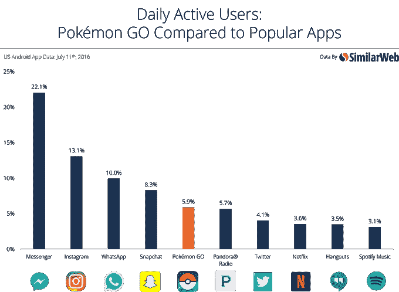
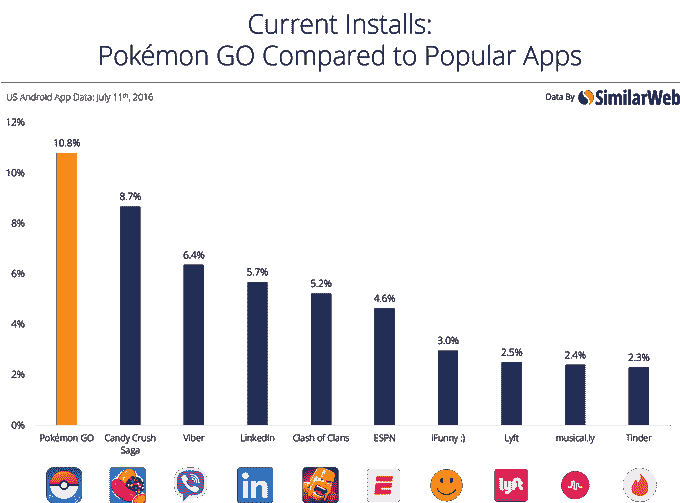
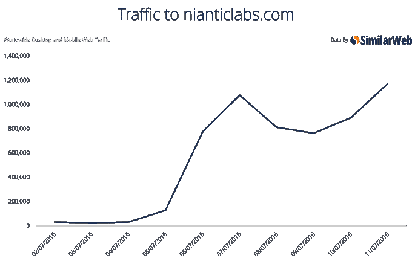

# Pokémon Go 安装在比 Candy Crush、LinkedIn、Lyft、Tinder 和 more TechCrunch 更多的设备上

> 原文：<https://web.archive.org/web/https://techcrunch.com/2016/07/14/pokemon-go-installed-on-more-devices-than-candy-crush-linkedin-lyft-tinder-more/>

# Pokémon Go 安装在比 Candy Crush、LinkedIn、Lyft、Tinder 等更多的设备上

还在着迷于《神奇宝贝 Go》的病毒式传播？我们也是。据报道，周一，这款名为[的应用超过了 Twitter 的每日用户数](https://web.archive.org/web/20220926001852/https://beta.techcrunch.com/2016/07/13/pokemon-go-tops-twitters-daily-users-sees-more-engagement-than-facebook/)，人们每天花在[玩游戏上的时间比浏览脸书](https://web.archive.org/web/20220926001852/https://beta.techcrunch.com/2016/07/13/pokemon-go-tops-twitters-daily-users-sees-more-engagement-than-facebook/)的时间还多。现在有消息称，就每日活跃用户而言，游戏也超过了潘多拉、网飞、谷歌 Hangouts 和 Spotify，并且安装在更多设备上，超过了许多流行的应用程序，如 Candy Crush、Viber、LinkedIn、Clash of Clans、Tinder 等。

这些数据基于追踪公司 [SimilarWeb 对美国安卓用户的分析](https://web.archive.org/web/20220926001852/https://www.similarweb.com/blog/pokemon-go-compared)。

该公司还报告称，7 月 11 日周一，美国所有安卓用户中有 5.9%玩《精灵宝可梦 Go》，比当天发布推特的 4.1%多 46%。然而，在这方面，少数其他应用程序仍在击败神奇宝贝，包括 Messenger、Instagram、WhatsApp 和 Snapchat。

尽管用户非常喜欢这款手机游戏，但它仍然不是迄今为止安装量最大的应用之一。潘多拉、网飞、谷歌 Hangouts 和 Spotify 在这方面更有吸引力，尽管在某些情况下差距正在缩小。

目前，Pokémon Go 安装在 10.8%的美国安卓手机上。相比之下，17%的设备安装了 Spotify，20%的设备安装了 Twitter。

然而，尽管它在美国[仅上线约一周，](https://web.archive.org/web/20220926001852/https://beta.techcrunch.com/2016/07/06/pokemon-go-is-now-available-in-the-us-for-ios-and-android/)这款应用已经安装在比 Candy Crush、Viber、LinkedIn、Clash of Clans、ESPN、iFunny、Lyft、musical.ly 和 Tinder 更多的设备上。

请记住，这一数据仅针对美国，但在其其他市场，澳大利亚和新西兰，Pokémon Go 也一直在飙升。在那里，分别有 15.1%和 16%的安卓设备安装了[这款应用](https://web.archive.org/web/20220926001852/https://beta.techcrunch.com/2016/07/13/pokemon-go-tops-twitters-daily-users-sees-more-engagement-than-facebook/)。

毫不奇怪，开发者网站 Niantic Labs 的访问量也很高。周一，它迎来了历史上访问量最大的一天，桌面和移动网络访问量达 117.1 万次。

