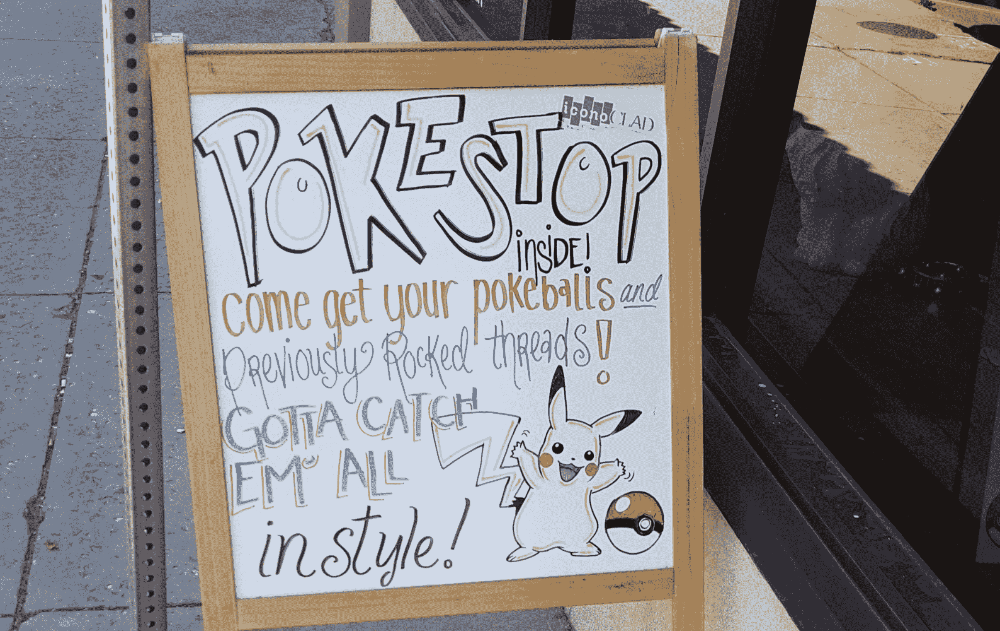

# Pokémon Go 正在做很少有应用程序能做到的事情——驱动真实世界的流量 

> 原文：<https://web.archive.org/web/https://techcrunch.com/2016/07/11/pokemon-go-is-doing-what-few-apps-can-driving-real-world-traffic/>

如果你正在寻找一个罕见的神奇宝贝，遇到了上面的标志，你会怎么做？因为我会付钱买下藏在里面的口袋妖怪。

Ingress 和任天堂目前似乎还没有将付费游戏内位置作为 Pokémon Go 商业模式的一部分(为此，可以看看应用内购买)，但该应用将真实世界的步行流量推向位置的能力是不可否认的。上面的例子发布在 [NeoGAF 论坛](https://web.archive.org/web/20230201191721/http://www.neogaf.com/forum/showthread.php?p=209486599#post209486599)上，但其他的例子比比皆是，一些企业正在走另一条路，利用他们的[神奇力量鼓励人们进入](https://web.archive.org/web/20230201191721/http://imgur.com/092b4wR)。

目前，神奇宝贝站和神奇宝贝健身房(神奇宝贝 Go 玩家访问以获得收藏品和进行战斗的关键现实世界位置和地标)是从 Niantic 最初基于位置的 AR 游戏 Ingress 的位置数据库中提取的。这些位置是通过[用户提交](https://web.archive.org/web/20230201191721/https://support.ingress.com/hc/en-us/articles/207343987-Candidate-Portal-criteria)生成的，对用户社区中的任何人开放，并在添加到公共数据库之前由 Niantic 审查。

Ingress 也利用赞助的游戏内位置来增加收入。[UFJ 东京三菱银行与 Niantic 联手](https://web.archive.org/web/20230201191721/http://www.bk.mufg.jp/ingress/en/)开展了一场大型品牌推广活动，例如，将自动取款机用作 Ingress 的“入口”,以及引入一个品牌化的游戏内物品。入口位置的其他赞助商包括 Zipcar、AXA 和 Circle K 等。

在接受 [gamesindustry.biz](https://web.archive.org/web/20230201191721/http://www.gamesindustry.biz/articles/2015-08-04-how-googles-niantic-labs-took-over-the-world) 采访时，Niantic 产品经理 Brandon Badger 解释了该公司如何设想一个旨在推动 Ingress 营销收入的品牌位置方案:

他在 2014 年接受该杂志采访时表示，“我认为，我们希望最终能有一种模式，可能会有一种按访问次数付费的模式，大品牌和小品牌也可以赞助游戏的不同元素，最终与玩家互动，并真正利用玩家的热情。”。

人们已经在使用 Niantic 和任天堂在 Pokémon Go 中提供的工具来利用现实世界流量的潜力。[福布斯撰稿人 Jason Evangelho 详细介绍了](https://web.archive.org/web/20230201191721/http://www.forbes.com/sites/jasonevangelho/2016/07/09/how-pokemon-go-can-lure-more-customers-to-your-local-business/#26a61397fe48)聪明的企业主是如何使用“诱饵”的，这是一种游戏中的物品，可以将任何现有的神奇宝贝停留点变成虚拟的喂食狂潮，吸引希望抓住神奇宝贝的玩家。

但这需要附近已经有一个 pokéStop——所以很自然，企业已经在寻求让 Niantic 在他们的位置上增加一个。

不仅是 Niantic，任天堂也有利用其产品在消费者中的知名度来推动客流量的历史。任天堂专区(Nintendo Zone)服务在玩家连接到特定位置时向他们提供特殊的可下载虚拟物品，任天堂与日本的麦当劳和美国的 Boingo 合作，向用户免费提供任天堂的内容。克里斯·斯库利昂在 Twitter 上指出了麦当劳与《精灵宝可梦 Go》形成类似合作关系的逻辑:

对于各种规模的企业来说，这种参与度的游戏肯定比只是在人行道上扔一个木制三明治标志要好。